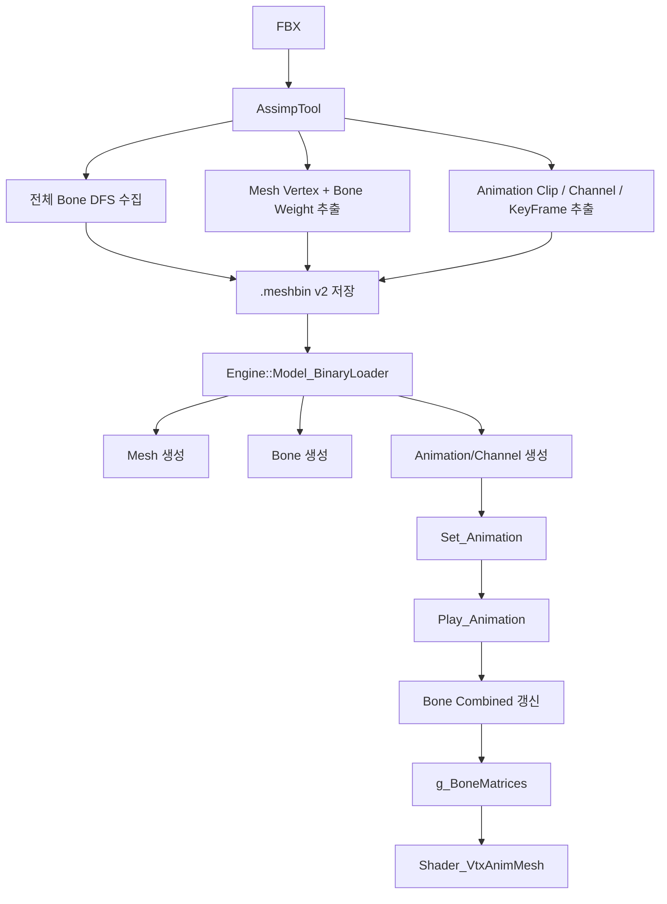

# AssimpTool 애니메이션 컨버터 확장 플랜 A to Z

> 작성일: 2026-03-16
> 목적: `9개월차 1~4일차` 수업 내용에서 정리한 `Bone -> Animation -> Channel -> KeyFrame -> 실제 재생` 흐름을 현재 `Dx11_Naruto` 프로젝트의 `AssimpTool` / `Engine` 구조에 맞게 다시 연결해서, 이제는 `FBX`에서 애니메이션 데이터까지 뽑아 `.meshbin`으로 저장하고 런타임에서 실제 재생할 수 있도록 만드는 상세 설계 문서
> 문서 성격: "바로 구현 가능한 설계서". 개념 요약이 아니라, 현재 코드 기준으로 어떤 구조체를 추가하고 어떤 함수 흐름으로 엮어야 하는지까지 포함한다.

---

## 0. 이 문서를 보는 방법

이번 문서는 아래 순서로 읽으면 된다.

1. 먼저 `왜 지금 애니메이션 컨버터를 붙여야 하는지`를 이해한다.
2. 그다음 `현재 프로젝트에서 어디가 비어 있는지`를 확인한다.
3. 그다음 `최종 저장 포맷`을 먼저 확정한다.
4. 포맷이 정해지면 `AssimpTool export`를 붙인다.
5. 마지막으로 `Engine import + 재생 + Shader`를 연결한다.

핵심은 하나다.

```text
수업 1~4일차에서 한 일은
Bone 구조를 읽고 -> Animation/Channel을 메모리에 올리고 ->
현재 시간을 계산해서 -> 키프레임 보간 -> Bone Matrix를 Shader에 넘기는 흐름을 만든 것

이번 작업은 그 흐름을
"수업용 Assimp 직결 로딩"이 아니라
"우리 프로젝트의 .meshbin 파이프라인"으로 옮기는 과정이다.
```

---

## 1. 이번 작업의 최종 목표

이번 확장의 최종 목표는 아래 한 문장으로 정리할 수 있다.

```text
AssimpTool이 Skeletal FBX를 읽으면,
메시 + 본 계층 + 정점 가중치 + 애니메이션 클립/채널/키프레임까지
우리 포맷으로 저장하고,
Engine::Model 이 그 파일을 읽어 실제 애니메이션 재생까지 수행한다.
```

즉 완료 기준은 아래다.

- `StaticMesh`는 지금처럼 그대로 동작해야 한다.
- `SkeletalMesh`는 `.meshbin` 하나만 읽어도 본/애니메이션 데이터가 메모리에 올라와야 한다.
- `Model::Set_Animation()`, `Model::Play_Animation()` 같은 흐름이 다시 생겨야 한다.
- 렌더 단계에서 `g_BoneMatrices`가 셰이더로 전달되어야 한다.
- 최소한 `Idle`, `Run`, `Attack` 같은 FBX 애니메이션 1개 이상을 실제 재생할 수 있어야 한다.

---

## 2. 1~4일차 수업 내용을 지금 작업에 어떻게 연결해야 하는가

### 2.1 1일차, 2일차에서 배운 것

`Bone` 관련 수업의 핵심은 아래였다.

- `aiNode` 트리를 따라 본 계층을 읽는다.
- 각 본은 `name`, `parent`, `transform`, `offsetMatrix` 개념을 가진다.
- 최종적으로는 `CombinedTransformationMatrix`를 계산해야 한다.

이번 AssimpTool 확장에서는 이 부분이 그대로 필요하다.

왜냐하면 스키닝은 단순히 `aiMesh::mBones`만 저장해서 끝나지 않기 때문이다.
애니메이션 채널은 대부분 `node name` 기준으로 들어오므로,
메시에 직접 weight가 붙은 본뿐 아니라 `전체 노드 계층`을 같이 들고 있어야 한다.

즉 이번 결론은 아래다.

```text
Bone export는 mesh bone list만 저장하면 부족하다.
반드시 aiScene::mRootNode 기준 전체 DFS 계층을 저장해야 한다.
```

### 2.2 3일차에서 배운 것

`Animation`, `Channel`, `KEYFRAME` 수업의 핵심은 아래였다.

- `aiScene::mAnimations`를 읽는다.
- 클립 하나를 `CAnimation`으로 만든다.
- 그 안의 `aiNodeAnim`을 `CChannel`로 만든다.
- 채널마다 `Position / Rotation / Scale` 키를 `KEYFRAME` 벡터로 저장한다.

즉 3일차는 "애니메이션 데이터를 메모리 구조에 정리해서 올리는 날"이었다.

이번 AssimpTool 확장에서는 이 내용을 오프라인 export 단계로 옮긴다.

```text
3일차 수업에서 런타임 메모리에 바로 올리던 것을,
이제는 AssimpTool이 먼저 바이너리로 저장해두고,
Engine이 그 바이너리를 읽어 같은 구조를 복원한다.
```

### 2.3 4일차에서 배운 것

4일차 핵심은 아래였다.

- `m_fCurrentTrackPosition`을 누적한다.
- 현재 시간에 맞는 키프레임 구간을 찾는다.
- `Lerp / Slerp`로 보간한다.
- `Bone Local Transform`을 갱신한다.
- 부모-자식 순서대로 `CombinedTransformationMatrix`를 갱신한다.
- 최종 `BoneMatrices`를 셰이더 상수 버퍼로 보낸다.

즉 이번 작업은 아래처럼 연결된다.

```text
AssimpTool 단계 = 3일차 내용을 저장 가능한 데이터 파일로 만드는 단계
Engine 단계     = 4일차의 실제 시간 기반 재생 로직을 현재 프로젝트 구조에 이식하는 단계
```

---

## 3. 현재 프로젝트 상태 진단

현재 프로젝트는 이미 "정적 메시 컨버터 1차 버전"까지는 와 있다.
하지만 SkeletalMesh 파이프라인은 아직 반쯤만 열려 있다.

### 3.1 현재 이미 되어 있는 것

현재 코드 기준으로 확인된 사실은 아래다.

- `AssimpTool`은 `EConvertModelType::StaticMesh`, `SkeletalMesh` 구분 enum이 있다.
- `Converter::Resolve_ModelType()`는 `HasAnimations()`, `HasBones()`를 보고 자동 판별한다.
- `.meta`에는 `modelType`을 써 준다.
- `ModelTable.json`에도 이미 `SkeletalMesh`로 등록된 항목이 있다.
- 런타임 `Engine::Model`은 `.meshbin`만 읽도록 정리되어 있다.

즉 표면적으로는 SkeletalMesh 파이프라인이 있는 것처럼 보인다.

### 3.2 하지만 실제로 비어 있는 부분

실제로는 아래가 아직 없다.

- `.meshbin` 내부에 본 계층 데이터가 없다.
- 정점별 `blendIndex`, `blendWeight` 저장이 없다.
- 애니메이션 클립/채널/키프레임 저장이 없다.
- `Model_BinaryLoader`는 정적 메시 형식만 읽는다.
- `Mesh`는 `VTXMESH` 경로만 있고 `VTXANIM` 경로가 없다.
- `Model`에는 `Set_Animation`, `Play_Animation`, `Bind_BoneMatrices` 흐름이 없다.
- 셰이더 테이블에 `VtxAnim`용 셰이더 등록이 없다.
- `ResourceLoader::Get_InputLayout()`도 `VtxAnim`을 지원하지 않는다.

즉 지금 상태를 한 줄로 요약하면 아래다.

```text
메타데이터 상으로는 SkeletalMesh인데,
실제 바이너리와 런타임은 아직 StaticMesh 파이프라인이다.
```

---

## 4. 이번 설계의 핵심 결론

이번 작업은 아래 원칙으로 가는 것을 추천한다.

### 4.1 기존 static `.meshbin` v1은 깨지지 않게 유지한다

이건 매우 중요하다.
이미 만들어둔 정적 메시 자산이 있으므로,
애니메이션 확장 때문에 예전 파일이 깨지면 안 된다.

따라서 권장 방식은 아래다.

- 기존 포맷은 `version = 1`로 그대로 둔다.
- 애니메이션 포함 형식은 `version = 2`로 새로 만든다.
- 로더는 `header.version`을 보고 분기한다.

### 4.2 애니메이션도 `.meshbin` 하나에 같이 넣는다

처음 확장 단계에서는 파일을 여러 개로 쪼개지 않는 편이 좋다.

즉 1차 목표는 아래처럼 간다.

- `character.meshbin` 안에 메시 데이터 포함
- 같은 파일 안에 bone hierarchy 포함
- 같은 파일 안에 animation clip / channel / keyframe 포함
- 머티리얼만 지금처럼 `.material.json` 유지

이렇게 하면 `ModelTable.json`과 로더 설계가 단순하다.

### 4.3 Skeletal import 경로에서는 `aiProcess_PreTransformVertices`를 쓰면 안 된다

정적 메시 컨버터에서는 `PreTransformVertices`가 편하다.
하지만 SkeletalMesh에서는 이 플래그를 쓰면 애니메이션 계층 정보가 사실상 무너진다.

따라서 규칙은 아래처럼 고정한다.

```text
StaticMesh   -> aiProcess_PreTransformVertices 사용 가능
SkeletalMesh -> 절대 사용 금지
```

### 4.4 본 계층은 `aiScene::mRootNode` 전체 DFS로 만든다

메시의 `aiMesh::mBones`는 "가중치가 실제 붙어 있는 본"만 제공한다.
하지만 애니메이션 채널은 보통 노드 전체에 대해 들어온다.

그래서 저장 시점 기준으로는 반드시 아래 2개를 둘 다 들고 있어야 한다.

- 전체 노드 계층 기반의 `global bone node array`
- 각 메시가 실제로 참조하는 `mesh-local bone reference`

### 4.5 정점 가중치는 최대 4개만 유지하고 정규화한다

현재 셰이더/버텍스 구조는 4개 influence 기준으로 가는 것이 가장 안전하다.
따라서 exporter에서 아래를 보장해야 한다.

- 한 정점에 weight가 5개 이상이면 상위 4개만 유지
- 남은 4개 weight 합을 1.0으로 정규화
- weight 합이 0이면 기본값 `(0,0,0,0)` / `(1,0,0,0)` 같은 안전값 처리

---
## 5. 최종 바이너리 포맷 설계

이제 가장 중요한 포맷을 먼저 고정한다.

## 5.1 공통 헤더

기존 v1을 최대한 유지하기 위해 공통 prefix는 아래처럼 둔다.

```cpp
struct FMeshFileHeaderCommon
{
    uint32 magic = MESHBIN_MAGIC;     // 'MESH'
    uint32 version = 2;               // v1 = static only, v2 = skeletal capable
    uint32 meshCount = 0;
    uint32 materialCount = 0;
    uint32 reserved = 0;
};

struct FMeshFileHeaderV2Extra
{
    uint32 modelType = 0;             // EConvertModelType
    uint32 flags = 0;                 // hasSkin, hasAnimation
    uint32 boneCount = 0;
    uint32 animationCount = 0;
};
```

추천 플래그는 아래처럼 둔다.

```cpp
enum EMeshBinFlags : uint32
{
    MESHBIN_FLAG_HAS_SKINNING   = 1 << 0,
    MESHBIN_FLAG_HAS_ANIMATION  = 1 << 1,
};
```

## 5.2 행렬 저장용 POD 구조

Assimp 행렬이나 DirectX 행렬을 그대로 raw dump 하면 위험하다.
패딩이나 내부 표현을 믿지 말고, 저장용 구조를 따로 만든다.

```cpp
struct FMatrixBin
{
    float m[16] = {};
};
```

변환 helper는 아래처럼 둔다.

```cpp
static FMatrixBin To_MatrixBin(const Matrix& mat)
{
    FMatrixBin out{};
    memcpy(out.m, &mat, sizeof(float) * 16);
    return out;
}
```

## 5.3 정점 구조

Static/Skeletal을 구분해서 저장한다.

```cpp
struct FMeshVertexBin
{
    float px = 0.f, py = 0.f, pz = 0.f;
    float nx = 0.f, ny = 1.f, nz = 0.f;
    float tx = 1.f, ty = 0.f, tz = 0.f;
    float u = 0.f, v = 0.f;
};

struct FMeshVertexAnimBin
{
    float px = 0.f, py = 0.f, pz = 0.f;
    float nx = 0.f, ny = 1.f, nz = 0.f;
    float tx = 1.f, ty = 0.f, tz = 0.f;
    float u = 0.f, v = 0.f;

    uint32 blendIndex[4] = {};
    float  blendWeight[4] = {};
};
```

## 5.4 메시 단위 정보

메시 하나를 읽을 때 필요한 메타는 아래 정도면 충분하다.

```cpp
struct FMeshSectionBin
{
    uint32 materialIndex = 0;
    uint32 vertexType = 0;        // 0 = static, 1 = animated
    uint32 vertexCount = 0;
    uint32 indexCount = 0;
    uint32 boneRefCount = 0;      // 이 메시가 실제로 참조하는 본 개수
};
```

디스크 기록 순서는 아래처럼 추천한다.

```text
WriteString(mesh.name)
Write(FMeshSectionBin)
Write(vertex array)
Write(index array)
repeat boneRefCount:
    WriteString(boneName)
    Write(uint32 boneIndex)
    Write(FMatrixBin offsetMatrix)
```

여기서 `boneIndex`는 전체 bone array 기준 index다.
즉 메시는 본을 따로 소유하지 않고, 전역 본 배열을 참조만 한다.

## 5.5 전체 본 계층 구조

전체 bone node는 아래 정보를 가져야 한다.

```cpp
struct FBoneBin
{
    int32 parentIndex = -1;
    uint32 depth = 0;
    FMatrixBin nodeTransform;
    FMatrixBin offsetMatrix;
    uint32 hasOffsetMatrix = 0;
};
```

실제 기록은 아래처럼 한다.

```text
repeat boneCount:
    WriteString(bone.name)
    Write(FBoneBin)
```

설계 의도는 아래다.

- `nodeTransform`: Assimp 노드의 기본 로컬 변환
- `offsetMatrix`: skinning에 필요한 inverse bind pose
- `hasOffsetMatrix`: 이 노드가 실제 skin bone인지 여부
- `parentIndex`: 부모-자식 관계 복원용

이 구조를 쓰면 애니메이션 채널이 없는 노드도 계층 유지가 가능하다.

## 5.6 키프레임 구조

수업 3, 4일차 흐름과 가장 잘 맞는 구조는 아래다.

```cpp
struct FKeyFrameBin
{
    float time = 0.f;
    float scale[3] = { 1.f, 1.f, 1.f };
    float rotation[4] = { 0.f, 0.f, 0.f, 1.f };   // x, y, z, w
    float translation[3] = { 0.f, 0.f, 0.f };
};
```

채널은 아래처럼 간다.

```cpp
struct FAnimationChannelBin
{
    int32 boneIndex = -1;
    uint32 keyFrameCount = 0;
};
```

실제 기록은 아래처럼 하면 된다.

```text
WriteString(channel.nodeName)
Write(FAnimationChannelBin)
Write(keyframe array)
```

## 5.7 애니메이션 클립 구조

```cpp
struct FAnimationClipBin
{
    float duration = 0.f;
    float ticksPerSecond = 25.f;
    uint32 channelCount = 0;
};
```

실제 기록은 아래처럼 추천한다.

```text
repeat animationCount:
    WriteString(clip.name)
    Write(FAnimationClipBin)
    repeat channelCount:
        WriteString(channel.nodeName)
        Write(FAnimationChannelBin)
        Write(keyframe array)
```

## 5.8 결과적으로 v2 `.meshbin` 전체 순서

```text
FMeshFileHeaderCommon
FMeshFileHeaderV2Extra

[Mesh Section Array]
  name
  section info
  vertices
  indices
  mesh bone refs

[Global Bone Array]
  bone name
  FBoneBin

[Animation Clip Array]
  clip name
  FAnimationClipBin
  channel name
  FAnimationChannelBin
  FKeyFrameBin[]
```

이 순서로 가면 로더 구현이 단순하고 디버깅도 쉽다.

---

## 6. AssimpTool 쪽 구현 플랜

이제 export 쪽을 단계별로 정리한다.

## 6.1 `ConverterTypes.h` 확장

현재는 정적 메시용 구조만 있다.
다음 구조들을 추가한다.

```cpp
#pragma once

NS_BEGIN(Assimp)

constexpr uint32 MESHBIN_MAGIC = 0x4853454D;
constexpr uint32 MESHBIN_VERSION = 1;
constexpr uint32 MESHBIN_VERSION_SKELETAL = 2;

enum class EConvertModelType : uint32
{
    Auto = 0,
    StaticMesh = 1,
    SkeletalMesh = 2,
    END
};

enum EMeshBinFlags : uint32
{
    MESHBIN_FLAG_HAS_SKINNING  = 1 << 0,
    MESHBIN_FLAG_HAS_ANIMATION = 1 << 1,
};

struct FMeshFileHeaderCommon
{
    uint32 magic = MESHBIN_MAGIC;
    uint32 version = MESHBIN_VERSION;
    uint32 meshCount = 0;
    uint32 materialCount = 0;
    uint32 reserved = 0;
};

struct FMeshFileHeaderV2Extra
{
    uint32 modelType = 0;
    uint32 flags = 0;
    uint32 boneCount = 0;
    uint32 animationCount = 0;
};

struct FMatrixBin
{
    float m[16] = {};
};

struct FMeshVertexBin
{
    float px = 0.f, py = 0.f, pz = 0.f;
    float nx = 0.f, ny = 1.f, nz = 0.f;
    float tx = 1.f, ty = 0.f, tz = 0.f;
    float u = 0.f, v = 0.f;
};

struct FMeshVertexAnimBin
{
    float px = 0.f, py = 0.f, pz = 0.f;
    float nx = 0.f, ny = 1.f, nz = 0.f;
    float tx = 1.f, ty = 0.f, tz = 0.f;
    float u = 0.f, v = 0.f;

    uint32 blendIndex[4] = {};
    float blendWeight[4] = {};
};

struct FMeshBoneRefBin
{
    uint32 boneIndex = 0;
    FMatrixBin offsetMatrix;
};
struct FMeshSectionBin
{
    uint32 materialIndex = 0;
    uint32 vertexType = 0;
    uint32 vertexCount = 0;
    uint32 indexCount = 0;
    uint32 boneRefCount = 0;
};

struct FBoneBin
{
    int32 parentIndex = -1;
    uint32 depth = 0;
    FMatrixBin nodeTransform;
    FMatrixBin offsetMatrix;
    uint32 hasOffsetMatrix = 0;
};

struct FKeyFrameBin
{
    float time = 0.f;
    float scale[3] = { 1.f, 1.f, 1.f };
    float rotation[4] = { 0.f, 0.f, 0.f, 1.f };
    float translation[3] = { 0.f, 0.f, 0.f };
};

struct FAnimationChannelBin
{
    int32 boneIndex = -1;
    uint32 keyFrameCount = 0;
};

struct FAnimationClipBin
{
    float duration = 0.f;
    float ticksPerSecond = 25.f;
    uint32 channelCount = 0;
};

struct FExportMeshBoneRef
{
    string name;
    uint32 boneIndex = 0;
    FMatrixBin offsetMatrix;
};

struct FExportMeshData
{
    string name;
    uint32 materialIndex = 0;
    bool isAnimated = false;

    vector<FMeshVertexBin> staticVertices;
    vector<FMeshVertexAnimBin> animVertices;
    vector<uint32> indices;
    vector<FExportMeshBoneRef> boneRefs;
};

struct FExportBoneData
{
    string name;
    int32 parentIndex = -1;
    uint32 depth = 0;
    FMatrixBin nodeTransform;
    FMatrixBin offsetMatrix;
    bool hasOffsetMatrix = false;
};

struct FExportAnimationChannel
{
    string nodeName;
    int32 boneIndex = -1;
    vector<FKeyFrameBin> keyFrames;
};

struct FExportAnimationClip
{
    string name;
    float duration = 0.f;
    float ticksPerSecond = 25.f;
    vector<FExportAnimationChannel> channels;
};

NS_END
```

포인트는 아래다.

- `FExportMeshData`가 static / skeletal 둘 다 담을 수 있게 한다.
- `FExportBoneData`는 전체 DFS 계층용이다.
- `FExportAnimationClip`은 수업의 `Animation -> Channel -> KeyFrame` 구조를 그대로 반영한다.

## 6.2 `Converter.h` 멤버 확장

현재 `Converter`는 메시/머티리얼만 들고 있다.
아래 멤버를 추가한다.

```cpp
private:
    EConvertModelType _resolvedModelType = EConvertModelType::END;

    vector<FExportMeshData> _meshes;
    vector<FExportMaterialData> _materials;
    vector<FExportBoneData> _bones;
    vector<FExportAnimationClip> _animations;

    umap<string, uint32> _boneNameToIndex;
```

그리고 함수도 분리한다.

```cpp
private:
    bool Build_StaticMeshData();
    bool Build_SkeletalMeshData();
    bool Build_BoneHierarchy();
    bool Build_AnimationData();

    void Collect_Bones_DFS(aiNode* node, int32 parentIndex, uint32 depth);
    int32 Find_BoneIndex_ByName(const string& name) const;

    void Add_BoneInfluence(FMeshVertexAnimBin& vertex, uint32 boneIndex, float weight);
    void Normalize_BoneWeights(FMeshVertexAnimBin& vertex);

    Matrix Convert_AssimpMatrix(const aiMatrix4x4& m) const;
    FMatrixBin To_MatrixBin(const Matrix& mat) const;
```

## 6.3 `Convert()` 흐름 수정

현재는 무조건 `Build_MeshData()`를 호출한다.
이제는 모델 타입에 따라 분기한다.

```cpp
bool Converter::Convert(const wstring& srcPath, const wstring& dstBasePath, EConvertModelType modelType)
{
    Clear();

    _resolvedModelType = Resolve_ModelType(srcPath, modelType);
    if (_resolvedModelType == EConvertModelType::END ||
        _resolvedModelType == EConvertModelType::Auto)
    {
        LOG_ERROR("Failed to resolve model type: {}", fs::path(srcPath).string());
        return false;
    }

    if (!Read_AssetFile(srcPath, _resolvedModelType))
        return false;

    if (_resolvedModelType == EConvertModelType::StaticMesh)
    {
        if (!Build_StaticMeshData())
            return false;
    }
    else
    {
        if (!Build_BoneHierarchy())
            return false;

        if (!Build_SkeletalMeshData())
            return false;

        if (!Build_AnimationData())
            return false;
    }

    if (!Build_MaterialData(srcPath))
        return false;

    const wstring meshPath = dstBasePath + L".meshbin";
    const wstring materialPath = dstBasePath + L".material.json";

    if (!Write_MeshBin(meshPath))
        return false;

    if (!Write_MaterialJson(materialPath))
        return false;

    if (!Write_ModelMeta(meshPath, _resolvedModelType))
        return false;

    return true;
}
```

## 6.4 `Read_AssetFile()` 수정 포인트

여기가 아주 중요하다.
현재는 `modelType == StaticMesh`일 때만 `PreTransformVertices`를 쓰고 있다.
이 방향은 맞다.
다만 `Convert()`에서 `resolvedType`이 아니라 원래 `modelType`을 넘기면 꼬일 수 있으니,
실제 호출은 반드시 `_resolvedModelType` 기준이어야 한다.

즉 아래처럼 유지한다.

```cpp
bool Converter::Read_AssetFile(const wstring& filePath, EConvertModelType modelType)
{
    uint32 flags = aiProcess_ConvertToLeftHanded | aiProcessPreset_TargetRealtime_Fast;

    if (modelType == EConvertModelType::StaticMesh)
    {
        flags |= aiProcess_PreTransformVertices;
    }

    const string path = fs::path(filePath).string();
    _scene = _importer->ReadFile(path, flags);

    if (_scene == nullptr || _scene->mRootNode == nullptr || _scene->mNumMeshes == 0)
    {
        LOG_ERROR("Failed to import: {}", path);
        return false;
    }

    return true;
}
```

## 6.5 Assimp 행렬을 엔진 행렬로 바꾸는 helper

수업 때도 결국 본 행렬 계산은 행렬 변환 정확도가 생명이다.
helper를 하나 고정해 두는 편이 좋다.

```cpp
Matrix Converter::Convert_AssimpMatrix(const aiMatrix4x4& m) const
{
    Matrix out(
        m.a1, m.b1, m.c1, m.d1,
        m.a2, m.b2, m.c2, m.d2,
        m.a3, m.b3, m.c3, m.d3,
        m.a4, m.b4, m.c4, m.d4);

    return out;
}

FMatrixBin Converter::To_MatrixBin(const Matrix& mat) const
{
    FMatrixBin out{};
    memcpy(out.m, &mat, sizeof(float) * 16);
    return out;
}
```

프로젝트의 기존 행렬 관례가 row-major / transpose 여부에 민감할 수 있으므로,
여기서 한 번 정한 규칙은 exporter와 shader에서 끝까지 동일하게 유지해야 한다.

---
## 6.6 전체 bone hierarchy 만들기

이 단계가 이번 설계의 중심이다.

```cpp
bool Converter::Build_BoneHierarchy()
{
    _bones.clear();
    _boneNameToIndex.clear();

    if (_scene == nullptr || _scene->mRootNode == nullptr)
        return false;

    Collect_Bones_DFS(_scene->mRootNode, -1, 0);

    // aiMesh::mBones 쪽 offsetMatrix를 전역 bone array에 덮어쓴다.
    for (uint32 meshIndex = 0; meshIndex < _scene->mNumMeshes; ++meshIndex)
    {
        const aiMesh* mesh = _scene->mMeshes[meshIndex];
        if (mesh == nullptr || !mesh->HasBones())
            continue;

        for (uint32 boneIdx = 0; boneIdx < mesh->mNumBones; ++boneIdx)
        {
            const aiBone* aiBonePtr = mesh->mBones[boneIdx];
            if (aiBonePtr == nullptr)
                continue;

            const string boneName = aiBonePtr->mName.C_Str();
            auto iter = _boneNameToIndex.find(boneName);
            if (iter == _boneNameToIndex.end())
                continue;

            FExportBoneData& bone = _bones[iter->second];
            bone.offsetMatrix = To_MatrixBin(Convert_AssimpMatrix(aiBonePtr->mOffsetMatrix));
            bone.hasOffsetMatrix = true;
        }
    }

    return !_bones.empty();
}

void Converter::Collect_Bones_DFS(aiNode* node, int32 parentIndex, uint32 depth)
{
    if (node == nullptr)
        return;

    const string nodeName = node->mName.C_Str();
    const uint32 currentIndex = static_cast<uint32>(_bones.size());

    FExportBoneData bone{};
    bone.name = nodeName;
    bone.parentIndex = parentIndex;
    bone.depth = depth;
    bone.nodeTransform = To_MatrixBin(Convert_AssimpMatrix(node->mTransformation));

    _bones.push_back(bone);
    _boneNameToIndex[nodeName] = currentIndex;

    for (uint32 i = 0; i < node->mNumChildren; ++i)
    {
        Collect_Bones_DFS(node->mChildren[i], static_cast<int32>(currentIndex), depth + 1);
    }
}
```

여기서 중요한 이유는 아래다.

- 애니메이션 채널 이름으로 bone index를 찾을 수 있다.
- 부모 인덱스를 바로 복원할 수 있다.
- 메시에 weight가 없는 중간 노드도 계층상 유지된다.

## 6.7 스키닝 메시 정점 만들기

이제 각 메시에서 `FMeshVertexAnimBin`을 만든다.

```cpp
void Converter::Add_BoneInfluence(FMeshVertexAnimBin& vertex, uint32 boneIndex, float weight)
{
    if (weight <= 0.f)
        return;

    for (uint32 i = 0; i < 4; ++i)
    {
        if (vertex.blendWeight[i] == 0.f)
        {
            vertex.blendIndex[i] = boneIndex;
            vertex.blendWeight[i] = weight;
            return;
        }
    }

    uint32 minIndex = 0;
    for (uint32 i = 1; i < 4; ++i)
    {
        if (vertex.blendWeight[i] < vertex.blendWeight[minIndex])
            minIndex = i;
    }

    if (weight > vertex.blendWeight[minIndex])
    {
        vertex.blendIndex[minIndex] = boneIndex;
        vertex.blendWeight[minIndex] = weight;
    }
}

void Converter::Normalize_BoneWeights(FMeshVertexAnimBin& vertex)
{
    float sum = vertex.blendWeight[0] + vertex.blendWeight[1] +
                vertex.blendWeight[2] + vertex.blendWeight[3];

    if (sum <= FLT_EPSILON)
    {
        vertex.blendIndex[0] = 0;
        vertex.blendWeight[0] = 1.f;
        return;
    }

    for (uint32 i = 0; i < 4; ++i)
        vertex.blendWeight[i] /= sum;
}
```

그리고 메시 빌드는 아래처럼 간다.

```cpp
bool Converter::Build_SkeletalMeshData()
{
    _meshes.clear();
    _meshes.reserve(_scene->mNumMeshes);

    for (uint32 meshIndex = 0; meshIndex < _scene->mNumMeshes; ++meshIndex)
    {
        const aiMesh* srcMesh = _scene->mMeshes[meshIndex];
        if (srcMesh == nullptr)
            continue;

        FExportMeshData meshData{};
        meshData.name = srcMesh->mName.length > 0 ? srcMesh->mName.C_Str() : ("Mesh_" + to_string(meshIndex));
        meshData.materialIndex = srcMesh->mMaterialIndex;
        meshData.isAnimated = true;
        meshData.animVertices.resize(srcMesh->mNumVertices);
        meshData.indices.reserve(srcMesh->mNumFaces * 3);

        for (uint32 v = 0; v < srcMesh->mNumVertices; ++v)
        {
            auto& vertex = meshData.animVertices[v];

            vertex.px = srcMesh->mVertices[v].x;
            vertex.py = srcMesh->mVertices[v].y;
            vertex.pz = srcMesh->mVertices[v].z;

            if (srcMesh->HasNormals())
            {
                vertex.nx = srcMesh->mNormals[v].x;
                vertex.ny = srcMesh->mNormals[v].y;
                vertex.nz = srcMesh->mNormals[v].z;
            }

            if (srcMesh->HasTangentsAndBitangents())
            {
                vertex.tx = srcMesh->mTangents[v].x;
                vertex.ty = srcMesh->mTangents[v].y;
                vertex.tz = srcMesh->mTangents[v].z;
            }

            if (srcMesh->HasTextureCoords(0))
            {
                vertex.u = srcMesh->mTextureCoords[0][v].x;
                vertex.v = srcMesh->mTextureCoords[0][v].y;
            }
        }

        for (uint32 boneIdx = 0; boneIdx < srcMesh->mNumBones; ++boneIdx)
        {
            const aiBone* aiBonePtr = srcMesh->mBones[boneIdx];
            if (aiBonePtr == nullptr)
                continue;

            const string boneName = aiBonePtr->mName.C_Str();
            const int32 boneIndex = Find_BoneIndex_ByName(boneName);
            if (boneIndex < 0)
                continue;

            FExportMeshBoneRef boneRef{};
            boneRef.name = boneName;
            boneRef.boneIndex = static_cast<uint32>(boneIndex);
            boneRef.offsetMatrix = To_MatrixBin(Convert_AssimpMatrix(aiBonePtr->mOffsetMatrix));
            meshData.boneRefs.push_back(boneRef);

            for (uint32 weightIdx = 0; weightIdx < aiBonePtr->mNumWeights; ++weightIdx)
            {
                const aiVertexWeight& vw = aiBonePtr->mWeights[weightIdx];
                if (vw.mVertexId >= meshData.animVertices.size())
                    continue;

                Add_BoneInfluence(meshData.animVertices[vw.mVertexId], static_cast<uint32>(boneIndex), vw.mWeight);
            }
        }

        for (auto& vertex : meshData.animVertices)
            Normalize_BoneWeights(vertex);

        for (uint32 f = 0; f < srcMesh->mNumFaces; ++f)
        {
            const aiFace& face = srcMesh->mFaces[f];
            if (face.mNumIndices != 3)
                continue;

            meshData.indices.push_back(face.mIndices[0]);
            meshData.indices.push_back(face.mIndices[1]);
            meshData.indices.push_back(face.mIndices[2]);
        }

        _meshes.push_back(std::move(meshData));
    }

    return !_meshes.empty();
}
```

## 6.8 애니메이션 클립/채널/키프레임 만들기

이 부분은 수업 3일차 구조를 거의 그대로 exporter로 옮기면 된다.

```cpp
int32 Converter::Find_BoneIndex_ByName(const string& name) const
{
    auto iter = _boneNameToIndex.find(name);
    if (iter == _boneNameToIndex.end())
        return -1;

    return static_cast<int32>(iter->second);
}

bool Converter::Build_AnimationData()
{
    _animations.clear();

    if (_scene == nullptr || !_scene->HasAnimations())
        return true;

    _animations.reserve(_scene->mNumAnimations);

    for (uint32 animIndex = 0; animIndex < _scene->mNumAnimations; ++animIndex)
    {
        const aiAnimation* srcAnim = _scene->mAnimations[animIndex];
        if (srcAnim == nullptr)
            continue;

        FExportAnimationClip clip{};
        clip.name = srcAnim->mName.length > 0 ? srcAnim->mName.C_Str() : ("Anim_" + to_string(animIndex));
        clip.duration = static_cast<float>(srcAnim->mDuration);
        clip.ticksPerSecond = (srcAnim->mTicksPerSecond > 0.0)
            ? static_cast<float>(srcAnim->mTicksPerSecond)
            : 25.f;

        clip.channels.reserve(srcAnim->mNumChannels);

        for (uint32 channelIndex = 0; channelIndex < srcAnim->mNumChannels; ++channelIndex)
        {
            const aiNodeAnim* srcChannel = srcAnim->mChannels[channelIndex];
            if (srcChannel == nullptr)
                continue;

            FExportAnimationChannel channel{};
            channel.nodeName = srcChannel->mNodeName.C_Str();
            channel.boneIndex = Find_BoneIndex_ByName(channel.nodeName);

            const uint32 keyCount = max(srcChannel->mNumPositionKeys,
                max(srcChannel->mNumRotationKeys, srcChannel->mNumScalingKeys));

            channel.keyFrames.reserve(keyCount);

            for (uint32 keyIndex = 0; keyIndex < keyCount; ++keyIndex)
            {
                FKeyFrameBin key{};

                if (keyIndex < srcChannel->mNumPositionKeys)
                {
                    const auto& posKey = srcChannel->mPositionKeys[keyIndex];
                    key.time = static_cast<float>(posKey.mTime);
                    key.translation[0] = posKey.mValue.x;
                    key.translation[1] = posKey.mValue.y;
                    key.translation[2] = posKey.mValue.z;
                }

                if (keyIndex < srcChannel->mNumRotationKeys)
                {
                    const auto& rotKey = srcChannel->mRotationKeys[keyIndex];
                    key.time = static_cast<float>(rotKey.mTime);
                    key.rotation[0] = rotKey.mValue.x;
                    key.rotation[1] = rotKey.mValue.y;
                    key.rotation[2] = rotKey.mValue.z;
                    key.rotation[3] = rotKey.mValue.w;
                }

                if (keyIndex < srcChannel->mNumScalingKeys)
                {
                    const auto& scaleKey = srcChannel->mScalingKeys[keyIndex];
                    key.time = static_cast<float>(scaleKey.mTime);
                    key.scale[0] = scaleKey.mValue.x;
                    key.scale[1] = scaleKey.mValue.y;
                    key.scale[2] = scaleKey.mValue.z;
                }

                channel.keyFrames.push_back(key);
            }

            clip.channels.push_back(std::move(channel));
        }

        _animations.push_back(std::move(clip));
    }

    return true;
}
```

주의할 점은 아래다.

- Assimp는 position/rotation/scale key 개수가 다를 수 있다.
- 위 코드는 수업 스타일을 맞춘 단순 버전이다.
- 더 정교하게 하려면 P/R/S를 각각 따로 저장하는 구조가 더 안전하다.

하지만 현재 수업 흐름과 엔진 난이도를 고려하면,
처음에는 위 방식처럼 "통합 keyframe 구조"로 시작해도 충분하다.

---
## 6.9 `Write_MeshBin()` v1/v2 분기

이제 파일 저장을 분기한다.

```cpp
bool Converter::Write_MeshBin(const wstring& outputPath)
{
    BinaryWriter writer;
    if (!writer.Open(outputPath))
    {
        LOG_ERROR("Failed to open meshbin output");
        return false;
    }

    FMeshFileHeaderCommon header{};
    header.meshCount = static_cast<uint32>(_meshes.size());
    header.materialCount = static_cast<uint32>(_materials.size());
    header.version = (_resolvedModelType == EConvertModelType::StaticMesh)
        ? 1
        : 2;

    writer.Write(header);

    if (_resolvedModelType == EConvertModelType::StaticMesh)
    {
        for (const auto& meshData : _meshes)
        {
            writer.WriteString(meshData.name);
            writer.Write(meshData.materialIndex);

            const uint32 vertexCount = static_cast<uint32>(meshData.staticVertices.size());
            writer.Write(vertexCount);
            writer.WriteBytes(meshData.staticVertices.data(), sizeof(FMeshVertexBin) * vertexCount);

            const uint32 indexCount = static_cast<uint32>(meshData.indices.size());
            writer.Write(indexCount);
            writer.WriteBytes(meshData.indices.data(), sizeof(uint32) * indexCount);
        }

        return true;
    }

    FMeshFileHeaderV2Extra extra{};
    extra.modelType = static_cast<uint32>(_resolvedModelType);
    extra.flags = MESHBIN_FLAG_HAS_SKINNING;
    if (!_animations.empty())
        extra.flags |= MESHBIN_FLAG_HAS_ANIMATION;
    extra.boneCount = static_cast<uint32>(_bones.size());
    extra.animationCount = static_cast<uint32>(_animations.size());
    writer.Write(extra);

    for (const auto& meshData : _meshes)
    {
        writer.WriteString(meshData.name);

        FMeshSectionBin section{};
        section.materialIndex = meshData.materialIndex;
        section.vertexType = meshData.isAnimated ? 1u : 0u;
        section.vertexCount = static_cast<uint32>(meshData.animVertices.size());
        section.indexCount = static_cast<uint32>(meshData.indices.size());
        section.boneRefCount = static_cast<uint32>(meshData.boneRefs.size());
        writer.Write(section);

        writer.WriteBytes(meshData.animVertices.data(), sizeof(FMeshVertexAnimBin) * meshData.animVertices.size());
        writer.WriteBytes(meshData.indices.data(), sizeof(uint32) * meshData.indices.size());

        for (const auto& boneRef : meshData.boneRefs)
        {
            writer.WriteString(boneRef.name);

            FMeshBoneRefBin boneRefBin{};
            boneRefBin.boneIndex = boneRef.boneIndex;
            boneRefBin.offsetMatrix = boneRef.offsetMatrix;
            writer.Write(boneRefBin);
        }
    }

    for (const auto& bone : _bones)
    {
        writer.WriteString(bone.name);

        FBoneBin bin{};
        bin.parentIndex = bone.parentIndex;
        bin.depth = bone.depth;
        bin.nodeTransform = bone.nodeTransform;
        bin.offsetMatrix = bone.offsetMatrix;
        bin.hasOffsetMatrix = bone.hasOffsetMatrix ? 1u : 0u;
        writer.Write(bin);
    }

    for (const auto& clip : _animations)
    {
        writer.WriteString(clip.name);

        FAnimationClipBin clipBin{};
        clipBin.duration = clip.duration;
        clipBin.ticksPerSecond = clip.ticksPerSecond;
        clipBin.channelCount = static_cast<uint32>(clip.channels.size());
        writer.Write(clipBin);

        for (const auto& channel : clip.channels)
        {
            writer.WriteString(channel.nodeName);

            FAnimationChannelBin channelBin{};
            channelBin.boneIndex = channel.boneIndex;
            channelBin.keyFrameCount = static_cast<uint32>(channel.keyFrames.size());
            writer.Write(channelBin);

            writer.WriteBytes(channel.keyFrames.data(), sizeof(FKeyFrameBin) * channel.keyFrames.size());
        }
    }

    return true;
}
```

---

## 7. Engine 쪽 바이너리 로더 확장 플랜

이제 읽는 쪽이다.

## 7.1 `Model_BinaryLoader.h` 구조 개편

현재는 static-only 구조다.
아래처럼 확장한다.

```cpp
#pragma once

NS_BEGIN(Engine)

struct FMeshFileHeaderCommon
{
    uint32 magic = 0;
    uint32 version = 0;
    uint32 meshCount = 0;
    uint32 materialCount = 0;
    uint32 reserved = 0;
};

struct FMeshFileHeaderV2Extra
{
    uint32 modelType = 0;
    uint32 flags = 0;
    uint32 boneCount = 0;
    uint32 animationCount = 0;
};

struct FMatrixBin
{
    float m[16] = {};
};

struct FMeshVertexRaw
{
    float px = 0.f, py = 0.f, pz = 0.f;
    float nx = 0.f, ny = 0.f, nz = 0.f;
    float tx = 0.f, ty = 0.f, tz = 0.f;
    float u = 0.f, v = 0.f;
};

struct FMeshVertexAnimRaw
{
    float px = 0.f, py = 0.f, pz = 0.f;
    float nx = 0.f, ny = 0.f, nz = 0.f;
    float tx = 0.f, ty = 0.f, tz = 0.f;
    float u = 0.f, v = 0.f;
    uint32 blendIndex[4] = {};
    float blendWeight[4] = {};
};

struct FMeshBoneRefRaw
{
    string name;
    uint32 boneIndex = 0;
    FMatrixBin offsetMatrix;
};

struct FBoneRaw
{
    string name;
    int32 parentIndex = -1;
    uint32 depth = 0;
    FMatrixBin nodeTransform;
    FMatrixBin offsetMatrix;
    bool hasOffsetMatrix = false;
};

struct FKeyFrameRaw
{
    float time = 0.f;
    Vec3 scale = Vec3(1.f, 1.f, 1.f);
    Quat rotation = Quat::Identity;
    Vec3 translation = Vec3::Zero;
};

struct FAnimationChannelRaw
{
    string nodeName;
    int32 boneIndex = -1;
    vector<FKeyFrameRaw> keyFrames;
};

struct FAnimationClipRaw
{
    string name;
    float duration = 0.f;
    float ticksPerSecond = 25.f;
    vector<FAnimationChannelRaw> channels;
};

struct FMeshBinaryData
{
    string name;
    uint32 materialIndex = 0;
    bool isAnimated = false;

    vector<FMeshVertexRaw> vertices;
    vector<FMeshVertexAnimRaw> animVertices;
    vector<uint32> indices;
    vector<FMeshBoneRefRaw> boneRefs;
};

struct FModelBinaryData
{
    uint32 materialCount = 0;
    EModelType modelType = EModelType::StaticMesh;

    vector<FMeshBinaryData> meshes;
    vector<FBoneRaw> bones;
    vector<FAnimationClipRaw> animations;
};

class ENGINE_DLL Model_BinaryLoader final
{
public:
    static bool Load(const string& filePath, FModelBinaryData& outData);
};

NS_END
```

## 7.2 로더 구현 방향

로더는 아래 로직이면 된다.

```cpp
bool Model_BinaryLoader::Load(const string& filePath, FModelBinaryData& outData)
{
    ifstream file(filePath, ios::binary);
    if (!file.is_open())
        return false;

    FMeshFileHeaderCommon header{};
    if (!Read_Value(file, header))
        return false;

    if (!Validate_Header(header, filePath))
        return false;

    outData = {};
    outData.materialCount = header.materialCount;

    if (header.version == 1)
    {
        outData.modelType = EModelType::StaticMesh;
        return Read_V1_Static(file, header, outData);
    }

    if (header.version == 2)
    {
        return Read_V2_Skeletal(file, header, outData);
    }

    LOG_ERROR("Unsupported meshbin version: {}", header.version);
    return false;
}
```

핵심은 아래다.

- v1은 기존 static 경로 유지
- v2는 skeletal 데이터까지 다 읽음
- 최종 반환형은 `FModelBinaryData` 하나로 통합

---
## 8. Engine 런타임 구조 확장 플랜

이제 실제 재생을 위해 엔진 객체를 늘린다.

## 8.1 `Vertex_Struct.h`의 `VTXANIM` 수정

현재 `blendIndex`가 `Vec4`인데 input layout은 `R32G32B32A32_UINT`다.
이건 타입이 맞지 않는다.

따라서 아래처럼 바꾸는 것을 권장한다.

```cpp
typedef struct FVertexAnimationMesh
{
    Vec3    position;
    Vec3    normal;
    Vec3    tangent;
    Vec2    texcoord;

    XMUINT4 blendIndex;
    Vec4    blendWeight;

    static const uint32 numElements = { 6 };

    static constexpr D3D11_INPUT_ELEMENT_DESC Elements[] =
    {
        { "POSITION", 0, DXGI_FORMAT_R32G32B32_FLOAT, 0, 0,  D3D11_INPUT_PER_VERTEX_DATA, 0 },
        { "NORMAL",   0, DXGI_FORMAT_R32G32B32_FLOAT, 0, 12, D3D11_INPUT_PER_VERTEX_DATA, 0 },
        { "TANGENT",  0, DXGI_FORMAT_R32G32B32_FLOAT, 0, 24, D3D11_INPUT_PER_VERTEX_DATA, 0 },
        { "TEXCOORD", 0, DXGI_FORMAT_R32G32_FLOAT,    0, 36, D3D11_INPUT_PER_VERTEX_DATA, 0 },
        { "BLENDINDEX",  0, DXGI_FORMAT_R32G32B32A32_UINT,  0, 44, D3D11_INPUT_PER_VERTEX_DATA, 0 },
        { "BLENDWEIGHT", 0, DXGI_FORMAT_R32G32B32A32_FLOAT, 0, 60, D3D11_INPUT_PER_VERTEX_DATA, 0 }
    };

} VTXANIM;
```

이 수정은 거의 필수다.

## 8.2 `Bone` 클래스 추가

수업 1, 2일차 구조를 현재 엔진 스타일로 옮긴다.

```cpp
class Bone final
{
public:
    HRESULT Initialize(const FBoneRaw& src)
    {
        _name = src.name;
        _parentIndex = src.parentIndex;
        _nodeTransform = Matrix(reinterpret_cast<const float*>(&src.nodeTransform));
        _offsetMatrix = Matrix(reinterpret_cast<const float*>(&src.offsetMatrix));
        _hasOffsetMatrix = src.hasOffsetMatrix;
        _localTransform = _nodeTransform;
        _combinedTransform = Matrix::Identity;
        return S_OK;
    }

    void Set_LocalTransform(const Matrix& local) { _localTransform = local; }

    void Update_Combined(const Matrix* parent)
    {
        if (parent)
            _combinedTransform = _localTransform * (*parent);
        else
            _combinedTransform = _localTransform;
    }

    Matrix Get_SkinningMatrix() const
    {
        if (_hasOffsetMatrix)
            return _offsetMatrix * _combinedTransform;
        return _combinedTransform;
    }

    const string& Get_Name() const { return _name; }
    int32 Get_ParentIndex() const { return _parentIndex; }
    const Matrix& Get_NodeTransform() const { return _nodeTransform; }
    const Matrix& Get_CombinedTransform() const { return _combinedTransform; }

private:
    string _name;
    int32 _parentIndex = -1;
    bool _hasOffsetMatrix = false;

    Matrix _nodeTransform = Matrix::Identity;
    Matrix _offsetMatrix = Matrix::Identity;
    Matrix _localTransform = Matrix::Identity;
    Matrix _combinedTransform = Matrix::Identity;
};
```

## 8.3 `Channel` 클래스 추가

수업 3, 4일차의 핵심 로직이다.

```cpp
struct KEYFRAME
{
    float time = 0.f;
    Vec3 scale = Vec3(1.f, 1.f, 1.f);
    Quat rotation = Quat::Identity;
    Vec3 translation = Vec3::Zero;
};

class Channel final
{
public:
    HRESULT Initialize(const FAnimationChannelRaw& src)
    {
        _nodeName = src.nodeName;
        _boneIndex = src.boneIndex;
        _keyFrames = src.keyFrames;
        _currentKeyFrameIndex = 0;
        return S_OK;
    }

    void Reset()
    {
        _currentKeyFrameIndex = 0;
    }

    void Update_TransformationMatrix(float trackPosition, vector<Shared<Bone>>& bones)
    {
        if (_boneIndex < 0 || _boneIndex >= static_cast<int32>(bones.size()))
            return;

        if (_keyFrames.empty())
            return;

        if (_keyFrames.size() == 1)
        {
            Apply_KeyFrame(_keyFrames[0], bones[_boneIndex]);
            return;
        }

        while (_currentKeyFrameIndex + 1 < _keyFrames.size() &&
               trackPosition >= _keyFrames[_currentKeyFrameIndex + 1].time)
        {
            ++_currentKeyFrameIndex;
        }

        if (_currentKeyFrameIndex + 1 >= _keyFrames.size())
        {
            Apply_KeyFrame(_keyFrames.back(), bones[_boneIndex]);
            return;
        }

        const KEYFRAME& cur = _keyFrames[_currentKeyFrameIndex];
        const KEYFRAME& next = _keyFrames[_currentKeyFrameIndex + 1];

        const float delta = next.time - cur.time;
        const float ratio = (delta <= FLT_EPSILON) ? 0.f : (trackPosition - cur.time) / delta;

        Vec3 scale = Vector3::Lerp(cur.scale, next.scale, ratio);
        Quat rot = Quaternion::Slerp(cur.rotation, next.rotation, ratio);
        Vec3 pos = Vector3::Lerp(cur.translation, next.translation, ratio);

        Matrix local = Matrix::CreateScale(scale)
            * Matrix::CreateFromQuaternion(rot)
            * Matrix::CreateTranslation(pos);

        bones[_boneIndex]->Set_LocalTransform(local);
    }

private:
    void Apply_KeyFrame(const KEYFRAME& key, Shared<Bone> bone)
    {
        Matrix local = Matrix::CreateScale(key.scale)
            * Matrix::CreateFromQuaternion(key.rotation)
            * Matrix::CreateTranslation(key.translation);
        bone->Set_LocalTransform(local);
    }

private:
    string _nodeName;
    int32 _boneIndex = -1;
    vector<KEYFRAME> _keyFrames;
    uint32 _currentKeyFrameIndex = 0;
};
```

## 8.4 `Animation` 클래스 추가

```cpp
class Animation final
{
public:
    HRESULT Initialize(const FAnimationClipRaw& src)
    {
        _name = src.name;
        _duration = src.duration;
        _ticksPerSecond = (src.ticksPerSecond > 0.f) ? src.ticksPerSecond : 25.f;
        _currentTrackPosition = 0.f;

        _channels.clear();
        _channels.reserve(src.channels.size());

        for (const auto& channelRaw : src.channels)
        {
            Shared<Channel> channel = make_shared<Channel>();
            CHECK_FAILED(channel->Initialize(channelRaw), E_FAIL);
            _channels.push_back(channel);
        }

        return S_OK;
    }

    void Reset()
    {
        _currentTrackPosition = 0.f;
        for (auto& channel : _channels)
            channel->Reset();
    }

    bool Update(float timeDelta, vector<Shared<Bone>>& bones, bool isLoop)
    {
        _currentTrackPosition += _ticksPerSecond * timeDelta;

        bool finished = false;
        if (_currentTrackPosition >= _duration)
        {
            finished = true;
            if (isLoop && _duration > 0.f)
            {
                _currentTrackPosition = fmod(_currentTrackPosition, _duration);
                for (auto& channel : _channels)
                    channel->Reset();
            }
            else
            {
                _currentTrackPosition = _duration;
            }
        }

        for (auto& channel : _channels)
            channel->Update_TransformationMatrix(_currentTrackPosition, bones);

        return finished;
    }

    const string& Get_Name() const { return _name; }

private:
    string _name;
    float _duration = 0.f;
    float _ticksPerSecond = 25.f;
    float _currentTrackPosition = 0.f;
    vector<Shared<Channel>> _channels;
};
```

## 8.5 `Mesh` 클래스 애니메이션 경로 추가

현재 `Mesh`는 `vector<VTXMESH>`만 받는다.
아래처럼 오버로드를 하나 더 둔다.

```cpp
HRESULT Initialize_Prototype(const string& meshName, uint32 materialIndex,
    const vector<VTXANIM>& vertices, const vector<uint32>& indices);
```

그리고 내부에 버텍스 종류를 구분한다.

```cpp
enum class EMeshVertexType : uint32
{
    Static = 0,
    Animated = 1,
};
```

`Create_Buffers()`도 두 버전으로 분리하면 편하다.

```cpp
HRESULT Create_Buffers_Static(const vector<VTXMESH>& vertices, const vector<uint32>& indices);
HRESULT Create_Buffers_Animated(const vector<VTXANIM>& vertices, const vector<uint32>& indices);
```
## 8.6 `Model` 클래스에 skeletal 데이터 추가

`Model`은 이제 메시만 들고 있으면 안 된다.
아래 멤버가 필요하다.

```cpp
private:
    vector<Shared<Mesh>> _meshes;
    vector<Shared<ModelMaterial>> _materials;

    vector<Shared<Bone>> _bones;
    vector<Shared<Animation>> _animations;
    vector<Matrix> _boneMatrices;

    int32 _currentAnimationIndex = -1;
    bool _isAnimationLoop = false;
```

로딩 후 복원은 아래처럼 진행한다.

```cpp
HRESULT Model::Ready_FromBinary(const string& modelFilePath)
{
    FModelBinaryData data{};
    if (!Model_BinaryLoader::Load(modelFilePath, data))
        return E_FAIL;

    _numMaterials = data.materialCount;

    if (data.modelType == EModelType::StaticMesh)
        return Ready_StaticMeshes(data);

    CHECK_FAILED(Ready_SkeletalMeshes(data), E_FAIL);
    CHECK_FAILED(Ready_Bones(data), E_FAIL);
    CHECK_FAILED(Ready_Animations(data), E_FAIL);

    _boneMatrices.resize(_bones.size(), Matrix::Identity);
    return S_OK;
}
```

## 8.7 `Set_Animation()`, `Play_Animation()` 추가

이 부분이 수업 4일차 핵심을 현재 프로젝트에 이식하는 지점이다.

```cpp
void Model::Set_Animation(uint32 animIndex, bool isLoop)
{
    if (animIndex >= _animations.size())
        return;

    _currentAnimationIndex = static_cast<int32>(animIndex);
    _isAnimationLoop = isLoop;
    _animations[animIndex]->Reset();

    for (auto& bone : _bones)
        bone->Set_LocalTransform(bone->Get_NodeTransform());
}

bool Model::Play_Animation(float timeDelta)
{
    if (_currentAnimationIndex < 0 || _currentAnimationIndex >= static_cast<int32>(_animations.size()))
        return false;

    for (auto& bone : _bones)
        bone->Set_LocalTransform(bone->Get_NodeTransform());

    const bool finished = _animations[_currentAnimationIndex]->Update(timeDelta, _bones, _isAnimationLoop);

    for (size_t i = 0; i < _bones.size(); ++i)
    {
        const int32 parentIndex = _bones[i]->Get_ParentIndex();
        const Matrix* parentMatrix = (parentIndex >= 0) ? &_bones[parentIndex]->Get_CombinedTransform() : nullptr;
        _bones[i]->Update_Combined(parentMatrix);
        _boneMatrices[i] = _bones[i]->Get_SkinningMatrix();
    }

    return finished;
}
```

흐름을 한 줄로 정리하면 아래다.

```text
기본 본 자세 복원 -> 현재 애니메이션 채널 반영 -> 부모/자식 Combined 갱신 -> BoneMatrices 업데이트
```

## 8.8 셰이더 바인딩 추가

애니메이션 메시를 그릴 때는 bone matrix 배열을 셰이더에 전달해야 한다.

```cpp
HRESULT Model::Bind_BoneMatrices(Shared<Shader> shader, const char* constantName)
{
    if (_boneMatrices.empty())
        return S_OK;

    return shader->Bind_RawValue(constantName, _boneMatrices.data(),
        static_cast<uint32>(sizeof(Matrix) * _boneMatrices.size()));
}
```

렌더 호출부는 아래 패턴이 된다.

```cpp
model->Play_Animation(fTimeDelta);
model->Bind_BoneMatrices(shader, "g_BoneMatrices");
model->Render(meshIndex);
```

## 8.9 `Shader_VtxAnimMesh.hlsl` 추가

최소 버전은 아래처럼 간다.

```hlsl
cbuffer BoneMatrices
{
    matrix g_BoneMatrices[256];
};

struct VS_IN
{
    float3 vPosition     : POSITION;
    float3 vNormal       : NORMAL;
    float3 vTangent      : TANGENT;
    float2 vTexcoord     : TEXCOORD;
    uint4  vBlendIndex   : BLENDINDEX;
    float4 vBlendWeight  : BLENDWEIGHT;
};

struct VS_OUT
{
    float4 vPosition : SV_POSITION;
    float3 vNormal   : NORMAL;
    float2 vTexcoord : TEXCOORD;
};

VS_OUT VS_MAIN(VS_IN input)
{
    VS_OUT output = (VS_OUT)0;

    matrix skinMat =
        g_BoneMatrices[input.vBlendIndex.x] * input.vBlendWeight.x +
        g_BoneMatrices[input.vBlendIndex.y] * input.vBlendWeight.y +
        g_BoneMatrices[input.vBlendIndex.z] * input.vBlendWeight.z +
        g_BoneMatrices[input.vBlendIndex.w] * input.vBlendWeight.w;

    float4 pos = mul(float4(input.vPosition, 1.f), skinMat);
    float3 nor = mul(float4(input.vNormal, 0.f), skinMat).xyz;

    output.vPosition = mul(pos, g_WorldMatrix);
    output.vPosition = mul(output.vPosition, g_ViewMatrix);
    output.vPosition = mul(output.vPosition, g_ProjMatrix);
    output.vNormal = normalize(nor);
    output.vTexcoord = input.vTexcoord;

    return output;
}
```

실제 프로젝트의 셰이더 공통 상수 버퍼 이름과 맞춰서 조정하면 된다.

## 8.10 `ResourceLoader`, `ShaderTable`, enum 등록

반드시 같이 수정해야 한다.

### `ResourceLoader::Get_InputLayout()`

```cpp
if (name == "VtxAnim")
{
    return { FVertexAnimationMesh::Elements, FVertexAnimationMesh::numElements };
}
```

### `Enum.pb.h` 또는 관련 enum 소스

```cpp
COMPONENT_TYPE_SHADER_VTXANIMESH = 406,
```

### `ShaderTable.json`

```json
{
    "id": "COMPONENT_TYPE_SHADER_VTXANIMESH",
    "level": "Static",
    "path": "../../Client/Bin/Shaders/Shader_VtxAnimMesh.hlsl",
    "count": 1,
    "type": "VtxAnim"
}
```

여기까지 해야 리소스 로더가 애니메이션 메시용 셰이더를 정상 등록한다.

---

## 9. 최종 데이터 흐름 한눈에 보기



---
## 10. 구현 순서 추천

실제로는 아래 순서로 가는 것이 가장 안전하다.

### 1단계

`AssimpTool`에서 v2 포맷 구조체 추가

완료 조건:
- 컴파일 통과
- 기존 static export 안 깨짐

### 2단계

`Build_BoneHierarchy()` 추가

완료 조건:
- skeletal FBX 하나 기준으로 bone count / bone name dump 가능
- parentIndex가 정상인지 확인

### 3단계

`Build_SkeletalMeshData()` 추가

완료 조건:
- anim vertex에 blend index / blend weight가 채워짐
- weight 총합 1.0 확인

### 4단계

`Build_AnimationData()` 추가

완료 조건:
- clip 개수, channel 개수, keyframe 개수 로그 확인
- `ticksPerSecond == 0` 대응 완료

### 5단계

`Write_MeshBin()` v2 저장 추가

완료 조건:
- skeletal `.meshbin` 파일 생성
- static v1 파일도 계속 정상 생성

### 6단계

`Model_BinaryLoader` v2 로더 추가

완료 조건:
- 본/애니메이션/메시 모두 읽혀서 메모리 구조 복원

### 7단계

`Mesh`, `Model`, `Bone`, `Animation`, `Channel` 엔진 클래스 추가

완료 조건:
- 로딩 후 애니메이션 데이터가 엔진 객체로 만들어짐

### 8단계

`Shader_VtxAnimMesh`, `ShaderTable`, `ResourceLoader` 연결

완료 조건:
- 애니메이션 메시 셰이더 바인딩 가능

### 9단계

게임 오브젝트 단에서 `Set_Animation()`, `Play_Animation()` 호출

완료 조건:
- 실제 캐릭터가 움직임

---

## 11. 검증 체크리스트

구현 후 반드시 아래를 체크한다.

### Export 검증

- Skeletal FBX에서 `version = 2`로 저장되는가
- bone count가 0이 아닌가
- animation count가 0이 아닌가
- mesh별 boneRefCount가 적절한가
- 각 정점 weight 합이 1.0 근처인가

### Import 검증

- 로더가 v1 / v2를 모두 읽는가
- bone name과 channel nodeName이 제대로 매칭되는가
- animation duration, ticksPerSecond가 정상인가

### Runtime 검증

- `Set_Animation(0, true)` 호출 후 튕기지 않는가
- `Play_Animation(delta)` 호출마다 track position이 증가하는가
- loop 시 0으로 정상 순환하는가
- non-loop 시 끝 프레임에서 멈추는가
- 본 행렬 배열이 셰이더로 정상 전달되는가

### Render 검증

- 메시가 T-pose로만 멈추지 않는가
- 정점이 폭발하지 않는가
- 회전 보간 시 뚝뚝 끊기지 않는가
- 루트 본 방향이 뒤집히지 않는가

---

## 12. 가장 흔한 실패 포인트

아래는 실제로 많이 틀리는 부분이다.

### 12.1 `PreTransformVertices`를 켠 채 skeletal export를 해버리는 경우

이러면 본 계층/애니메이션이 사실상 무의미해진다.

### 12.2 전체 노드 계층을 저장하지 않고 `aiMesh::mBones`만 저장하는 경우

애니메이션 채널 이름과 bone index 매핑이 중간에 비어버릴 수 있다.

### 12.3 blend index 타입 불일치

현재 `Vec4`와 `R32G32B32A32_UINT` 조합은 위험하다.
`XMUINT4`로 맞춰 주는 편이 안전하다.

### 12.4 행렬 transpose 규칙이 exporter / runtime / shader에서 제각각인 경우

이 경우 캐릭터가 뒤집히거나, 본이 길게 터지거나, 회전 방향이 이상해진다.
한 번 규칙을 정하면 끝까지 동일해야 한다.

### 12.5 keyframe 개수 불일치 처리 미흡

Assimp는 position/rotation/scale key 개수가 다를 수 있다.
처음에는 통합 keyframe 방식으로 시작하더라도,
문제가 생기면 P/R/S 분리 구조로 확장할 준비를 해두는 것이 좋다.

### 12.6 `ticksPerSecond == 0` 처리 누락

Assimp에서 0으로 들어오는 FBX가 꽤 있다.
반드시 기본값 `25.f` 같은 안전값을 넣어야 한다.

---

## 13. 이번 문서의 최종 결론

이번 작업은 새 기능을 덕지덕지 붙이는 게 아니다.
수업 1~4일차에서 이미 만든 아래 흐름을
현재 프로젝트의 오프라인/런타임 파이프라인으로 옮기는 작업이다.

```text
Bone 계층 읽기
-> Animation / Channel / KeyFrame 저장
-> 현재 시간 계산
-> 보간
-> Bone Combined 갱신
-> BoneMatrices를 셰이더에 전달
```

즉 구현 우선순위는 아래 한 줄로 기억하면 된다.

```text
포맷 먼저 확정 -> exporter 저장 -> loader 복원 -> runtime 재생 -> shader 연결
```

이 순서만 지키면,
현재 `AssimpTool 1차 정적 메시 컨버터` 위에
`애니메이션 포함 SkeletalMesh 컨버터`를 무리 없이 확장할 수 있다.

---

## 14. 바로 다음 작업 추천

가장 좋은 다음 단계는 아래다.

1. `ConverterTypes.h`에 v2 구조체를 먼저 추가한다.
2. `Build_BoneHierarchy()`만 먼저 붙여서 bone dump를 확인한다.
3. 그다음 `Build_SkeletalMeshData()`에서 weight export를 붙인다.
4. 마지막으로 `Build_AnimationData()`와 런타임 `Play_Animation()`을 연결한다.

즉 처음부터 한 번에 다 붙이기보다,
`Bone -> Weight -> Animation -> Runtime` 순서로 켜 나가면 디버깅이 훨씬 쉽다.
