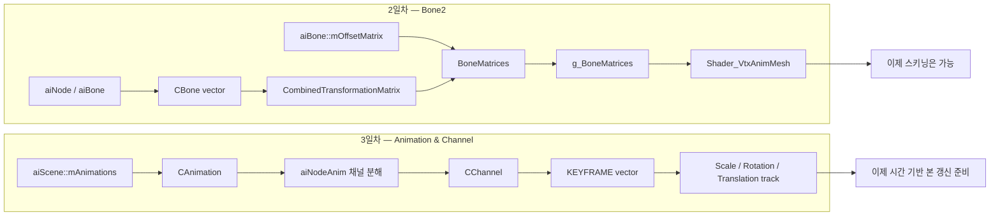

# 수업 복습용 리뷰 플랜 — 9개월차 2일차, 3일차 Animation & Channel

> 작성일: 2026-03-14
> 목적: 기존 Bone2 단계에서 이어진 3일차 Animation / Channel 수업 내용을 복습 중심으로 다시 정리하고, "데이터 준비 -> 스키닝 연결 -> 애니메이션 데이터 적재" 흐름까지 설명할 수 있도록 만드는 계획서

---

## 한눈에 보는 진행 흐름



---

## Part 1 — 이번 복습의 목표

- 2일차는 `OffsetMatrix`, `CombinedTransformationMatrix`, `g_BoneMatrices`가 어떻게 연결되는지 다시 설명할 수 있어야 한다.
- 3일차는 `aiAnimation`, `aiNodeAnim`, `KEYFRAME`가 엔진 구조로 어떻게 옮겨지는지 설명할 수 있어야 한다.
- 최종적으로는 "2일차는 스키닝 파이프라인 연결, 3일차는 애니메이션 데이터 적재 구조 추가"라고 한 문장으로 정리할 수 있어야 한다.
- 추가로, 현재 코드 기준으로 무엇이 구현되었고 무엇이 아직 미완성인지 구분할 수 있어야 한다.

---

## Part 2 — 2일차 핵심 재확인

### 2.1 2일차에서 이미 완성된 축

기존 `1일차_2일차 플랜` 기준으로 2일차 핵심은 이미 다음 단계까지 연결된 상태다.

```text
본 트리 생성
-> aiBone 이름을 모델 본 인덱스와 연결
-> OffsetMatrix 저장
-> CombinedTransformationMatrix 계산
-> 메쉬별 BoneMatrices 생성
-> Shader_VtxAnimMesh로 GPU 스키닝
```

즉 2일차 시점에서는,
"본이 정점을 움직일 수 있는 렌더 구조"가 이미 만들어져 있다.

### 2.2 2일차를 다시 짧게 잡고 가야 하는 이유

3일차는 Bone을 새로 배우는 날이 아니라,
2일차까지 만들어둔 스키닝 구조 위에
"시간에 따라 본이 어떻게 바뀌는가"를 올리기 시작하는 날이다.

그래서 3일차를 이해하려면 반드시 아래 두 문장을 기억해야 한다.

- `CBone`은 현재 본의 누적 행렬을 계산하는 객체다.
- `CMesh`는 그 본 행렬을 셰이더가 먹을 수 있는 `BoneMatrices`로 바꾸는 객체다.

### 2.3 2일차와 3일차의 경계

2일차까지는 사실상 아래와 같다.

```text
"현재 본 상태"를 GPU 스키닝에 전달할 수 있다.
```

3일차에서 새로 들어오는 것은 아래다.

```text
"그 현재 본 상태를 시간축에서 어디서 가져올 것인가"에 대한 데이터 구조
```

이 경계를 정확히 구분하는 것이 이번 복습의 핵심이다.

---

## Part 3 — 3일차 핵심 정리

### 3.1 3일차에서 무엇이 추가되었는가

| 파일 | 핵심 내용 |
|---|---|
| `Animation.h/cpp` | `aiAnimation`을 엔진용 `CAnimation`으로 옮기는 클래스 추가 |
| `Channel.h/cpp` | `aiNodeAnim`을 엔진용 `CChannel`과 `KEYFRAME` 벡터로 옮기는 클래스 추가 |
| `Engine_Struct.h` | `KEYFRAME` 구조체 추가 |
| `Model.h/cpp` | `m_Animations`, `Ready_Animations()` 추가 |
| `Engine.vcxproj*` | Animation / Channel 소스가 프로젝트에 등록됨 |

### 3.2 3일차의 본질

2일차가 "본을 셰이더까지 넘기는 날"이었다면,
3일차는 "애니메이션 파일 안의 시간 정보를 엔진 구조로 옮기는 날"이다.

즉 3일차의 핵심 흐름은 아래와 같다.

```text
aiScene
-> aiAnimation
-> aiNodeAnim(Channel)
-> 각 채널의 Position / Rotation / Scale Key
-> 엔진용 KEYFRAME 배열
```

### 3.3 왜 `Animation`과 `Channel`이 따로 필요한가

Assimp 기준으로 애니메이션 데이터는 계층이 나뉘어 있다.

```text
aiAnimation
  └─ 여러 개의 aiNodeAnim
       └─ 각 노드의 Position / Rotation / Scale 키 목록
```

이걸 그대로 엔진에 옮기면 아래처럼 된다.

```text
CAnimation
  └─ 여러 개의 CChannel
       └─ 여러 개의 KEYFRAME
```

역할을 구분하면 다음과 같다.

- `CAnimation`: 애니메이션 하나 전체를 대표한다.
- `CChannel`: 특정 본 또는 노드 하나의 시간축 변화를 들고 있다.
- `KEYFRAME`: 어떤 시점의 Scale / Rotation / Translation 값을 하나로 묶는다.

### 3.4 `KEYFRAME` 구조체의 의미

3일차에서 `Engine_Struct.h`에 새로 추가된 구조체는 아래 개념을 가진다.

```cpp
typedef struct tagKeyFrame
{
    XMFLOAT3 vScale;
    XMFLOAT4 vRotation;
    XMFLOAT3 vTranslation;
    float    fTrackPosition;
} KEYFRAME;
```

- `vScale`: 해당 시점의 스케일 값
- `vRotation`: 해당 시점의 회전 값, Quaternion 형태
- `vTranslation`: 해당 시점의 위치 값
- `fTrackPosition`: 이 키가 애니메이션 타임라인의 어느 위치에 있는지

여기서 중요한 포인트는,
3일차부터 엔진이 단순 Bone 행렬만 아는 상태를 넘어서
"시간축 위의 본 상태 후보들"을 저장할 수 있게 되었다는 점이다.

### 3.5 `CAnimation`이 하는 일

`CAnimation`은 `aiAnimation` 하나를 받아서
애니메이션 전체 메타데이터와 채널 목록을 엔진 쪽으로 정리한다.

핵심 멤버는 다음과 같다.

```cpp
_float  m_fDuration;
_float  m_fTickPerSecond;
_uint   m_iNumChannels;
vector<class CChannel*> m_Channels;
```

- `m_fDuration`: 전체 애니메이션 길이
- `m_fTickPerSecond`: 초당 몇 tick으로 재생되는지
- `m_Channels`: 이 애니메이션에 포함된 노드별 움직임 정보

즉 `CAnimation`은
"재생 전체 단위"를 관리하는 컨테이너라고 보면 된다.

### 3.6 `CAnimation::Initialize()` 흐름

```cpp
m_fDuration = pAIAnimation->mDuration;
m_fTickPerSecond = pAIAnimation->mTicksPerSecond;
m_iNumChannels = pAIAnimation->mNumChannels;

for (size_t i = 0; i < m_iNumChannels; i++)
{
    CChannel* pChannel = CChannel::Create(pAIAnimation->mChannels[i]);
    m_Channels.push_back(pChannel);
}
```

이 함수가 하는 일은 딱 세 가지다.

1. 애니메이션 전체 길이를 가져온다.
2. 재생 속도 기준인 tick 정보를 가져온다.
3. 각 채널을 `CChannel` 객체로 만들어 보관한다.

즉,
2일차의 `Ready_Bones()`가 "노드 계층을 엔진 본 배열로 옮기는 함수"였다면,
3일차의 `CAnimation::Initialize()`는 "애니메이션 계층을 엔진 애니메이션 구조로 옮기는 함수"라고 볼 수 있다.

### 3.7 `CChannel`의 의미

`CChannel`은 `aiNodeAnim` 하나를 엔진용으로 옮긴 객체다.

여기서 `aiNodeAnim`은 보통 "특정 노드 하나가 시간에 따라 어떻게 변하는가"를 담는다.
즉 본 관점으로 보면,
특정 본 하나의 위치/회전/스케일 타임라인이라고 이해하면 된다.

핵심 멤버는 아래다.

```cpp
vector<KEYFRAME> m_KeyFrames;
_uint            m_iNumKeyFrames;
```

즉 `CChannel`은
"한 본의 시간축 데이터 묶음"이라고 보면 된다.

### 3.8 `CChannel::Initialize()` 핵심

3일차에서 가장 중요한 코드 중 하나가 바로 이 부분이다.

```cpp
m_iNumKeyFrames = max(pAIChannel->mNumScalingKeys, pAIChannel->mNumRotationKeys);
m_iNumKeyFrames = max(m_iNumKeyFrames, pAIChannel->mNumPositionKeys);
```

이 의미는 다음과 같다.

- 스케일 키 개수
- 회전 키 개수
- 위치 키 개수

이 세 종류의 키 개수가 완전히 같다고 보장할 수 없으므로,
일단 가장 큰 개수를 기준으로 채널의 프레임 수를 잡는다.

그 뒤 각 인덱스마다 `KEYFRAME`을 하나 만들고,
현재 시점에서 들어있는 데이터를 채워 넣는다.

```cpp
if (pAIChannel->mNumScalingKeys > i)
{
    memcpy(&vScale, &pAIChannel->mScalingKeys[i].mValue, sizeof(_float3));
    KeyFrame.fTrackPosition = pAIChannel->mScalingKeys[i].mTime;
}
if (pAIChannel->mNumRotationKeys > i)
{
    memcpy(&vRotation, &pAIChannel->mRotationKeys[i].mValue, sizeof(_float4));
    KeyFrame.fTrackPosition = pAIChannel->mRotationKeys[i].mTime;
}
if (pAIChannel->mNumPositionKeys > i)
{
    memcpy(&vTranslation, &pAIChannel->mPositionKeys[i].mValue, sizeof(_float3));
    KeyFrame.fTrackPosition = pAIChannel->mPositionKeys[i].mTime;
}
```

그리고 마지막에

```cpp
KeyFrame.vScale = vScale;
KeyFrame.vRotation = vRotation;
KeyFrame.vTranslation = vTranslation;
```

형태로 묶어서 벡터에 저장한다.

### 3.9 왜 `Scale / Rotation / Translation`을 한 프레임으로 묶는가

애니메이션 계산 최종 목적은 결국 변환 행렬을 만드는 것이다.

변환 행렬은 보통 다음 세 요소에서 나온다.

```text
Scale
-> Rotation
-> Translation
```

그래서 3일차는
각 요소를 따로따로 흩어놓는 대신,
"같은 시간대의 변환 후보"라는 하나의 묶음으로 저장하는 쪽으로 구조를 잡은 것이다.

이 구조가 있어야 다음 단계에서 아래가 가능해진다.

- 현재 재생 시간을 기준으로 앞뒤 키를 찾고
- Position은 Lerp
- Rotation은 Slerp
- Scale은 Lerp
- 그 결과를 행렬로 합쳐서 Bone Local Transform 갱신

즉 3일차는 보간 직전까지 가는 준비 단계라고 볼 수 있다.

### 3.10 `Model`에서 새로 들어온 것

3일차 `Model.h/cpp`에는 애니메이션 보관용 멤버가 추가된다.

```cpp
_uint m_iNumAnimations = {};
vector<class CAnimation*> m_Animations;
```

그리고 초기화 단계에 아래가 추가된다.

```cpp
if (FAILED(Ready_Animations()))
    return E_FAIL;
```

즉 모델 생성 흐름이 이제 아래처럼 확장된다.

```text
ReadFile
-> Ready_Bones
-> Ready_Meshes
-> Ready_Materials
-> Ready_Animations
```

이 말은 곧,
모델이 이제 단순히 본과 메쉬만 가진 객체가 아니라
"애니메이션 데이터까지 품고 있는 객체"로 확장되었다는 뜻이다.

### 3.11 `Ready_Animations()`가 하는 일

```cpp
m_iNumAnimations = m_pAIScene->mNumAnimations;

for (size_t i = 0; i < m_iNumAnimations; i++)
{
    CAnimation* pAnimation = CAnimation::Create(m_pAIScene->mAnimations[i]);
    m_Animations.push_back(pAnimation);
}
```

여기서 핵심은 매우 단순하다.

- Assimp가 읽어온 `aiScene` 안에는 `mAnimations`가 있다.
- 3일차부터는 이 배열을 무시하지 않고 엔진 객체로 복사한다.

즉 2일차까지는 `aiScene`의 애니메이션 정보가 사실상 안 쓰이고 있었다면,
3일차부터는 그 데이터를 엔진 쪽 메모리 구조로 정리하기 시작한 것이다.

### 3.12 `Play_Animation()`의 현재 상태

이 부분이 복습할 때 가장 중요하다.

함수 이름은 `Play_Animation()`이지만,
현재 코드에서는 아직 `m_Animations`나 `CChannel`을 실제로 사용하지 않는다.

현재 구현은 사실상 아래 수준이다.

```cpp
for (auto& pBone : m_Bones)
    pBone->Update_CombinedTransformationMatrix(...);
```

즉 현재 단계는

- Animation 데이터는 로드한다.
- Channel과 KeyFrame도 만든다.
- 하지만 그 데이터를 이용해 본의 Local Transform을 시간에 따라 바꾸지는 않는다.

이 점을 반드시 기억해야 한다.

> [!IMPORTANT]
> 3일차는 "애니메이션 재생 완성"이 아니라 "애니메이션 데이터 구조 추가" 단계다.

### 3.13 그래서 3일차가 실제로 추가한 것은 무엇인가

정리하면 3일차가 추가한 실질 가치는 아래다.

```text
1. 모델이 애니메이션 목록을 가질 수 있게 됨
2. 애니메이션 하나가 여러 채널을 가진다는 구조가 생김
3. 채널 하나가 여러 키프레임을 가진다는 구조가 생김
4. 각 키프레임이 S/R/T와 트랙 위치를 저장할 수 있게 됨
5. 다음 단계의 보간 / 재생 / 상태머신 연결을 위한 기반이 생김
```

---

## Part 4 — 2일차와 3일차 비교 정리

| 구분 | 2일차 Bone2 | 3일차 Animation & Channel |
|---|---|---|
| 초점 | 스키닝 렌더 파이프라인 연결 | 애니메이션 시간 데이터 구조 적재 |
| 핵심 객체 | `CBone`, `CMesh`, `CModel`, `Shader_VtxAnimMesh` | `CAnimation`, `CChannel`, `KEYFRAME`, `CModel` |
| 입력 데이터 | `aiNode`, `aiBone`, `aiMesh` | `aiAnimation`, `aiNodeAnim` |
| 결과 | GPU가 본 행렬로 정점을 움직일 수 있음 | 엔진이 시간축 애니메이션 데이터를 저장할 수 있음 |
| 아직 없는 것 | 키프레임 보간 | 실제 본 Transform 갱신 연결 |
| 상태 | 스키닝 가능 | 재생 준비 단계 |

### 4.1 한 문장으로 구분하면

```text
2일차는 "본을 GPU에 먹이는 날"이고,
3일차는 "그 본이 시간에 따라 어떻게 바뀔지 저장하는 날"이다.
```

---

## Part 5 — 반드시 이해해야 하는 흐름

### 5.1 Assimp 기준 데이터 구조

```text
aiScene
├─ mRootNode
├─ mMeshes
├─ mMaterials
└─ mAnimations
    ├─ aiAnimation[0]
    │   ├─ Duration
    │   ├─ TicksPerSecond
    │   └─ aiNodeAnim[]
    └─ ...
```

### 5.2 엔진 기준 데이터 구조

```text
CModel
├─ m_Bones
├─ m_Meshes
├─ m_Materials
└─ m_Animations
    ├─ CAnimation[0]
    │   └─ m_Channels
    │       ├─ CChannel[0]
    │       │   └─ m_KeyFrames
    │       └─ ...
    └─ ...
```

### 5.3 지금 시점 전체 파이프라인

```text
FBX 로드
-> aiScene 생성
-> Bone / Mesh / Material 생성
-> Animation / Channel / KeyFrame 생성
-> 아직은 기존 Bone Transform 기준으로 Combined 갱신
-> Mesh가 BoneMatrices 생성
-> Shader가 스키닝 수행
```

즉 3일차 이후 현재 상태를 한 줄로 말하면 아래와 같다.

```text
렌더링 파이프라인은 이미 있고, 이제 애니메이션 원본 데이터도 메모리에 올라왔다.
```

---

## Part 6 — 복습 플랜 계획서

### 6.1 1차 복습 — 구조 복원 (30분)

목표: 2일차와 3일차의 역할 경계를 분명히 잡는 것

- `CBone`, `CAnimation`, `CChannel`, `KEYFRAME`를 각각 한 줄로 정의한다.
- `aiBone`과 `aiNodeAnim`의 차이를 노트에 적는다.
- "2일차는 GPU 연결, 3일차는 시간 데이터 적재" 문장을 직접 다시 써본다.

### 6.2 2차 복습 — 코드 추적 (40분)

목표: 3일차 코드가 실제 어디에 붙었는지 보는 것

복습 순서:

```text
Model::Initialize_Prototype
-> Ready_Bones
-> Ready_Meshes
-> Ready_Materials
-> Ready_Animations
-> Animation::Initialize
-> Channel::Initialize
-> Play_Animation
```

- `Ready_Animations()`가 정확히 언제 호출되는지 확인한다.
- `CAnimation`이 `Duration`, `TicksPerSecond`, `Channels`를 어떻게 보관하는지 체크한다.
- `CChannel`이 왜 `KEYFRAME` 벡터를 가지는지 설명해본다.

### 6.3 3차 복습 — 말로 설명하기 (30분)

목표: 누군가에게 흐름을 설명할 수 있을 정도로 정리하는 것

아래 문장을 막힘 없이 설명할 수 있어야 한다.

```text
2일차에는 Bone 행렬을 셰이더까지 넘기는 구조가 완성되었고,
3일차에는 aiAnimation과 aiNodeAnim을 엔진의 Animation, Channel, KeyFrame 구조로 옮겨서
이제 시간 기반 본 갱신을 붙일 준비가 되었다.
```

### 6.4 4차 복습 — 다음 단계 예측하기 (20분)

- [ ] `Play_Animation()`이 앞으로 무엇을 해야 하는지 설명할 수 있는가?
- [ ] `CChannel`의 `KEYFRAME` 두 개를 이용해 보간이 왜 필요한지 설명할 수 있는가?
- [ ] `Quaternion` 회전에 왜 `Slerp`가 자주 쓰이는지 알고 있는가?
- [ ] 왜 3일차만으로는 아직 "재생된다"고 말하기 어려운지 설명할 수 있는가?

---

## Part 7 — 헷갈리기 쉬운 포인트 정리

### 7.1 `aiBone`과 `aiNodeAnim`은 같은가?

아니다.

- `aiBone`은 메쉬 스키닝과 연결되는 본 영향 정보다.
- `aiNodeAnim`은 특정 노드의 시간 기반 키프레임 정보다.

즉 하나는 "누가 정점을 움직이느냐"에 가깝고,
다른 하나는 "그 본이 시간에 따라 어떻게 변하느냐"에 가깝다.

### 7.2 `CAnimation`이 생겼으면 바로 애니메이션이 재생되는가?

아직 아니다.

현재 3일차 코드에서는
`CAnimation`, `CChannel`, `KEYFRAME`를 만들고 보관하지만,
그 값을 실제 `CBone`의 로컬 변환에 반영하는 로직은 아직 없다.

### 7.3 `KEYFRAME` 하나가 곧 최종 본 행렬인가?

아니다.

`KEYFRAME`은 행렬이 아니라
행렬을 만들기 위한 재료 묶음이다.

```text
Scale / Rotation / Translation
-> 보간
-> 행렬 생성
-> Bone Local Transform 갱신
-> CombinedTransform 계산
-> Offset과 곱해서 최종 BoneMatrix 생성
```

### 7.4 왜 3일차에 굳이 `Duration`, `TicksPerSecond`를 저장하는가?

실제 재생 시간 계산을 하려면
"현재 몇 초가 애니메이션 트랙에서 몇 tick인가"를 계산해야 하기 때문이다.

즉 이 값들은 다음 단계에서 아래 계산의 기반이 된다.

```text
누적 시간
-> tick 변환
-> 현재 트랙 위치 계산
-> 현재 키프레임 구간 탐색
```

### 7.5 `Channel`이 본 이름을 직접 들고 있지 않아도 되는가?

현재 코드상 최소 구현은 키 배열 적재 중심이다.
다음 단계에서는 보통
"이 채널이 어떤 본 / 노드에 대응되는가"를 추가로 연결해야 실제 재생이 가능해진다.

즉 3일차는 구조를 여는 단계고,
매핑과 재생 상태 관리는 다음 단계 주제가 될 가능성이 높다.

---

## Part 8 — 최종 체크리스트

### 2일차 체크

- [ ] `OffsetMatrix * CombinedTransformationMatrix`를 설명할 수 있다.
- [ ] 왜 `Bind_BoneMatrices()`가 메쉬 단위인지 이해했다.
- [ ] 스키닝 셰이더가 정점을 어떻게 움직이는지 설명할 수 있다.

### 3일차 체크

- [ ] `aiAnimation -> CAnimation` 변환 흐름을 이해했다.
- [ ] `aiNodeAnim -> CChannel` 변환 흐름을 이해했다.
- [ ] `KEYFRAME`이 왜 필요한지 설명할 수 있다.
- [ ] `Duration`과 `TicksPerSecond`의 의미를 설명할 수 있다.
- [ ] 현재 `Play_Animation()`이 실제 키프레임 재생까지는 하지 않는다는 점을 이해했다.

### 최종 목표 체크

- [ ] "2일차는 스키닝 연결, 3일차는 애니메이션 데이터 구조 추가"라고 정리할 수 있다.
- [ ] 다음 단계로 무엇이 남았는지 말할 수 있다: 현재 시간 계산, 채널-본 매핑, 키프레임 보간, 본 로컬 변환 갱신, 실제 재생 상태 제어

---

## 부록 — 한 문장 요약

```text
2일차는 Bone을 셰이더 스키닝까지 연결한 날이고,
3일차는 aiAnimation과 aiNodeAnim을 엔진의 Animation / Channel / KeyFrame 구조로 옮겨
실제 시간 기반 애니메이션 재생을 붙일 준비를 시작한 날이다.
```
