# 수업 복습용 리뷰 플랜 — 9개월차 3일차, 4일차 Animation & Channel2

> 작성일: 2026-03-16
> 목적: 3일차에 추가된 `Animation / Channel / KEYFRAME` 데이터 구조가 4일차에 어떻게 실제 본 재생 로직으로 연결되었는지 복습 중심으로 다시 정리하고, "데이터 적재 -> 현재 시간 계산 -> 키프레임 보간 -> 본 행렬 갱신" 흐름까지 설명할 수 있도록 만드는 계획서

---

## 한눈에 보는 진행 흐름

```mermaid
graph LR
  subgraph "3일차 — Animation & Channel"
    A[aiScene::mAnimations] --> B[CAnimation]
    B --> C[aiNodeAnim]
    C --> D[CChannel]
    D --> E[KEYFRAME vector]
    E --> F[Scale / Rotation / Translation 저장]
  end

  subgraph "4일차 — Animation & Channel2"
    G[fTimeDelta] --> H[m_fCurrentTrackPosition]
    H --> I[현재 키프레임 구간 탐색]
    I --> J[Lerp / Slerp 보간]
    J --> K[Bone Local Transform 갱신]
    K --> L[CombinedTransformationMatrix]
    L --> M[BoneMatrices]
    M --> N[g_BoneMatrices]
    N --> O[Shader_VtxAnimMesh]
  end

  F --> G
  O --> P[이제 실제 시간 기반 재생 시작]
```



---

## Part 1 — 이번 복습의 목표

- 3일차는 `CAnimation`, `CChannel`, `KEYFRAME`가 왜 필요한지 다시 설명할 수 있어야 한다.
- 4일차는 `fTimeDelta`가 어떻게 `CurrentTrackPosition`으로 바뀌고, 그 값이 어떻게 키프레임 보간에 쓰이는지 설명할 수 있어야 한다.
- `Channel -> Bone 매핑`, `Lerp / Slerp`, `Local Transform 갱신`, `Combined 갱신`의 순서를 끊기지 않고 설명할 수 있어야 한다.
- 최종적으로는 "3일차는 애니메이션 데이터를 메모리에 올린 날, 4일차는 그 데이터를 이용해 실제 본을 움직이기 시작한 날"이라고 한 문장으로 정리할 수 있어야 한다.

---

## Part 2 — 3일차 핵심 재확인

### 2.1 3일차에서 만들어둔 기반

기존 `2일차_3일차 플랜` 기준으로 3일차는 아래까지 준비한 상태였다.

```text
aiScene::mAnimations 읽기
-> CAnimation 생성
-> aiNodeAnim을 CChannel로 변환
-> Position / Rotation / Scale 키를 KEYFRAME으로 저장
-> 모델이 Animation 목록을 보관
```

즉 3일차 시점에서는
"애니메이션 원본 데이터가 엔진 메모리 구조에 올라온 상태"라고 볼 수 있다.

### 2.2 3일차에서 아직 없었던 것

3일차 문서에서 가장 중요했던 문장은 아래였다.

```text
Animation 데이터는 로드하지만,
그 데이터를 실제 Bone Local Transform에 반영하지는 않는다.
```

즉 3일차의 `Play_Animation()`은 이름과 달리
실제로는 기존 Bone의 `CombinedTransformationMatrix`를 갱신하는 정도에 가까웠다.

### 2.3 그래서 4일차가 필요한 이유

애니메이션 재생이 되려면 최소한 아래 단계가 더 필요하다.

```text
현재 시간 계산
-> 어떤 키프레임 구간인지 찾기
-> 앞뒤 키프레임 보간
-> Bone의 Local Transform 바꾸기
-> 다시 Combined 계산하기
```

4일차는 바로 이 빠져 있던 연결부를 붙이는 날이다.

---

## Part 3 — 4일차 핵심 정리

### 3.1 4일차에서 무엇이 추가되었는가

| 파일 | 핵심 내용 |
|---|---|
| `Animation.h/cpp` | 현재 트랙 위치 저장, 시간 누적, 채널 갱신, 루프/종료 처리 추가 |
| `Channel.h/cpp` | Channel과 Bone 연결, 현재 키 인덱스 저장, 키프레임 보간, Bone Transform 갱신 추가 |
| `Bone.h/cpp` | `Update_TransformationMatrix()` 추가 |
| `Model.h/cpp` | `Set_Animation()`, `Play_Animation()` 반환값, 현재 애니메이션 선택/루프 상태 추가 |
| `Monster.cpp` | 시작 시 애니메이션 지정, 매 프레임 재생 결과 받기 |

### 3.2 4일차의 본질

3일차가 "애니메이션 파일 구조를 엔진 객체로 옮기는 날"이었다면,
4일차는 "그 구조를 실제 본 갱신과 연결하는 날"이다.

핵심 흐름은 아래처럼 확장된다.

```text
fTimeDelta
-> 현재 트랙 위치 누적
-> 각 Channel이 현재 구간의 KeyFrame 찾기
-> Scale / Rotation / Translation 보간
-> Bone Local Transform 갱신
-> Bone CombinedTransform 다시 계산
-> Mesh가 BoneMatrices 생성
-> Shader가 실제 스키닝 수행
```

### 3.3 `CAnimation`에서 새로 생긴 것

4일차 `Animation.h`에는 아래 멤버와 함수가 추가된다.

```cpp
_float m_fCurrentTrackPosition = {};
_bool  Update_TransformationMatrices(_float fTimeDelta, const vector<class CBone*>& Bones, _bool isLoop);
```

의미는 다음과 같다.

- `m_fCurrentTrackPosition`: 현재 애니메이션 트랙에서 몇 tick 위치에 있는지
- `Update_TransformationMatrices()`: 누적 시간 계산 후, 모든 채널에 현재 위치를 전달하는 함수

즉 `CAnimation`이 이제 단순 컨테이너가 아니라
"현재 재생 중인 위치"를 알고 실제 갱신을 시작하는 객체가 된다.

### 3.4 `CAnimation::Update_TransformationMatrices()` 흐름

```cpp
m_fCurrentTrackPosition += m_fTickPerSecond * fTimeDelta;

if (m_fCurrentTrackPosition >= m_fDuration)
{
    if (false == isLoop)
        return true;

    m_fCurrentTrackPosition = 0.f;
}

for (auto& pChannel : m_Channels)
    pChannel->Update_TransformationMatrix(m_fCurrentTrackPosition, Bones);
```

이 함수가 하는 일은 네 단계다.

1. `fTimeDelta`를 tick 단위 트랙 위치로 변환한다.
2. 애니메이션 길이를 넘었는지 검사한다.
3. 루프면 0으로 돌리고, 비루프면 종료 신호를 반환한다.
4. 모든 채널에게 "지금 위치는 여기다"라고 알려준다.

### 3.5 왜 `TicksPerSecond`가 여기서 진짜 중요해지는가

3일차에서는 `Duration`, `TicksPerSecond`를 저장만 했다.
4일차부터는 그 값이 실제 계산에 쓰인다.

```text
초 단위 프레임 시간
-> tick 단위 재생 위치
-> 애니메이션 내부 타임라인 좌표
```

즉 4일차부터 `TicksPerSecond`는 단순 메타데이터가 아니라
실제 재생 속도를 결정하는 값이 된다.

### 3.6 `Channel`이 이제 Bone과 연결된다

4일차 `Channel::Initialize()`는 아래처럼 바뀐다.

```cpp
m_iBoneIndex = pModel->Get_BoneIndex(pAIChannel->mNodeName.data);
```

이 부분이 매우 중요하다.

3일차까지는 `CChannel`이 "키프레임 묶음"이었다면,
4일차부터는 "어느 Bone을 움직여야 하는 채널인지 아는 객체"가 된다.

즉 연결 관계가 아래처럼 완성된다.

```text
aiNodeAnim
-> CChannel
-> Bone 이름 매칭
-> m_iBoneIndex 확보
-> 실제 Bone Transform 갱신 가능
```

### 3.7 `Channel`의 새 멤버 의미

4일차 `Channel.h`에는 아래 멤버가 추가된다.

```cpp
_uint m_iCurrentKeyFrameIndex = { 0 };
_int  m_iBoneIndex = { -1 };
```

- `m_iCurrentKeyFrameIndex`: 현재 어느 키 구간을 보고 있는지
- `m_iBoneIndex`: 이 채널이 갱신해야 할 Bone 인덱스

여기서 핵심은,
이제 `Channel`이 단순 데이터 보관함이 아니라
"현재 진행도와 대상 Bone"을 둘 다 가진 실행 객체가 되었다는 점이다.

### 3.8 `CChannel::Update_TransformationMatrix()`가 하는 일

4일차에서 가장 핵심적인 함수는 바로 이 함수다.

큰 흐름은 아래와 같다.

```text
현재 트랙 위치 확인
-> 마지막 키 이후인지 검사
-> 아니면 현재 키 구간 찾기
-> 보간 비율 계산
-> Scale / Rotation / Translation 보간
-> 최종 로컬 행렬 생성
-> 대상 Bone에 반영
```

### 3.9 마지막 키프레임 처리

```cpp
if (fCurrentTrackPosition >= LastKeyFrame.fTrackPosition)
{
    vScale = XMLoadFloat3(&LastKeyFrame.vScale);
    vRotation = XMLoadFloat4(&LastKeyFrame.vRotation);
    vTranslation = XMVectorSetW(XMLoadFloat3(&LastKeyFrame.vTranslation), 1.f);
}
```

이 처리는
"현재 시간이 마지막 키를 넘어갔으면 마지막 자세를 그대로 유지한다"는 의미다.

즉 마지막 키 이후에는 더 이상 보간하지 않고
최종 포즈를 그대로 쓴다.

### 3.10 중간 키프레임 보간

사이 구간에 있으면 현재 인덱스를 앞으로 밀어준다.

```cpp
while (fCurrentTrackPosition >= m_KeyFrames[m_iCurrentKeyFrameIndex + 1].fTrackPosition)
    ++m_iCurrentKeyFrameIndex;
```

그다음 비율을 계산한다.

```cpp
fRatio =
    (현재시간 - 왼쪽키시간) /
    (오른쪽키시간 - 왼쪽키시간)
```

즉 `fRatio`는 현재가 두 키 사이에서 몇 퍼센트 진행됐는지를 나타낸다.

### 3.11 왜 `m_iCurrentKeyFrameIndex`를 따로 저장하는가

매 프레임마다 처음부터 키 전체를 다시 찾으면 비효율적이다.

애니메이션은 보통 시간이 앞으로만 흐르므로,
현재 키 인덱스를 기억해두면 다음 프레임에서는
그 근처부터 이어서 볼 수 있다.

즉 4일차는 단순 동작만 붙인 것이 아니라,
최소한의 순방향 재생 최적화도 함께 들어간 셈이다.

### 3.12 S / R / T 보간 방식

```cpp
vScale = XMVectorLerp(vLeftScale, vRightScale, fRatio);
vRotation = XMQuaternionSlerp(vLeftRotation, vRightRotation, fRatio);
vTranslation = XMVectorLerp(vLeftTranslation, vRightTranslation, fRatio);
```

각각의 이유는 아래와 같다.

- `Scale`: 선형 보간 `Lerp`
- `Translation`: 선형 보간 `Lerp`
- `Rotation`: Quaternion 회전이므로 `Slerp`

이 차이를 반드시 기억해야 한다.

> [!IMPORTANT]
> 4일차 핵심은 "모든 값을 같은 방식으로 보간하지 않는다"는 점이다.
> 회전은 Quaternion 특성 때문에 `Slerp`가 필요하다.

### 3.13 최종 Bone 로컬 행렬 생성

보간이 끝나면 아래 코드로 최종 행렬을 만든다.

```cpp
_matrix BoneTransformationMatrix =
    XMMatrixAffineTransformation(
        vScale,
        XMVectorSet(0.f, 0.f, 0.f, 1.f),
        vRotation,
        vTranslation);
```

즉 4일차는
"저장된 키값"을 "실제 Bone이 먹을 행렬"로 바꾸는 단계까지 도달한다.

### 3.14 `CBone::Update_TransformationMatrix()`

4일차 `Bone.cpp`에는 아래 함수가 추가된다.

```cpp
void CBone::Update_TransformationMatrix(_fmatrix TransformMatrix)
{
    XMStoreFloat4x4(&m_TransformationMatrix, TransformMatrix);
}
```

이 의미는 단순하지만 매우 중요하다.

이제 `CBone`의 로컬 변환은 더 이상
초기 Assimp 노드값에만 머무르지 않고,
애니메이션 채널이 계산한 결과로 매 프레임 바뀔 수 있다.

### 3.15 `CModel::Play_Animation()`의 의미 변화

3일차까지의 `Play_Animation()`은 사실상 Combined 계산 함수에 가까웠다.
4일차에는 아래처럼 바뀐다.

```cpp
isFinish = m_Animations[m_iCurrentAnimIndex]->
    Update_TransformationMatrices(fTimeDelta, m_Bones, m_isAnimLoop);

for (auto& pBone : m_Bones)
    pBone->Update_CombinedTransformationMatrix(...);
```

즉 흐름이 분명해진다.

```text
1. Animation이 각 Bone의 로컬 변환을 바꾼다.
2. 그 다음 모든 Bone이 Combined를 다시 계산한다.
```

이 순서가 매우 중요하다.
로컬을 먼저 바꾸지 않으면 Combined는 옛 값으로 계산된다.

### 3.16 `Set_Animation()`이 왜 필요한가

`Model.h`에는 아래 함수가 추가된다.

```cpp
void Set_Animation(_uint iIndex, _bool isLoop)
{
    m_iCurrentAnimIndex = iIndex;
    m_isAnimLoop = isLoop;
}
```

이 함수는 현재 단계에서는 단순해 보이지만,
애니메이션 시스템이 "어떤 애니메이션을 재생할지"를 외부에서 지정할 수 있게 만드는 첫 인터페이스다.

즉 4일차부터는 모델이
"애니메이션 데이터를 가지고 있음"을 넘어서
"지금 어떤 애니메이션을 재생 중인지"라는 상태를 갖기 시작한다.

### 3.17 `Play_Animation()` 반환값의 의미

4일차부터 `Play_Animation()`은 `_bool`을 반환한다.

이 값은 현재 애니메이션이 끝났는지 여부를 뜻한다.

```cpp
if (m_fCurrentTrackPosition >= m_fDuration)
{
    if (false == isLoop)
        return true;
}
```

즉 비루프 애니메이션이면
끝났다는 신호를 밖으로 올려줄 수 있다.

이 구조는 다음 단계에서 아래 용도로 이어질 수 있다.

- 공격 애니메이션 종료 판정
- 다음 애니메이션 전환
- 상태머신 이벤트 트리거

### 3.18 `Monster`에서 실제 사용 시작

`Monster.cpp`에서는 초기화 때 아래가 추가된다.

```cpp
m_pModelCom->Set_Animation(0, true);
```

그리고 업데이트 때 아래처럼 바뀐다.

```cpp
if (true == m_pModelCom->Play_Animation(fTimeDelta))
    int a = 10;
```

즉 4일차부터 클라이언트 오브젝트는
"모델이 애니메이션을 재생하도록 요청"하기 시작한다.

비록 지금은 종료 시점에 임시 코드만 있지만,
구조상으로는 이미 "재생 결과를 받아 다음 로직으로 넘길 수 있는 상태"가 된 것이다.

### 3.19 그래서 4일차가 실제로 추가한 것

정리하면 4일차의 실질 가치는 아래다.

```text
1. 현재 재생 시간 개념이 생김
2. Channel이 Bone을 직접 찾을 수 있게 됨
3. 키프레임 사이를 실제로 보간함
4. 보간 결과를 Bone Local Transform에 반영함
5. 그 뒤 CombinedTransform을 다시 계산함
6. 이제 스키닝 결과가 시간에 따라 실제로 변하기 시작함
```

---

## Part 4 — 3일차와 4일차 비교 정리

| 구분 | 3일차 Animation & Channel | 4일차 Animation & Channel2 |
|---|---|---|
| 초점 | 애니메이션 데이터 구조 적재 | 실제 시간 기반 본 재생 연결 |
| 핵심 객체 | `CAnimation`, `CChannel`, `KEYFRAME` | `CAnimation`, `CChannel`, `CBone`, `CModel` |
| 새 정보 | Duration, TicksPerSecond, KeyFrame 저장 | CurrentTrackPosition, BoneIndex, CurrentKeyFrameIndex |
| 처리 수준 | 메모리 적재 | 보간 + 로컬 변환 갱신 + Combined 재계산 |
| `Play_Animation()` 상태 | 사실상 재생 준비 | 실제 재생 1차 완성 |
| 남은 과제 | 보간 / 연결 | 상태 전이, 다중 애니메이션, 블렌딩 |

### 4.1 한 문장으로 구분하면

```text
3일차는 "애니메이션을 저장하는 날"이고,
4일차는 "저장한 애니메이션으로 본을 실제로 움직이는 날"이다.
```

---

## Part 5 — 반드시 이해해야 하는 전체 흐름

### 5.1 Assimp 기준

```text
aiScene
└─ aiAnimation
   └─ aiNodeAnim
      └─ Position / Rotation / Scale Keys
```

### 5.2 엔진 기준

```text
CModel
└─ CAnimation
   └─ CChannel
      └─ KEYFRAME
         └─ 보간
            └─ CBone::m_TransformationMatrix
               └─ CBone::m_CombinedTransformationMatrix
                  └─ CMesh::BoneMatrices
                     └─ Shader_VtxAnimMesh
```

### 5.3 지금 시점 실제 파이프라인

```text
fTimeDelta
-> Animation current track position 증가
-> Channel이 현재 키 구간 찾기
-> S / R / T 보간
-> Bone local transform 갱신
-> Bone combined transform 갱신
-> OffsetMatrix와 곱해서 BoneMatrix 생성
-> Shader가 정점 스키닝
```

### 5.4 핵심 문장으로 외워야 하는 흐름

```text
4일차는 채널이 현재 트랙 위치를 기준으로 키프레임을 보간해서
각 Bone의 Local Transform을 바꾸고,
그 결과를 다시 CombinedTransform으로 누적해 실제 스키닝 재생으로 이어지게 만든 단계다.
```

---

## Part 6 — 복습 플랜 계획서

### 6.1 1차 복습 — 역할 경계 복원 (30분)

목표: 3일차와 4일차의 차이를 정확히 나누는 것

- `CAnimation`, `CChannel`, `CBone`, `KEYFRAME`를 각각 한 줄로 정의한다.
- "3일차는 저장, 4일차는 재생" 문장을 직접 써본다.
- `CurrentTrackPosition`, `CurrentKeyFrameIndex`, `BoneIndex`를 각각 왜 저장하는지 적는다.

### 6.2 2차 복습 — 코드 추적 (45분)

목표: 실제 재생 흐름을 함수 기준으로 따라가는 것

복습 순서:

```text
Monster::Initialize
-> Model::Set_Animation
-> Monster::Update
-> Model::Play_Animation
-> Animation::Update_TransformationMatrices
-> Channel::Update_TransformationMatrix
-> Bone::Update_TransformationMatrix
-> Bone::Update_CombinedTransformationMatrix
-> Mesh::Bind_BoneMatrices
```

- 어느 함수가 "현재 시간 계산"을 하는지 체크한다.
- 어느 함수가 "보간"을 하는지 체크한다.
- 어느 함수가 "Bone Local"을 바꾸고, 어느 함수가 "Combined"를 바꾸는지 구분한다.

### 6.3 3차 복습 — 수식과 보간 이해 (30분)

목표: 보간 공식을 말로 설명할 수 있게 만드는 것

- `fRatio` 계산식을 직접 적어본다.
- 왜 `Scale / Translation`은 `Lerp`이고 `Rotation`은 `Slerp`인지 설명해본다.
- 마지막 키프레임 이후에는 왜 마지막 상태를 유지하는지 설명해본다.

### 6.4 4차 복습 — 말로 설명하기 (30분)

목표: 누군가에게 끊기지 않고 설명할 수 있는지 확인하는 것

아래 문장을 막힘 없이 설명할 수 있어야 한다.

```text
3일차에 애니메이션 데이터를 Animation / Channel / KeyFrame 구조로 올려두고,
4일차에는 현재 재생 시간을 기준으로 각 Channel이 키프레임을 보간해서
Bone의 Local Transform을 갱신한 뒤,
다시 CombinedTransform과 BoneMatrices를 계산해 실제 스키닝 재생으로 연결했다.
```

### 6.5 5차 복습 — 다음 단계 예측 (20분)

- [ ] 애니메이션이 끝났을 때 다음 상태로 넘기려면 어디를 확장해야 하는가?
- [ ] 여러 애니메이션 사이 전환을 하려면 무엇이 더 필요할까?
- [ ] 현재 구조에서 애니메이션 블렌딩이 어려운 이유는 무엇인가?
- [ ] 루트 모션이나 이벤트 노티파이는 어떤 계층에 붙는 것이 자연스러운가?

---

## Part 7 — 헷갈리기 쉬운 포인트 정리

### 7.1 `CurrentTrackPosition`과 `CurrentKeyFrameIndex`는 같은가?

아니다.

- `CurrentTrackPosition`: 전체 애니메이션 타임라인에서 현재 시간 위치
- `CurrentKeyFrameIndex`: 현재 보고 있는 키 구간의 왼쪽 키 인덱스

즉 하나는 "시간",
다른 하나는 "배열 위치"다.

### 7.2 왜 `Channel`에서 Bone 이름을 바로 인덱스로 바꾸는가?

실제 재생 때는 매 프레임 빠르게 Bone을 찾아야 한다.

이름 비교를 매번 하면 느리고 번거롭기 때문에,
초기화 때 한 번 `m_iBoneIndex`로 바꿔두는 것이 훨씬 효율적이다.

### 7.3 `KEYFRAME`이 곧 최종 BoneMatrix인가?

아니다.

`KEYFRAME`은 여전히 재료 묶음이다.

```text
KEYFRAME
-> 보간
-> Local Transform Matrix
-> CombinedTransform
-> OffsetMatrix와 곱
-> 최종 BoneMatrix
```

즉 4일차는 `KEYFRAME -> Local Matrix` 단계가 추가된 것이다.

### 7.4 왜 Local Transform을 먼저 갱신하고 Combined를 나중에 계산하는가?

Combined는 부모부터 누적된 결과라서,
현재 프레임의 Local 값이 먼저 확정되어야 올바른 누적 결과가 나온다.

순서를 바꾸면 이전 프레임 값이 섞일 수 있다.

### 7.5 마지막 키프레임 이후에도 왜 값이 유지되는가?

트랙 끝을 넘어섰다고 해서
바로 쓰레기 값이 되면 안 된다.

그래서 마지막 자세를 유지한 뒤,
루프 여부에 따라 0으로 돌아가거나 종료 처리한다.

### 7.6 `Play_Animation()`이 이제 완전히 완성된 시스템인가?

아직 아니다.

4일차는 "단일 애니메이션 재생 1차 완성"에 가깝다.
아직 아래 요소들은 남아 있다.

- 다중 애니메이션 전환
- 상태머신 연결
- 블렌딩
- 재생 속도 조절
- 이벤트 노티파이
- 루트 모션 분리

### 7.7 루프와 종료 신호는 왜 둘 다 필요한가?

모든 애니메이션이 반복되면 안 된다.

- Idle, Run은 보통 루프
- Attack, Hit, Die는 보통 비루프

그래서 4일차 구조는
"루프 애니메이션은 자동 반복"
"비루프 애니메이션은 끝났다는 신호 반환"
을 분리할 수 있게 만든 것이다.

### 7.8 현재 샘플 코드에서 주의해서 볼 점

`Monster.cpp`에는 테스트용으로 보이는 임시 코드가 있다.

- `Set_Animation(0, true)`로 0번 애니메이션을 고정 재생
- 종료 시 `int a = 10;` 같은 임시 디버그 코드 존재

즉 구조는 연결되었지만,
실제 게임 로직까지 다듬어진 최종 상태는 아니라는 점을 기억해야 한다.

---

## Part 8 — 최종 체크리스트

### 3일차 체크

- [ ] `aiAnimation -> CAnimation` 변환 흐름을 이해했다.
- [ ] `aiNodeAnim -> CChannel` 변환 흐름을 이해했다.
- [ ] `KEYFRAME`이 왜 필요한지 설명할 수 있다.
- [ ] 3일차가 아직 실제 재생 단계는 아니었다는 점을 이해했다.

### 4일차 체크

- [ ] `fTimeDelta * TickPerSecond`가 왜 필요한지 설명할 수 있다.
- [ ] `CurrentTrackPosition`의 의미를 설명할 수 있다.
- [ ] `Channel`이 Bone 인덱스를 왜 가져야 하는지 설명할 수 있다.
- [ ] `CurrentKeyFrameIndex`를 왜 캐싱하는지 설명할 수 있다.
- [ ] `Lerp`와 `Slerp`의 차이를 설명할 수 있다.
- [ ] 보간 결과가 어떻게 Bone Local Transform으로 들어가는지 설명할 수 있다.
- [ ] 그 다음 왜 CombinedTransform을 다시 계산해야 하는지 설명할 수 있다.
- [ ] `Play_Animation()` 반환값이 무엇을 뜻하는지 설명할 수 있다.

### 최종 목표 체크

- [ ] "3일차는 적재, 4일차는 실제 재생 연결"이라고 정리할 수 있다.
- [ ] 전체 흐름을 말할 수 있다: 현재 시간 계산, 키 구간 탐색, 보간, Bone Local 갱신, Combined 갱신, BoneMatrices, 스키닝
- [ ] 다음 단계로 무엇이 남았는지 말할 수 있다: 애니메이션 전환, 블렌딩, 상태머신, 이벤트 처리

---

## 부록 — 한 문장 요약

```text
3일차는 aiAnimation과 aiNodeAnim을 엔진의 Animation / Channel / KeyFrame 구조로 옮겨 저장한 날이고,
4일차는 그 데이터를 현재 시간 기준으로 보간해서 Bone Local Transform에 반영하고,
다시 CombinedTransform과 BoneMatrices를 계산해 실제 스키닝 재생으로 이어지게 만든 날이다.
```
