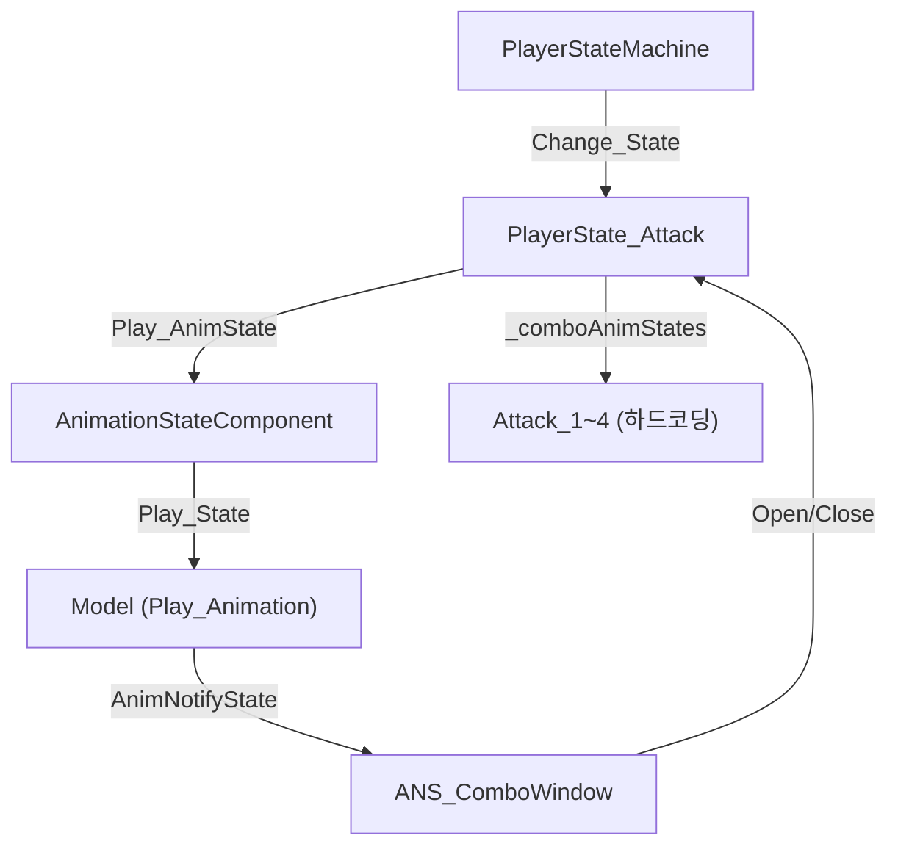
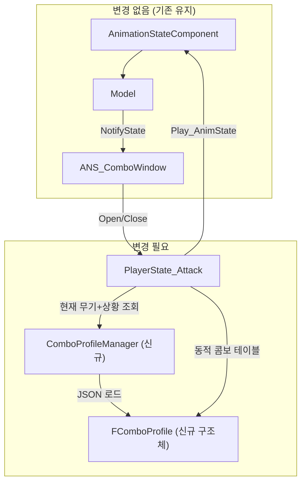
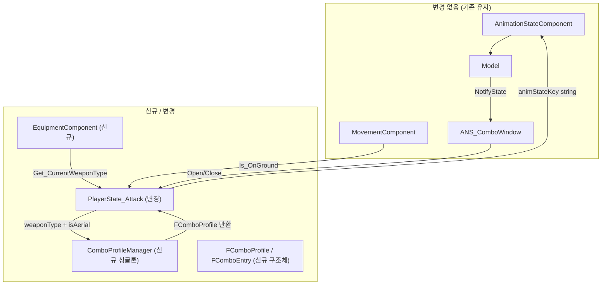

# 콤보 공격 시스템 구조 피드백

## 현재 구조 정리

현재 콤보/공격 시스템의 핵심 구성:



| 요소 | 현재 상태 |
|------|----------|
| 콤보 정의 | `_comboAnimStates = { Attack_1, Attack_2, Attack_3, Attack_4 }` 하드코딩 |
| 콤보 윈도우 | `ANS_ComboWindow` NotifyState로 Open/Close 타이밍 제어 |
| 상태 전이 | `PlayerState_Attack` 하나가 Attack_1~4 전부 담당 |
| 무기 분기 | `EWeaponType` enum만 존재, 실제 분기 로직 없음 |
| 공중 콤보 | 구현 없음, 지상 콤보만 존재 |
| 스킬과의 관계 | 별도 `PlayerState_Skill` + `SkillDataManager`로 완전 분리 |

---

## 핵심 고민: "스킬 컨디션 데이터 구조" vs "현재 구조 유지"

### 현재 구조의 장점
- `ANS_ComboWindow`로 콤보 타이밍이 **애니메이션에 직접 바인딩**되어 정확함
- `AnimationStateComponent`가 이미 JSON 데이터 드리븐으로 동작중 (프리팹에서 확인)
- 단순한 상태 하나(`Attack_1`)가 콤보 인덱스로 `Attack_1~4` 루프 → 명쾌

### 현재 구조의 한계
- **무기가 바뀌면?** → 콤보 테이블 자체가 변경되어야 하는데, 하드코딩이라 대응 불가
- **공중 콤보?** → 공중에서 Attack 입력 시 분기해야 하는데, `PlayerState_Attack`이 지상만 가정
- **콤보 수가 달라지면?** → MAX_COMBO=4 고정, 무기마다 콤보 수가 다를 수 있음
- **콤보마다 다른 속성?** → 데미지 배율, 히트스탑, 넉백 등 콤보별 파라미터 없음

---

## 제안: "콤보 프로파일" 데이터 드리븐 방식

> [!IMPORTANT]
> 기존 `AnimationStateComponent` + `ANS_ComboWindow` 구조를 **그대로 살리면서**, 콤보 테이블만 데이터화하는 것이 가장 현실적입니다. 스킬 컨디션까지 갈 필요가 아직은 없습니다.

### 콤보 프로파일 JSON 예시

```json
// ComboProfiles/Hand_Ground.comboprofile.json
{
    "profileName": "Hand_Ground",
    "weaponType": "Hand",
    "isAerial": false,
    "maxCombo": 4,
    "combos": [
        {
            "index": 0,
            "animStateKey": "Attack_1",
            "damageMultiplier": 1.0,
            "canCancel": true
        },
        {
            "index": 1,
            "animStateKey": "Attack_2",
            "damageMultiplier": 1.2,
            "canCancel": true
        },
        {
            "index": 2,
            "animStateKey": "Attack_3",
            "damageMultiplier": 1.5,
            "canCancel": true
        },
        {
            "index": 3,
            "animStateKey": "Attack_4",
            "damageMultiplier": 2.0,
            "canCancel": false
        }
    ]
}
```

```json
// ComboProfiles/BigSword_Ground.comboprofile.json
{
    "profileName": "BigSword_Ground",
    "weaponType": "BigSword",
    "isAerial": false,
    "maxCombo": 3,
    "combos": [
        {
            "index": 0,
            "animStateKey": "Attack_Sword_1",
            "damageMultiplier": 1.5,
            "canCancel": true
        },
        {
            "index": 1,
            "animStateKey": "Attack_Sword_2",
            "damageMultiplier": 2.0,
            "canCancel": true
        },
        {
            "index": 2,
            "animStateKey": "Attack_Sword_3",
            "damageMultiplier": 3.0,
            "canCancel": false
        }
    ]
}
```

### 구조 변경 범위



### 코드 변경 최소 범위

#### 1. `FComboProfile` 구조체 (신규)
```cpp
struct FComboEntry
{
    string  animStateKey;       // "Attack_1", "Attack_Sword_1" 등
    float   damageMultiplier = 1.f;
    bool    canCancel = true;   // 콤보 중 캔슬 가능 여부
};

struct FComboProfile
{
    string          profileName;
    EWeaponType     weaponType = EWeaponType::Hand;
    bool            isAerial = false;
    int32           maxCombo = 4;
    vector<FComboEntry> combos;
};
```

#### 2. `PlayerState_Attack` 수정 방향
```cpp
// 기존: 하드코딩
vector<EPlayerState> _comboAnimStates = { Attack_1, Attack_2, Attack_3, Attack_4 };

// 변경: 프로파일 기반
const FComboProfile* _activeProfile = nullptr;  // 현재 활성 프로파일

void Enter(PlayerStateMachine* state) override
{
    // 현재 무기 + 공중여부로 프로파일 선택
    EWeaponType weapon = /* Player에서 현재 무기 조회 */;
    bool isAerial = state->Get_Movement()->Is_InAir();
    
    _activeProfile = ComboProfileManager::Get()->Find(weapon, isAerial);
    
    // 나머지는 기존과 동일
    Play_AnimState(/* _activeProfile->combos[_comboIndex].animStateKey */);
}
```

---

## 공중 콤보 처리 방안

> [!TIP]
> 공중 콤보는 별도의 `PlayerState_AerialAttack` 클래스를 만들 필요 **없이**, 같은 `PlayerState_Attack`에서 프로파일만 교체하면 됩니다.

| 상황 | 프로파일 선택 |
|------|-------------|
| 맨손 + 지상 | `Hand_Ground` |
| 맨손 + 공중 | `Hand_Aerial` |
| 대검 + 지상 | `BigSword_Ground` |
| 대검 + 공중 | `BigSword_Aerial` |

**진입 조건 분기 위치**: `PlayerState_Attack::Enter()` 에서 `Movement->Is_InAir()`로 판단

**공중 콤보 종료 후**: 
- 착지 시 `HeightLand` or `Idle`로 전이
- 이건 `PlayerState_Attack::Update()`에서 `Is_OnGround()` 체크 추가만 하면 됨

---

## 무기 타입이 달라질 때

> [!IMPORTANT]
> `AnimationStateComponent`의 `_stateAnimations` map에 무기별 애니메이션 키가 이미 등록 가능한 구조입니다. `Attack_Sword_1`, `Attack_Sword_2`같은 키를 프리팹 JSON에 추가 등록만 하면, 코드 변경 없이 `Play_State("Attack_Sword_1")`이 동작합니다.

### 필요한 작업
1. 프리팹 JSON에 무기별 애니메이션 상태 추가 등록
2. `EPlayerState` enum에 무기별 공격 추가 (or string 기반으로 전환)
3. `PlayerState_Attack`이 프로파일에서 `animStateKey`를 string으로 읽어서 `Play_State()` 호출

### enum vs string 선택

| 방식 | 장점 | 단점 |
|------|------|------|
| **EPlayerState enum 유지** | 타입 안전, 네트워크 동기화 쉬움 | 무기/콤보 추가할 때마다 enum 추가 필요 |
| **string 키 기반** | 확장성 좋음, 데이터만 추가하면 됨 | 네트워크 동기화 시 string 전송 비용, 오타 위험 |

> [!TIP]  
> 현재 `AnimationStateComponent`가 이미 **string 키 기반**이므로, 콤보 프로파일도 string 키를 사용하는 게 자연스럽습니다. `EPlayerState` enum은 FSM 상태 전이용으로만 남기고, 콤보 내부 애니메이션 선택은 string으로 가는 것이 깔끔합니다.

---

## 최종 권장 사항

### ✅ 지금 바로 하면 좋은 것
1. **`FComboProfile` 구조체** + JSON 로더 만들기
2. **`PlayerState_Attack`에서 프로파일 기반으로 콤보 테이블 교체** (하드코딩 제거)
3. 기존 `ANS_ComboWindow` 구조는 **그대로 유지**

### ❌ 아직 안 해도 되는 것
- 스킬 컨디션 시스템 (콤보와 스킬은 현재 잘 분리되어 있음)
- `PlayerState_AerialAttack` 별도 클래스 (프로파일 교체로 충분)
- 콤보-스킬 통합 (콤보 → 스킬 파생은 나중에 `ANS_ComboFinisher` 같은 NotifyState로 확장 가능)

### 📐 전체 아키텍처 비전

```
[입력] → [FSM 상태 전이] → [PlayerState_Attack::Enter]
                                    ↓
                          [무기+공중 여부로 프로파일 선택]
                                    ↓
                          [프로파일의 combo[index] 참조]
                                    ↓
                          [AnimationStateComponent::Play_State(animStateKey)]
                                    ↓
                          [Model::Play_Animation → ANS_ComboWindow 트리거]
                                    ↓
                          [ComboWindow Open → 입력 대기 → Advance_Combo]
```

기존 구조를 최대한 살리면서, **데이터 레이어 하나만 끼워넣는** 방식이라 작업량도 크지 않고, 지금 잘 돌아가는 `ANS_ComboWindow` + `AnimationStateComponent` 흐름을 깨뜨리지 않습니다.

---
---

# [변경] 무기 타입 소스 오브 트루스 — Player 멤버 안 폐기 → EquipmentComponent 안으로 대체

> 마지막 갱신: 2026-03-29
> 이 섹션은 위 초안의 "무기 분기 로직 없음" 한계를 해결하기 위한 **확정 구현안**이다.

## 변경 요약

| 항목 | 초안 (위) | 확정안 (이 섹션) |
|------|----------|----------------|
| 무기 타입 소유자 | `Player` 멤버 변수 (미구현) | `EquipmentComponent` |
| 콤보 테이블 | `_comboAnimStates` 하드코딩 | `ComboProfileManager` 싱글톤 + JSON 데이터 |
| 네트워크 공격 동기화 | 없음 (Idle로 fallback) | `OBJECT_STATE_TYPE_ATTACK` + `attack_profile` + `attack_combo_index` |
| FSM enum | `Attack_1, Attack_2, Attack_3, Attack_4` 4개 | `Attack` 하나 (기존 4개는 deprecated 유지) |

---

## 왜 EquipmentComponent인가

1. 프로토콜에 이미 `equipParts` (slot → assetTag 맵)가 있다.
2. 장비 슬롯 체계가 Weapon 하나로 끝나지 않는다 (Headgear, Face, Onepiece, Weapon …).
3. 향후 UI, 저장, 네트워크가 같은 상태를 봐야 하므로 "장착 상태를 아는 컴포넌트"가 자연스럽다.
4. `WeaponComponent`라는 이름은 기존 `Weapon` PartObject와 이름 충돌이 있어서 사용하지 않는다.

### v1 구현 범위 제한

| 이번에 구현 | 이번에 미룸 |
|------------|-----------|
| 장착 슬롯 상태 저장 | 장비 스탯 보너스 계산 |
| 무기 타입 판정 | 인벤토리 시스템 |
| 콤보 시스템 질의 지원 | 장비 제한 규칙 |
| 네트워크/JSON 직렬화 기준 | 서버 권한 장비 검증 |

---

# [추가] 전체 아키텍처 다이어그램 (확정)



---

# [추가] EAttackProfileType — 공격 프로파일 타입 enum

```cpp
// Client/Public/Client_Enum.h — EWeaponType 아래에 추가

// 무기 타입 + 공중/지상 조합으로 결정되는 공격 프로파일 종류.
// ComboProfileManager에서 프로파일을 선택할 때 사용한다.
// 네트워크 동기화 시 ATTACK_PROFILE_TYPE (proto)와 1:1 매핑된다.
enum class EAttackProfileType
{
    Hand_Ground,        // 맨손 + 지상
    Hand_Aerial,        // 맨손 + 공중
    BigSword_Ground,    // 대검 + 지상
    BigSword_Aerial,    // 대검 + 공중

    END
};
```

> [!IMPORTANT]
> 기존 `EPlayerState`의 `Attack_1, Attack_2, Attack_3, Attack_4`는 삭제하지 않고 deprecated 주석만 달아둔다.
> 새로 `Attack` 하나를 추가한다.

```cpp
// Client/Public/Client_Enum.h — EPlayerState 수정
enum class EPlayerState
{
    Idle,
    Run,
    Jump,
    DoubleJump,
    JumpDash,

    SuperJumpCharge,
    SuperJump,
    HeightLand,

    // [deprecated] 프로파일 기반으로 대체됨. 빌드 호환용으로 남겨둠
    Attack_1,
    Attack_2,
    Attack_3,
    Attack_4,

    // [추가] 프로파일 기반 공격 상태 — 실제 콤보는 프로파일 + comboIndex로 결정
    Attack,

    Hit,
    Dash,

    Skill_Rasengan,
    Skill_RasenShuriken,

    Dead,
    END
};
```

---

# [추가] FComboEntry / FComboProfile 구조체

```cpp
// Client/Public/Client_Struct.h — FStateAnimationDesc 아래에 추가

// 콤보 1타의 정보를 담는 엔트리.
// animStateKey는 AnimationStateComponent에 등록된 string 키와 매칭된다.
struct FComboEntry
{
    string  animStateKey;           // "Attack_01", "Attack_Sword_1" 등
    float   damageMultiplier = 1.f; // 기본 데미지 대비 배율
    bool    canCancel = true;       // 콤보 중 캔슬 가능 여부
};

// 무기 타입 + 공중/지상 조합 하나에 대응하는 콤보 프로파일.
// ComboProfileManager가 JSON에서 읽어 캐싱한다.
struct FComboProfile
{
    string              profileName;                        // "Hand_Ground" 등
    EAttackProfileType  profileType = EAttackProfileType::Hand_Ground;
    EWeaponType         weaponType  = EWeaponType::Hand;    // 이 프로파일의 무기 타입
    bool                isAerial    = false;                // 공중 콤보인지
    int32               maxCombo    = 4;                    // 콤보 최대 타수
    vector<FComboEntry> combos;                             // 타수별 엔트리
};
```

---

# [추가] EquipmentComponent — 장착 상태 관리 컴포넌트

## EquipmentComponent.h

```cpp
// Client/Public/EquipmentComponent.h
#pragma once

#include "Component.h"
#include "ContainerObject.h"

NS_BEGIN(Client)

// 캐릭터의 장착 상태를 소유하는 컴포넌트.
// v1 범위: 슬롯별 assetTag 저장, 현재 무기 타입 판정, 콤보 프로파일 선택 지원.
// 실제 PartObject 생성/렌더링은 Player가 수행하며,
// 이 컴포넌트는 상태/동기화/판정 로직만 담당한다.
class EquipmentComponent : public Component
{
    GENERATED_COMPONENT(EquipmentComponent, Protocol::COMPONENT_TYPE_EQUIPMENT)

public:
    using EPartSlot = ContainerObject::EPartSlot;

public:
    explicit EquipmentComponent(ComPtr<Device> device, ComPtr<DeviceContext> context);
    explicit EquipmentComponent(const EquipmentComponent& rhs);
    virtual ~EquipmentComponent() = default;

public:
    HRESULT Initialize_Prototype() override;
    HRESULT Initialize(void* arg) override;
    void    BeginPlay() override;

public:
    // ── 장착 / 해제 ──

    // 지정 슬롯에 모델 에셋을 장착한다.
    // Player::Apply_CustomizingPart의 래퍼에서 호출되어 상태를 먼저 갱신한 뒤,
    // Player가 실제 PartObject 교체를 수행한다.
    void    Equip_Part(EPartSlot slot, const wstring& assetTag);

    // 지정 슬롯을 비운다.
    void    Unequip_Part(EPartSlot slot);

    // ── 조회 ──

    // 현재 Weapon 슬롯의 assetTag로부터 무기 타입을 판정하여 반환한다.
    // 무기가 없으면 Hand를 리턴한다.
    EWeaponType     Get_CurrentWeaponType() const { return _currentWeaponType; }

    // 지정 슬롯에 장착된 에셋 태그를 반환한다.
    // 비어있으면 빈 문자열을 반환한다.
    const wstring&  Get_EquippedPartTag(EPartSlot slot) const;

    // 현재 무기 타입 + 공중/지상 여부로 EAttackProfileType을 결정한다.
    // PlayerState_Attack::Enter에서 콤보 프로파일 선택에 사용된다.
    EAttackProfileType Resolve_AttackProfileType(bool isAerial) const;

public: /* 직렬화 */
    json To_Json() const override;
    void From_Json(const json& data) override;

private:
    // assetTag 문자열로부터 EWeaponType을 역산하는 헬퍼.
    // "BigSword"가 포함되면 BigSword, 그 외는 Hand.
    // 무기 종류가 늘어나면 여기만 확장하면 된다.
    static EWeaponType Resolve_WeaponType_FromAssetTag(const wstring& assetTag);

private:
    // 슬롯별 장착된 모델 에셋 태그. 비어있으면 미장착.
    array<wstring, ETOI(EPartSlot::END)> _equippedPartTags{};

    // 현재 무기 타입 — Weapon 슬롯 변경 시 자동 갱신
    EWeaponType _currentWeaponType = EWeaponType::Hand;

public:
    static Shared<EquipmentComponent> Create(ComPtr<Device> device, ComPtr<DeviceContext> context);
    Shared<Component> Clone(void* arg) override;
    void Free() override;
};

NS_END
```

## EquipmentComponent.cpp

```cpp
// Client/Private/EquipmentComponent.cpp
#include "pch.h"
#include "EquipmentComponent.h"

EquipmentComponent::EquipmentComponent(ComPtr<Device> device, ComPtr<DeviceContext> context)
    : Component(device, context)
{
}

EquipmentComponent::EquipmentComponent(const EquipmentComponent& rhs)
    : Component(rhs)
    , _equippedPartTags(rhs._equippedPartTags)
    , _currentWeaponType(rhs._currentWeaponType)
{
}

HRESULT EquipmentComponent::Initialize_Prototype()
{
    return Component::Initialize_Prototype();
}

HRESULT EquipmentComponent::Initialize(void* arg)
{
    return Component::Initialize(arg);
}

void EquipmentComponent::BeginPlay()
{
    Component::BeginPlay();

    // 초기 장착 상태에서 무기 타입을 판정한다.
    _currentWeaponType = Resolve_WeaponType_FromAssetTag(
        _equippedPartTags[ETOI(EPartSlot::Weapon)]);
}

// ── 장착 / 해제 ──

void EquipmentComponent::Equip_Part(EPartSlot slot, const wstring& assetTag)
{
    _equippedPartTags[ETOI(slot)] = assetTag;

    // 무기 슬롯이 변경되면 무기 타입을 재판정한다.
    if (slot == EPartSlot::Weapon)
    {
        _currentWeaponType = Resolve_WeaponType_FromAssetTag(assetTag);
    }
}

void EquipmentComponent::Unequip_Part(EPartSlot slot)
{
    _equippedPartTags[ETOI(slot)].clear();

    // 무기를 해제하면 맨손으로 복귀
    if (slot == EPartSlot::Weapon)
    {
        _currentWeaponType = EWeaponType::Hand;
    }
}

// ── 조회 ──

const wstring& EquipmentComponent::Get_EquippedPartTag(EPartSlot slot) const
{
    return _equippedPartTags[ETOI(slot)];
}

EAttackProfileType EquipmentComponent::Resolve_AttackProfileType(bool isAerial) const
{
    // 무기 타입 + 공중/지상 조합으로 프로파일 타입을 결정한다.
    switch (_currentWeaponType)
    {
    case EWeaponType::BigSwrod:
        return isAerial ? EAttackProfileType::BigSword_Aerial
                        : EAttackProfileType::BigSword_Ground;

    case EWeaponType::Hand:
    default:
        return isAerial ? EAttackProfileType::Hand_Aerial
                        : EAttackProfileType::Hand_Ground;
    }
}

// ── 헬퍼 ──

EWeaponType EquipmentComponent::Resolve_WeaponType_FromAssetTag(const wstring& assetTag)
{
    // assetTag에 "BigSword"가 포함되면 대검으로 판정한다.
    // 무기 종류가 늘어나면 여기에 분기를 추가한다.
    if (assetTag.find(TEXT("BigSword")) != wstring::npos)
        return EWeaponType::BigSwrod;

    return EWeaponType::Hand;
}

// ── 직렬화 ──

json EquipmentComponent::To_Json() const
{
    json root = Component::To_Json();

    json parts = json::object();
    for (int32 i = 0; i < ETOI(EPartSlot::END); ++i)
    {
        if (!_equippedPartTags[i].empty())
        {
            // wstring → string 변환 (JSON 저장용)
            string narrow(_equippedPartTags[i].begin(), _equippedPartTags[i].end());
            parts[ContainerObject::Get_PartSlotName(static_cast<EPartSlot>(i))] = narrow;
        }
    }
    root["equipped_parts"] = parts;

    return root;
}

void EquipmentComponent::From_Json(const json& data)
{
    Component::From_Json(data);

    if (!data.contains("equipped_parts"))
        return;

    const auto& parts = data["equipped_parts"];
    for (int32 i = 0; i < ETOI(EPartSlot::END); ++i)
    {
        string slotName = ContainerObject::Get_PartSlotName(static_cast<EPartSlot>(i));
        if (parts.contains(slotName))
        {
            string narrow = parts[slotName].get<string>();
            _equippedPartTags[i] = wstring(narrow.begin(), narrow.end());
        }
    }

    // 역직렬화 후 무기 타입 재판정
    _currentWeaponType = Resolve_WeaponType_FromAssetTag(
        _equippedPartTags[ETOI(EPartSlot::Weapon)]);
}

// ── 팩토리 ──

Shared<EquipmentComponent> EquipmentComponent::Create(ComPtr<Device> device, ComPtr<DeviceContext> context)
{
    auto instance = make_shared<EquipmentComponent>(device, context);

    if (FAILED(instance->Initialize_Prototype()))
    {
        MSG_BOX("Failed to Create : EquipmentComponent");
        return nullptr;
    }

    return instance;
}

Shared<Component> EquipmentComponent::Clone(void* arg)
{
    auto clone = make_shared<EquipmentComponent>(*this);

    if (FAILED(clone->Initialize(arg)))
    {
        MSG_BOX("Failed to Clone : EquipmentComponent");
        return nullptr;
    }

    return clone;
}

void EquipmentComponent::Free()
{
    Component::Free();
}
```

---

# [추가] ComboProfileManager — 콤보 프로파일 싱글톤 매니저

> `SkillDataManager`와 동일한 `DECLARE_SINGLETON` 패턴을 사용한다.

## ComboProfileManager.h

```cpp
// Client/Public/ComboProfileManager.h
#pragma once

#include "Base.h"

NS_BEGIN(Client)

// 콤보 프로파일 데이터를 관리하는 싱글톤.
// DT_ComboProfile.json에서 프로파일을 로드하고,
// EAttackProfileType 기준으로 빠르게 조회할 수 있게 캐싱한다.
// SkillDataManager와 동일한 수명 관리를 따른다.
class ComboProfileManager : public Base
{
    DECLARE_SINGLETON(ComboProfileManager)

public:
    ComboProfileManager() = default;
    ~ComboProfileManager() override = default;

public:
    // JSON 파일에서 콤보 프로파일 전체를 로드한다.
    // Loader에서 리소스 로딩 단계에 한 번 호출된다.
    bool Load_FromJson(const string& filePath);

    // 프로파일 타입으로 조회한다. 없으면 nullptr.
    const FComboProfile* Find(EAttackProfileType profileType) const;

    // 무기 타입 + 공중/지상으로 조회하는 편의 함수.
    // EquipmentComponent::Resolve_AttackProfileType로 먼저 변환해도 되고,
    // 이 함수를 직접 써도 된다.
    const FComboProfile* Find(EWeaponType weaponType, bool isAerial) const;

    void Clear();

private:
    // profileType → FComboProfile 매핑
    umap<int32, FComboProfile> _profileMap;

public:
    void Free() override;
};

NS_END
```

## ComboProfileManager.cpp

```cpp
// Client/Private/ComboProfileManager.cpp
#include "pch.h"
#include "ComboProfileManager.h"
#include <fstream>

IMPLEMENT_SINGLETON(ComboProfileManager)

bool ComboProfileManager::Load_FromJson(const string& filePath)
{
    std::ifstream ifs(filePath);
    if (!ifs.is_open())
    {
        LOG_ERROR("ComboProfileManager: JSON 파일 열기 실패 — {}", filePath);
        return false;
    }

    json root;
    ifs >> root;

    if (!root.contains("profiles") || !root["profiles"].is_array())
    {
        LOG_ERROR("ComboProfileManager: 'profiles' 배열 없음");
        return false;
    }

    for (const auto& item : root["profiles"])
    {
        FComboProfile profile;
        profile.profileName = item.value("profileName", "");

        // profileType 문자열 → enum
        string profileTypeStr = item.value("profileType", "Hand_Ground");
        auto opt = magic_enum::enum_cast<EAttackProfileType>(profileTypeStr);
        profile.profileType = opt.value_or(EAttackProfileType::Hand_Ground);

        // weaponType 문자열 → enum
        string weaponStr = item.value("weaponType", "Hand");
        auto wopt = magic_enum::enum_cast<EWeaponType>(weaponStr);
        profile.weaponType = wopt.value_or(EWeaponType::Hand);

        profile.isAerial = item.value("isAerial", false);
        profile.maxCombo = item.value("maxCombo", 4);

        if (item.contains("combos") && item["combos"].is_array())
        {
            for (const auto& comboItem : item["combos"])
            {
                FComboEntry entry;
                entry.animStateKey      = comboItem.value("animStateKey", "");
                entry.damageMultiplier  = comboItem.value("damageMultiplier", 1.f);
                entry.canCancel         = comboItem.value("canCancel", true);

                profile.combos.push_back(entry);
            }
        }

        // maxCombo를 실제 엔트리 수와 맞춘다
        profile.maxCombo = static_cast<int32>(profile.combos.size());

        _profileMap[ETOI(profile.profileType)] = profile;

        LOG_INFO("ComboProfile 로드: {} (combos={})", profile.profileName, profile.maxCombo);
    }

    return true;
}

const FComboProfile* ComboProfileManager::Find(EAttackProfileType profileType) const
{
    auto iter = _profileMap.find(ETOI(profileType));
    if (iter == _profileMap.end())
        return nullptr;

    return &iter->second;
}

const FComboProfile* ComboProfileManager::Find(EWeaponType weaponType, bool isAerial) const
{
    // 무기 타입 + 공중/지상 → EAttackProfileType 변환 후 조회
    for (const auto& [key, profile] : _profileMap)
    {
        if (profile.weaponType == weaponType && profile.isAerial == isAerial)
            return &profile;
    }

    return nullptr;
}

void ComboProfileManager::Clear()
{
    _profileMap.clear();
}

void ComboProfileManager::Free()
{
    _profileMap.clear();
    Base::Free();
}
```

## DT_ComboProfile.json 예시

```json
{
    "profiles": [
        {
            "profileName": "Hand_Ground",
            "profileType": "Hand_Ground",
            "weaponType": "Hand",
            "isAerial": false,
            "maxCombo": 4,
            "combos": [
                { "animStateKey": "Attack_01", "damageMultiplier": 1.0, "canCancel": true },
                { "animStateKey": "Attack_02", "damageMultiplier": 1.2, "canCancel": true },
                { "animStateKey": "Attack_03", "damageMultiplier": 1.5, "canCancel": true },
                { "animStateKey": "Attack_04", "damageMultiplier": 2.0, "canCancel": false }
            ]
        },
        {
            "profileName": "BigSword_Ground",
            "profileType": "BigSword_Ground",
            "weaponType": "BigSwrod",
            "isAerial": false,
            "maxCombo": 3,
            "combos": [
                { "animStateKey": "Attack_Sword_01", "damageMultiplier": 1.5, "canCancel": true },
                { "animStateKey": "Attack_Sword_02", "damageMultiplier": 2.0, "canCancel": true },
                { "animStateKey": "Attack_Sword_03", "damageMultiplier": 3.0, "canCancel": false }
            ]
        },
        {
            "profileName": "Hand_Aerial",
            "profileType": "Hand_Aerial",
            "weaponType": "Hand",
            "isAerial": true,
            "maxCombo": 3,
            "combos": [
                { "animStateKey": "Attack_Air_01", "damageMultiplier": 1.0, "canCancel": true },
                { "animStateKey": "Attack_Air_02", "damageMultiplier": 1.3, "canCancel": true },
                { "animStateKey": "Attack_Air_03", "damageMultiplier": 1.8, "canCancel": false }
            ]
        },
        {
            "profileName": "BigSword_Aerial",
            "profileType": "BigSword_Aerial",
            "weaponType": "BigSwrod",
            "isAerial": true,
            "maxCombo": 2,
            "combos": [
                { "animStateKey": "Attack_SwordAir_01", "damageMultiplier": 2.0, "canCancel": true },
                { "animStateKey": "Attack_SwordAir_02", "damageMultiplier": 3.0, "canCancel": false }
            ]
        }
    ]
}
```

---

# [변경] PlayerState_Attack — 프로파일 기반으로 리팩토링

## PlayerState_Attack.h (변경본)

```cpp
// Client/Public/PlayerState_Attack.h
#pragma once

#include "IPlayerState.h"

NS_BEGIN(Client)

class EquipmentComponent;

// 프로파일 기반 콤보 공격 상태.
// Enter 시점에 EquipmentComponent에서 무기 타입을 읽고,
// MovementComponent에서 공중 여부를 읽어 적절한 FComboProfile을 선택한다.
// 내부 콤보 인덱스로 프로파일의 combos[index].animStateKey를 재생한다.
class PlayerState_Attack : public IPlayerState
{
public:
    PlayerState_Attack();
    ~PlayerState_Attack() override = default;

public:
    void Enter(PlayerStateMachine* state) override;
    void Update(PlayerStateMachine* state, float timeDelta) override;
    void Exit(PlayerStateMachine* state) override;

    // [변경] Attack_1 → Attack 으로 변경
    EPlayerState Get_StateID() const override { return EPlayerState::Attack; }

public:
    // ── ANS_ComboWindow 콜백 ──

    // 콤보 입력 예약 구간 시작 (ANS_ComboWindow::On_Begin에서 호출)
    void Open_ComboWindow();

    // 콤보 입력 예약 구간 종료 (ANS_ComboWindow::On_End에서 호출)
    void Close_ComboWindow();

    // 공격 입력 예약 (Update에서 호출)
    void Buffer_AttackInput();

    // 콤보 인덱스 + 상태 리셋
    void Reset_Combo();

    // 현재 콤보 인덱스 반환 (네트워크 동기화용)
    int32 Get_ComboIndex() const { return _comboIndex; }

    // 현재 활성 프로파일 타입 반환 (네트워크 동기화용)
    EAttackProfileType Get_ActiveProfileType() const { return _activeProfileType; }

    // 다음 콤보 단계로 진행
    void Advance_Combo();

private:
    // ── 프로파일 선택 헬퍼 ──

    // EquipmentComponent + MovementComponent를 읽어서 적절한 프로파일을 선택한다.
    // Enter에서 호출된다.
    void Select_Profile(PlayerStateMachine* state);

    // 현재 콤보 인덱스에 해당하는 animStateKey를 재생한다.
    // Enter와 Advance_Combo에서 호출된다.
    void Play_CurrentComboClip(PlayerStateMachine* state);

private:
    int32   _comboIndex = 0;            // 현재 콤보 단계 (0-based)
    bool    _comboWindowOpen = false;   // 현재 입력 예약 가능한지
    bool    _hasBufferedAttack = false; // 윈도우 내에 공격 입력이 예약되었는지

    // 현재 활성화된 프로파일 포인터 (ComboProfileManager 소유 데이터를 가리킴)
    const FComboProfile* _activeProfile = nullptr;

    // 현재 활성화된 프로파일 타입 (네트워크 동기화 시 전송용)
    EAttackProfileType _activeProfileType = EAttackProfileType::Hand_Ground;

    // Close_ComboWindow에서 상태 전이용 — Enter에서 캐싱
    PlayerStateMachine* _cachedStateMachine = nullptr;

public:
    static Shared<PlayerState_Attack> Create();
};

NS_END
```

## PlayerState_Attack.cpp (변경본)

```cpp
// Client/Private/PlayerState_Attack.cpp
#include "pch.h"
#include "PlayerState_Attack.h"
#include "PlayerStateMachine.h"
#include "InputComponent.h"
#include "MovementComponent.h"
#include "EquipmentComponent.h"
#include "ComboProfileManager.h"
#include "AnimationStateComponent.h"
#include "Transform.h"
#include "GameObject.h"

PlayerState_Attack::PlayerState_Attack()
{
}

void PlayerState_Attack::Enter(PlayerStateMachine* state)
{
    if (!state) return;

    _cachedStateMachine = state;

    auto input = state->Get_Input();
    auto movement = state->Get_Movement();
    auto owner = state->Get_Owner();

    if (!input || !movement || !owner)
        return;

    // 공격 중 입력 모드 설정
    input->Set_InputMode(EPlayerInputMode::Normal);

    // 이동에 의한 자동 회전 끄기 (공격 방향 고정)
    movement->Set_OrientRotationToMovement(false);

    // ── 프로파일 선택 ──
    // EquipmentComponent에서 무기 타입, MovementComponent에서 공중 여부를 읽어
    // ComboProfileManager에서 적절한 프로파일을 가져온다.
    Select_Profile(state);

    // 노티파이에서 세팅
    _comboWindowOpen = false;
    _hasBufferedAttack = false;

    // 프로파일의 현재 콤보 인덱스에 해당하는 클립 재생
    Play_CurrentComboClip(state);
}

void PlayerState_Attack::Update(PlayerStateMachine* state, float timeDelta)
{
    auto input = state->Get_Input();
    CHECK_NULL(input);

    // 공격 입력이 들어오면 버퍼링
    if (input->Get_Frame().attackDown)
    {
        if (_comboWindowOpen && _activeProfile &&
            _comboIndex < _activeProfile->maxCombo - 1)
        {
            Advance_Combo();
            return;
        }
    }

    // 현재 클립이 완전히 끝났는데 아직 상태가 안 바뀌었으면 Idle 복귀 (보험)
    if (state->Is_AnimStateFinished())
    {
        Reset_Combo();
        state->Change_State(EPlayerState::Idle);
    }
}

void PlayerState_Attack::Exit(PlayerStateMachine* state)
{
    if (!state) return;

    auto movement = state->Get_Movement();
    if (movement)
        movement->Set_OrientRotationToMovement(true);

    auto input = state->Get_Input();
    if (input)
        input->Set_InputMode(EPlayerInputMode::Normal);

    _cachedStateMachine = nullptr;
}

void PlayerState_Attack::Open_ComboWindow()
{
    // ANS_ComboWindow::On_Begin에서 호출됨
    _comboWindowOpen = true;

    // 윈도우가 열리기 전에 이미 공격 입력이 버퍼되어 있었다면 즉시 진행
    if (_hasBufferedAttack && _activeProfile &&
        _comboIndex < _activeProfile->maxCombo - 1)
    {
        Advance_Combo();
    }
}

void PlayerState_Attack::Close_ComboWindow()
{
    // ANS_ComboWindow::On_End에서 호출됨
    if (!_comboWindowOpen)
        return;

    _comboWindowOpen = false;

    // 콤보 종료 → Idle 복귀
    Reset_Combo();
}

void PlayerState_Attack::Buffer_AttackInput()
{
    // 콤보 윈도우 열림 여부와 무관하게 일단 예약한다.
    // Open_ComboWindow 시점에 체크하므로 타이밍 누락을 방지한다.
    _hasBufferedAttack = true;
}

void PlayerState_Attack::Reset_Combo()
{
    _comboIndex = 0;
    _comboWindowOpen = false;
    _hasBufferedAttack = false;
    _activeProfile = nullptr;
    _activeProfileType = EAttackProfileType::Hand_Ground;
}

void PlayerState_Attack::Advance_Combo()
{
    _comboIndex++;
    _comboWindowOpen = false;
    _hasBufferedAttack = false;

    if (_cachedStateMachine)
    {
        Play_CurrentComboClip(_cachedStateMachine);
    }
}

void PlayerState_Attack::Select_Profile(PlayerStateMachine* state)
{
    // EquipmentComponent에서 현재 무기 타입을 읽는다
    auto owner = state->Get_Owner();
    auto equipment = owner ? owner->Get_Component<EquipmentComponent>() : nullptr;

    bool isAerial = false;
    auto movement = state->Get_Movement();
    if (movement)
        isAerial = !movement->Is_OnGround();

    // 프로파일 타입 결정
    if (equipment)
    {
        _activeProfileType = equipment->Resolve_AttackProfileType(isAerial);
    }
    else
    {
        // EquipmentComponent가 없으면 맨손 지상 기본값
        _activeProfileType = isAerial
            ? EAttackProfileType::Hand_Aerial
            : EAttackProfileType::Hand_Ground;
    }

    // ComboProfileManager에서 프로파일 조회
    _activeProfile = GET_SINGLE(ComboProfileManager)->Find(_activeProfileType);

    if (!_activeProfile)
    {
        LOG_WARN("PlayerState_Attack: 프로파일 없음 — profileType={}",
            magic_enum::enum_name(_activeProfileType));
    }
}

void PlayerState_Attack::Play_CurrentComboClip(PlayerStateMachine* state)
{
    if (!_activeProfile || _activeProfile->combos.empty())
    {
        // 프로파일이 없으면 fallback으로 기존 Attack_1 재생 시도
        state->Get_AnimationState()->Play_State("Attack_1");
        return;
    }

    int32 safeIndex = min(_comboIndex,
        static_cast<int32>(_activeProfile->combos.size()) - 1);

    const string& animKey = _activeProfile->combos[safeIndex].animStateKey;

    // AnimationStateComponent에 등록된 string 키로 재생한다
    state->Get_AnimationState()->Play_State(animKey);
}

Shared<PlayerState_Attack> PlayerState_Attack::Create()
{
    return make_shared<PlayerState_Attack>();
}
```

---

# [변경] Player.h / Player.cpp — EquipmentComponent 통합

## Player.h 변경 사항

```cpp
// Client/Public/Player.h — forward declaration 추가
class EquipmentComponent;

// protected 멤버에 추가
protected:
    Shared<EquipmentComponent>      _equipment;     // 장착 상태 관리 컴포넌트

// Apply_CustomizingPart는 외부 호환 래퍼로 유지 (시그니처 불변)
public:
    HRESULT Apply_CustomizingPart(EPartSlot slot, const wstring& modelAssetTag);
```

## Player.cpp 변경 사항

```cpp
// Player.cpp — #include 추가
#include "EquipmentComponent.h"

// Ready_Components에 EquipmentComponent 추가
HRESULT Player::Ready_Components()
{
    Character::Ready_Components();

    // ... 기존 CombatStat, AnimState, Model 추가 ...

    // [추가] 장착 상태 컴포넌트
    CHECK_FAILED(Add_Component(Protocol::COMPONENT_TYPE_EQUIPMENT, _equipment), E_FAIL);

    return S_OK;
}

// [변경] Apply_CustomizingPart — EquipmentComponent 상태를 먼저 갱신한 뒤 실제 파츠 교체
HRESULT Player::Apply_CustomizingPart(EPartSlot slot, const wstring& modelAssetTag)
{
    // 1) EquipmentComponent 상태 갱신 (소스 오브 트루스)
    if (_equipment)
    {
        if (modelAssetTag == TEXT("None") || modelAssetTag.empty())
            _equipment->Unequip_Part(slot);
        else
            _equipment->Equip_Part(slot, modelAssetTag);
    }

    // 2) 기존 실제 파츠 교체 로직 (변경 없음)
    if (modelAssetTag == TEXT("None") || modelAssetTag.empty())
    {
        if (slot == EPartSlot::Weapon)
            return Change_PartObject(slot, Protocol::OBJECT_TYPE_PART_WEAPON, nullptr);

        return Change_PartObject(slot, Protocol::OBJECT_TYPE_PART_OBJECT, nullptr);
    }

    if (slot == EPartSlot::Weapon)
    {
        Weapon::FWeaponDesc weaponDesc{};
        weaponDesc.parentTransform = _transformCom;
        weaponDesc.modelAssetTag = modelAssetTag;
        weaponDesc.socketMatrix = _model->Get_SocketBoneMatrixPtr("Attach_Sword");
        return Change_PartObject(slot, Protocol::OBJECT_TYPE_PART_WEAPON, &weaponDesc);
    }
    else
    {
        PartObject::FPartObjectDesc partDesc{};
        partDesc.parentTransform = _transformCom;
        partDesc.modelAssetTag = modelAssetTag;
        partDesc.masterPoseModel = _model;
        return Change_PartObject(slot, Protocol::OBJECT_TYPE_PART_OBJECT, &partDesc);
    }
}
```

---

# [변경] Protobuf 변경 — Enum.proto / Struct.proto

## Enum.proto 추가 사항

```protobuf
// Enum.proto — ComponentID에 추가
COMPONENT_TYPE_EQUIPMENT            = 1010;

// Enum.proto — OBJECT_STATE_TYPE에 추가
enum OBJECT_STATE_TYPE
{
    // ... 기존 값 전부 유지 ...
    OBJECT_STATE_TYPE_ATTACK = 8;
}

// Enum.proto — 신규 enum 추가
enum ATTACK_PROFILE_TYPE
{
    ATTACK_PROFILE_TYPE_HAND_GROUND     = 0;
    ATTACK_PROFILE_TYPE_HAND_AERIAL     = 1;
    ATTACK_PROFILE_TYPE_BIGSWORD_GROUND = 2;
    ATTACK_PROFILE_TYPE_BIGSWORD_AERIAL = 3;
}
```

## Struct.proto 추가 사항

```protobuf
message ObjectInfo
{
    // ... 기존 필드 1~14 전부 유지 ...

    // [추가] 공격 프로파일 + 콤보 인덱스 — 리모트 플레이어 공격 재생용
    ATTACK_PROFILE_TYPE attack_profile      = 15;
    int32               attack_combo_index  = 16;
}
```

---

# [변경] AnimationStateComponent — 공격 동기화 필드 추가

## FAnimReplicatedState 변경

```cpp
// AnimationStateComponent.h — FAnimReplicatedState에 추가
struct FAnimReplicatedState final
{
    EPlayerState        state = EPlayerState::Idle;
    EMoveInputDirection dir = EMoveInputDirection::Forward;
    EAnimPhase          phase = EAnimPhase::Start;
    bool                forceRestart = false;

    // [추가] 공격 프로파일과 콤보 인덱스 — Attack 상태일 때만 유효
    EAttackProfileType  attackProfile = EAttackProfileType::Hand_Ground;
    int32               attackComboIndex = 0;
};
```

## Capture_FromStateMachine 변경

```cpp
// AnimationStateComponent.cpp — Capture_FromStateMachine 하단에 추가
void AnimationStateComponent::Capture_FromStateMachine(const Shared<PlayerStateMachine> stateMachine)
{
    // ... 기존 state, dir, phase 캡처 로직 전부 유지 ...

    // [추가] Attack 상태일 때 프로파일 타입과 콤보 인덱스를 캡처한다.
    if (nextState == EPlayerState::Attack)
    {
        auto attackState = dynamic_pointer_cast<PlayerState_Attack>(
            stateMachine->Get_CurrentState());

        if (attackState)
        {
            _replicatedState.attackProfile = attackState->Get_ActiveProfileType();
            _replicatedState.attackComboIndex = attackState->Get_ComboIndex();
        }
    }
    else
    {
        _replicatedState.attackProfile = EAttackProfileType::Hand_Ground;
        _replicatedState.attackComboIndex = 0;
    }
}
```

## Write_ToObjectInfo / Read_FromObjectInfo 변경

```cpp
// Write_ToObjectInfo — 기존 코드 아래에 추가
void AnimationStateComponent::Write_ToObjectInfo(Protocol::ObjectInfo& info) const
{
    // ... 기존 4줄 유지 ...

    // [추가] 공격 프로파일 + 콤보 인덱스
    info.set_attack_profile(To_ProtoAttackProfile(_replicatedState.attackProfile));
    info.set_attack_combo_index(_replicatedState.attackComboIndex);
}

// Read_FromObjectInfo — 기존 코드 아래에 추가
void AnimationStateComponent::Read_FromObjectInfo(const Protocol::ObjectInfo& info)
{
    // ... 기존 state, dir, phase, forceRestart 읽기 유지 ...

    // [추가]
    state.attackProfile = From_ProtoAttackProfile(info.attack_profile());
    state.attackComboIndex = info.attack_combo_index();

    Sync_FromNetwork(state);
}
```

## To_ProtoState / From_ProtoState — Attack 매핑 추가

```cpp
// To_ProtoState에 case 추가
case EPlayerState::Attack: return Protocol::OBJECT_STATE_TYPE_ATTACK;

// From_ProtoState에 case 추가
case Protocol::OBJECT_STATE_TYPE_ATTACK: return EPlayerState::Attack;
```

## 신규 변환 헬퍼 (AnimationStateComponent 내 private static)

```cpp
// AnimationStateComponent.h — private static에 추가 선언
static Protocol::ATTACK_PROFILE_TYPE To_ProtoAttackProfile(EAttackProfileType type);
static EAttackProfileType From_ProtoAttackProfile(Protocol::ATTACK_PROFILE_TYPE type);

// AnimationStateComponent.cpp — 구현
Protocol::ATTACK_PROFILE_TYPE AnimationStateComponent::To_ProtoAttackProfile(EAttackProfileType type)
{
    switch (type)
    {
    case EAttackProfileType::Hand_Ground:       return Protocol::ATTACK_PROFILE_TYPE_HAND_GROUND;
    case EAttackProfileType::Hand_Aerial:       return Protocol::ATTACK_PROFILE_TYPE_HAND_AERIAL;
    case EAttackProfileType::BigSword_Ground:   return Protocol::ATTACK_PROFILE_TYPE_BIGSWORD_GROUND;
    case EAttackProfileType::BigSword_Aerial:   return Protocol::ATTACK_PROFILE_TYPE_BIGSWORD_AERIAL;
    default:                                    return Protocol::ATTACK_PROFILE_TYPE_HAND_GROUND;
    }
}

EAttackProfileType AnimationStateComponent::From_ProtoAttackProfile(Protocol::ATTACK_PROFILE_TYPE type)
{
    switch (type)
    {
    case Protocol::ATTACK_PROFILE_TYPE_HAND_GROUND:     return EAttackProfileType::Hand_Ground;
    case Protocol::ATTACK_PROFILE_TYPE_HAND_AERIAL:     return EAttackProfileType::Hand_Aerial;
    case Protocol::ATTACK_PROFILE_TYPE_BIGSWORD_GROUND: return EAttackProfileType::BigSword_Ground;
    case Protocol::ATTACK_PROFILE_TYPE_BIGSWORD_AERIAL: return EAttackProfileType::BigSword_Aerial;
    default:                                            return EAttackProfileType::Hand_Ground;
    }
}
```

---

# [변경] Apply_NetworkState — 리모트 플레이어 공격 재생

```cpp
// AnimationStateComponent::Apply_NetworkState — Attack 분기 추가
void AnimationStateComponent::Apply_NetworkState()
{
    // ... 기존 stateChanged, phaseChanged 판정 유지 ...

    // [추가] 공격 상태에서는 attack_profile + combo_index도 비교해야 한다
    const bool attackInfoChanged =
        _replicatedState.attackProfile != _appliedState.attackProfile ||
        _replicatedState.attackComboIndex != _appliedState.attackComboIndex;

    if (!stateChanged && !phaseChanged && !_replicatedState.forceRestart && !attackInfoChanged)
        return;

    bool played = false;

    // [추가] Attack 상태이면 프로파일 기반으로 animStateKey를 직접 재생
    if (_replicatedState.state == EPlayerState::Attack)
    {
        auto profile = GET_SINGLE(ComboProfileManager)->Find(_replicatedState.attackProfile);
        if (profile && _replicatedState.attackComboIndex < static_cast<int32>(profile->combos.size()))
        {
            const string& animKey = profile->combos[_replicatedState.attackComboIndex].animStateKey;
            played = Play_State(animKey);
        }
    }

    // Attack이 아닌 경우 기존 로직 그대로 실행
    if (!played)
    {
        // ... 기존 Dash 분기, 일반 Play_State 등 로직 그대로 유지 ...
    }

    if (played)
    {
        _appliedState = _replicatedState;
        _replicatedState.forceRestart = false;
    }
}
```

---

# [변경] MyPlayer — 공격 정보 변경 감지 추가

```cpp
// MyPlayer.cpp — Should_SendMovePacket에 추가
bool MyPlayer::Should_SendMovePacket(const Protocol::ObjectInfo& nextInfo) const
{
    // ... 기존 pos, rot, state, dir, phase, forceRestart 체크 전부 유지 ...

    // [추가] 공격 프로파일 또는 콤보 인덱스가 변경되면 즉시 전송
    if (nextInfo.attack_profile() != _lastAttackProfile)
        return true;

    if (nextInfo.attack_combo_index() != _lastAttackComboIndex)
        return true;

    return false;
}

// MyPlayer.cpp — Send_MovePacket에서 캐시 갱신 추가
void MyPlayer::Send_MovePacket(bool forceSend)
{
    // ... 기존 코드 유지 ...

    // [추가] 공격 정보 캐싱
    _lastAttackProfile = info.attack_profile();
    _lastAttackComboIndex = info.attack_combo_index();
}
```

```cpp
// MyPlayer.h — private 멤버에 추가
private:
    // [추가] 마지막 동기화된 공격 정보 — Should_SendMovePacket 비교용
    Protocol::ATTACK_PROFILE_TYPE _lastAttackProfile = Protocol::ATTACK_PROFILE_TYPE_HAND_GROUND;
    int32 _lastAttackComboIndex = 0;
```

---

# [변경] PlayerStateMachine — Attack 등록 변경

```cpp
// PlayerStateMachine.cpp — Initialize_Prototype()에서 변경
// 기존:
// Register_State(EPlayerState::Attack_1, PlayerState_Attack::Create());

// [변경] 프로파일 기반 Attack 상태 하나만 등록
Register_State(EPlayerState::Attack, PlayerState_Attack::Create());
```

---

# [추가] ANS_ComboWindow 변경 — Attack enum 참조 갱신

```cpp
// ANS_ComboWindow.cpp — On_Begin, On_End에서
// 기존: psm->Get_CurrentStateID() != EPlayerState::Attack_1
// [변경]
if (!psm || psm->Get_CurrentStateID() != EPlayerState::Attack) return;
```

---

# [추가] Loader에서 ComboProfileManager 로딩 호출

```cpp
// Loader.cpp 또는 ResourceLoader.cpp — 리소스 로딩 단계에 추가
#include "ComboProfileManager.h"

// 스킬 데이터 로딩 직후에 추가
GET_SINGLE(ComboProfileManager)->Load_FromJson(
    "Resources/Data/json/DT_ComboProfile.json");
```

---

# [추가] 파일별 수정/생성 체크리스트

| 작업 | 파일 | 내용 |
|------|------|------|
| [NEW] | `Client/Public/EquipmentComponent.h` | 장착 상태 컴포넌트 헤더 |
| [NEW] | `Client/Private/EquipmentComponent.cpp` | 장착 상태 컴포넌트 구현 |
| [NEW] | `Client/Public/ComboProfileManager.h` | 콤보 프로파일 싱글톤 헤더 |
| [NEW] | `Client/Private/ComboProfileManager.cpp` | 콤보 프로파일 싱글톤 구현 |
| [NEW] | `Client/Bin/Resources/Data/json/DT_ComboProfile.json` | 콤보 프로파일 데이터 |
| [MODIFY] | `Client/Public/Client_Enum.h` | `EAttackProfileType` 추가, `EPlayerState::Attack` 추가 |
| [MODIFY] | `Client/Public/Client_Struct.h` | `FComboEntry`, `FComboProfile` 구조체 추가 |
| [MODIFY] | `Client/Public/Player.h` | `_equipment` 멤버 추가 |
| [MODIFY] | `Client/Private/Player.cpp` | `EquipmentComponent` 연동, `Apply_CustomizingPart` 래퍼화 |
| [MODIFY] | `Client/Public/PlayerState_Attack.h` | 프로파일 기반으로 전면 변경 |
| [MODIFY] | `Client/Private/PlayerState_Attack.cpp` | 프로파일 기반으로 전면 변경 |
| [MODIFY] | `Client/Public/AnimationStateComponent.h` | `FAnimReplicatedState` 필드 추가, 변환 함수 추가 |
| [MODIFY] | `Client/Private/AnimationStateComponent.cpp` | Capture/Write/Read/Apply 함수 확장 |
| [MODIFY] | `Client/Public/MyPlayer.h` | `_lastAttackProfile`, `_lastAttackComboIndex` 멤버 추가 |
| [MODIFY] | `Client/Private/MyPlayer.cpp` | `Should_SendMovePacket` 공격 정보 감지 추가 |
| [MODIFY] | `Client/Private/PlayerStateMachine.cpp` | `Attack` 상태 등록 변경 |
| [MODIFY] | `Client/Private/ANS_ComboWindow.cpp` | `Attack_1` → `Attack` 참조 변경 |
| [MODIFY] | `Server/Protobuf/Protocol/Enum.proto` | `COMPONENT_TYPE_EQUIPMENT`, `OBJECT_STATE_TYPE_ATTACK`, `ATTACK_PROFILE_TYPE` 추가 |
| [MODIFY] | `Server/Protobuf/Protocol/Struct.proto` | `attack_profile`, `attack_combo_index` 필드 추가 |
| [MODIFY] | `Client/Private/Loader.cpp` (또는 `ResourceLoader.cpp`) | `ComboProfileManager` 로딩 호출 추가 |

---

# [추가] 테스트 플랜

## 장비 상태 테스트
1. 기본 스폰 시 `EquipmentComponent::Get_CurrentWeaponType()`이 `BigSword` (현재 Ready_PartObjects에서 BigSword 기본 장착)
2. 무기 교체 시 `EquipmentComponent` 상태와 실제 파츠 비주얼이 함께 바뀌는지 확인
3. 헤드/페이스/원피스 변경이 기존처럼 유지되고 무기 타입은 Weapon 슬롯만 기준

## 콤보 테스트
1. 맨손 지상 → `Hand_Ground` 프로파일, 4콤보
2. 대검 지상 → `BigSword_Ground` 프로파일, 3콤보
3. 같은 공격 입력에서 무기에 따라 다른 `animStateKey`가 재생되는지 확인
4. 공중에서 공격 → `_Aerial` 프로파일이 선택되는지 확인

## 네트워크 테스트
1. 리모트 플레이어가 같은 무기 기준으로 같은 공격 프로파일을 재생하는지 확인
2. 공격 1타 시작 → 연계 → 종료가 `attack_profile + attack_combo_index` 기준으로 정확히 재생
3. 장비 변경 직후 공격해도 잘못된 이전 프로파일이 재생되지 않는지 확인

## 회귀 테스트
1. 기존 커스터마이징 UI/초기 장착 흐름이 유지되는지 확인
2. Idle/Run/Jump/Dash/Skill 네트워크 복제가 기존대로 동작하는지 확인
3. protobuf 재생성 후 클라/서버 빌드가 모두 통과하는지 확인
