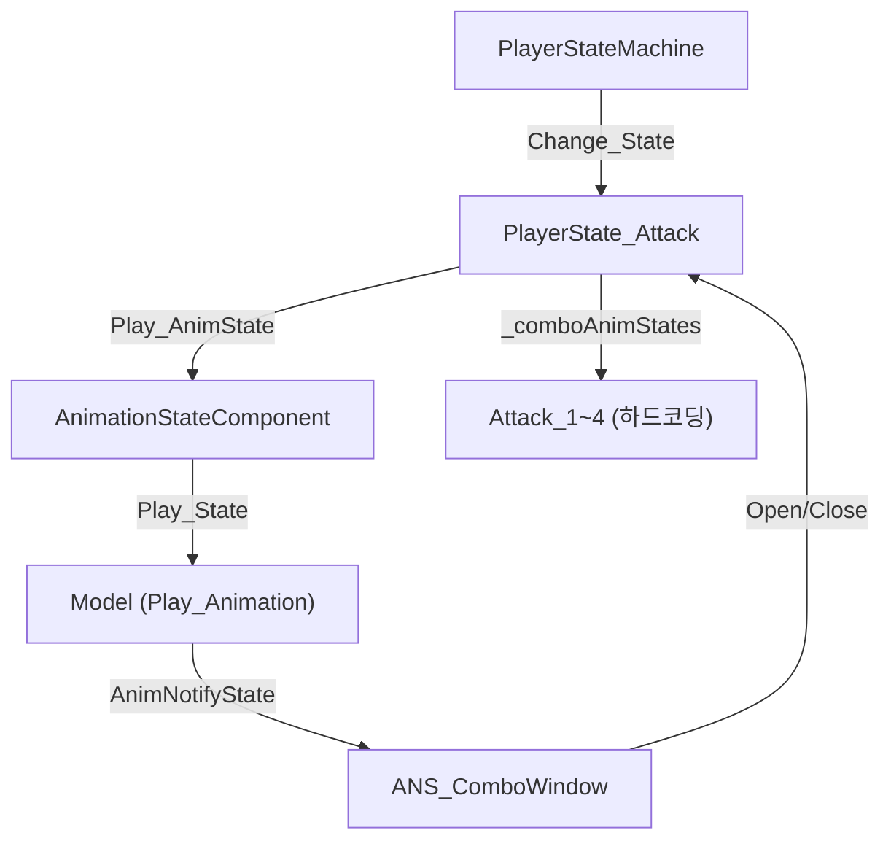
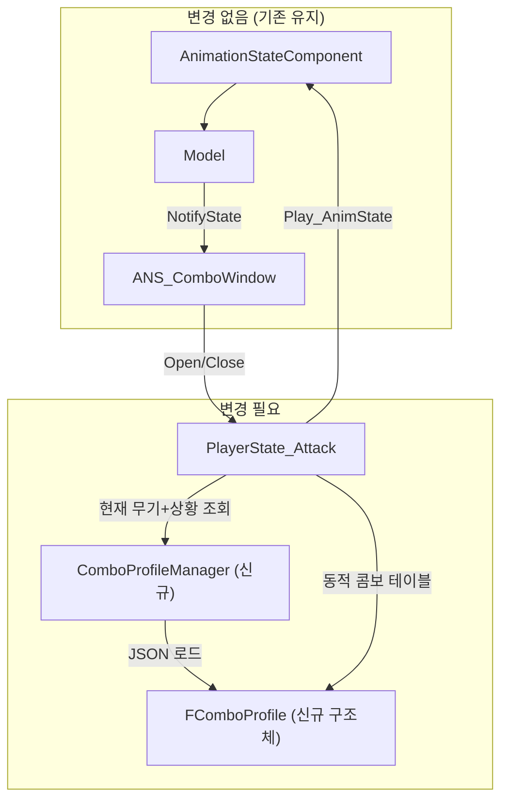

# 콤보 공격 시스템 구조 피드백

## 현재 구조 정리

현재 콤보/공격 시스템의 핵심 구성:



| 요소 | 현재 상태 |
|------|----------|
| 콤보 정의 | `_comboAnimStates = { Attack_1, Attack_2, Attack_3, Attack_4 }` 하드코딩 |
| 콤보 윈도우 | `ANS_ComboWindow` NotifyState로 Open/Close 타이밍 제어 |
| 상태 전이 | `PlayerState_Attack` 하나가 Attack_1~4 전부 담당 |
| 무기 분기 | `EWeaponType` enum만 존재, 실제 분기 로직 없음 |
| 공중 콤보 | 구현 없음, 지상 콤보만 존재 |
| 스킬과의 관계 | 별도 `PlayerState_Skill` + `SkillDataManager`로 완전 분리 |

---

## 핵심 고민: "스킬 컨디션 데이터 구조" vs "현재 구조 유지"

### 현재 구조의 장점
- `ANS_ComboWindow`로 콤보 타이밍이 **애니메이션에 직접 바인딩**되어 정확함
- `AnimationStateComponent`가 이미 JSON 데이터 드리븐으로 동작중 (프리팹에서 확인)
- 단순한 상태 하나(`Attack_1`)가 콤보 인덱스로 `Attack_1~4` 루프 → 명쾌

### 현재 구조의 한계
- **무기가 바뀌면?** → 콤보 테이블 자체가 변경되어야 하는데, 하드코딩이라 대응 불가
- **공중 콤보?** → 공중에서 Attack 입력 시 분기해야 하는데, `PlayerState_Attack`이 지상만 가정
- **콤보 수가 달라지면?** → MAX_COMBO=4 고정, 무기마다 콤보 수가 다를 수 있음
- **콤보마다 다른 속성?** → 데미지 배율, 히트스탑, 넉백 등 콤보별 파라미터 없음

---

## 제안: "콤보 프로파일" 데이터 드리븐 방식

> [!IMPORTANT]
> 기존 `AnimationStateComponent` + `ANS_ComboWindow` 구조를 **그대로 살리면서**, 콤보 테이블만 데이터화하는 것이 가장 현실적입니다. 스킬 컨디션까지 갈 필요가 아직은 없습니다.

### 콤보 프로파일 JSON 예시

```json
// ComboProfiles/Hand_Ground.comboprofile.json
{
    "profileName": "Hand_Ground",
    "weaponType": "Hand",
    "isAerial": false,
    "maxCombo": 4,
    "combos": [
        {
            "index": 0,
            "animStateKey": "Attack_1",
            "damageMultiplier": 1.0,
            "canCancel": true
        },
        {
            "index": 1,
            "animStateKey": "Attack_2",
            "damageMultiplier": 1.2,
            "canCancel": true
        },
        {
            "index": 2,
            "animStateKey": "Attack_3",
            "damageMultiplier": 1.5,
            "canCancel": true
        },
        {
            "index": 3,
            "animStateKey": "Attack_4",
            "damageMultiplier": 2.0,
            "canCancel": false
        }
    ]
}
```

```json
// ComboProfiles/BigSword_Ground.comboprofile.json
{
    "profileName": "BigSword_Ground",
    "weaponType": "BigSword",
    "isAerial": false,
    "maxCombo": 3,
    "combos": [
        {
            "index": 0,
            "animStateKey": "Attack_Sword_1",
            "damageMultiplier": 1.5,
            "canCancel": true
        },
        {
            "index": 1,
            "animStateKey": "Attack_Sword_2",
            "damageMultiplier": 2.0,
            "canCancel": true
        },
        {
            "index": 2,
            "animStateKey": "Attack_Sword_3",
            "damageMultiplier": 3.0,
            "canCancel": false
        }
    ]
}
```

### 구조 변경 범위



### 코드 변경 최소 범위

#### 1. `FComboProfile` 구조체 (신규)
```cpp
struct FComboEntry
{
    string  animStateKey;       // "Attack_1", "Attack_Sword_1" 등
    float   damageMultiplier = 1.f;
    bool    canCancel = true;   // 콤보 중 캔슬 가능 여부
};

struct FComboProfile
{
    string          profileName;
    EWeaponType     weaponType = EWeaponType::Hand;
    bool            isAerial = false;
    int32           maxCombo = 4;
    vector<FComboEntry> combos;
};
```

#### 2. `PlayerState_Attack` 수정 방향
```cpp
// 기존: 하드코딩
vector<EPlayerState> _comboAnimStates = { Attack_1, Attack_2, Attack_3, Attack_4 };

// 변경: 프로파일 기반
const FComboProfile* _activeProfile = nullptr;  // 현재 활성 프로파일

void Enter(PlayerStateMachine* state) override
{
    // 현재 무기 + 공중여부로 프로파일 선택
    EWeaponType weapon = /* Player에서 현재 무기 조회 */;
    bool isAerial = state->Get_Movement()->Is_InAir();
    
    _activeProfile = ComboProfileManager::Get()->Find(weapon, isAerial);
    
    // 나머지는 기존과 동일
    Play_AnimState(/* _activeProfile->combos[_comboIndex].animStateKey */);
}
```

---

## 공중 콤보 처리 방안

> [!TIP]
> 공중 콤보는 별도의 `PlayerState_AerialAttack` 클래스를 만들 필요 **없이**, 같은 `PlayerState_Attack`에서 프로파일만 교체하면 됩니다.

| 상황 | 프로파일 선택 |
|------|-------------|
| 맨손 + 지상 | `Hand_Ground` |
| 맨손 + 공중 | `Hand_Aerial` |
| 대검 + 지상 | `BigSword_Ground` |
| 대검 + 공중 | `BigSword_Aerial` |

**진입 조건 분기 위치**: `PlayerState_Attack::Enter()` 에서 `Movement->Is_InAir()`로 판단

**공중 콤보 종료 후**: 
- 착지 시 `HeightLand` or `Idle`로 전이
- 이건 `PlayerState_Attack::Update()`에서 `Is_OnGround()` 체크 추가만 하면 됨

---

## 무기 타입이 달라질 때

> [!IMPORTANT]
> `AnimationStateComponent`의 `_stateAnimations` map에 무기별 애니메이션 키가 이미 등록 가능한 구조입니다. `Attack_Sword_1`, `Attack_Sword_2`같은 키를 프리팹 JSON에 추가 등록만 하면, 코드 변경 없이 `Play_State("Attack_Sword_1")`이 동작합니다.

### 필요한 작업
1. 프리팹 JSON에 무기별 애니메이션 상태 추가 등록
2. `EPlayerState` enum에 무기별 공격 추가 (or string 기반으로 전환)
3. `PlayerState_Attack`이 프로파일에서 `animStateKey`를 string으로 읽어서 `Play_State()` 호출

### enum vs string 선택

| 방식 | 장점 | 단점 |
|------|------|------|
| **EPlayerState enum 유지** | 타입 안전, 네트워크 동기화 쉬움 | 무기/콤보 추가할 때마다 enum 추가 필요 |
| **string 키 기반** | 확장성 좋음, 데이터만 추가하면 됨 | 네트워크 동기화 시 string 전송 비용, 오타 위험 |

> [!TIP]  
> 현재 `AnimationStateComponent`가 이미 **string 키 기반**이므로, 콤보 프로파일도 string 키를 사용하는 게 자연스럽습니다. `EPlayerState` enum은 FSM 상태 전이용으로만 남기고, 콤보 내부 애니메이션 선택은 string으로 가는 것이 깔끔합니다.

---

## 최종 권장 사항

### ✅ 지금 바로 하면 좋은 것
1. **`FComboProfile` 구조체** + JSON 로더 만들기
2. **`PlayerState_Attack`에서 프로파일 기반으로 콤보 테이블 교체** (하드코딩 제거)
3. 기존 `ANS_ComboWindow` 구조는 **그대로 유지**

### ❌ 아직 안 해도 되는 것
- 스킬 컨디션 시스템 (콤보와 스킬은 현재 잘 분리되어 있음)
- `PlayerState_AerialAttack` 별도 클래스 (프로파일 교체로 충분)
- 콤보-스킬 통합 (콤보 → 스킬 파생은 나중에 `ANS_ComboFinisher` 같은 NotifyState로 확장 가능)

### 📐 전체 아키텍처 비전

```
[입력] → [FSM 상태 전이] → [PlayerState_Attack::Enter]
                                    ↓
                          [무기+공중 여부로 프로파일 선택]
                                    ↓
                          [프로파일의 combo[index] 참조]
                                    ↓
                          [AnimationStateComponent::Play_State(animStateKey)]
                                    ↓
                          [Model::Play_Animation → ANS_ComboWindow 트리거]
                                    ↓
                          [ComboWindow Open → 입력 대기 → Advance_Combo]
```

기존 구조를 최대한 살리면서, **데이터 레이어 하나만 끼워넣는** 방식이라 작업량도 크지 않고, 지금 잘 돌아가는 `ANS_ComboWindow` + `AnimationStateComponent` 흐름을 깨뜨리지 않습니다.
