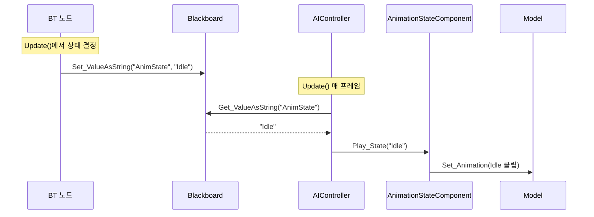

# 몬스터 BT + AnimationState 가이드라인

> BT가 상태 판단 + 애니메이션 전환까지 모두 담당하는 구조. FSM 없이 BT만으로 Idle/Run/Jump 제어.

---

## 전체 파이프라인 (이미 존재)



> [!IMPORTANT]
> `AIController.cpp` L73~117의 애니 재생 코드는 **이미 완성**되어 있다.
> 단, 같은 AnimState 문자열이 반복 세팅되면 **재생을 다시 시작하지 않는다** (변경 감지 방식).

---

## 현재 엔진 BT 인프라 현황

| 항목 | 상태 | 비고 |
|---|---|---|
| `Root` | ✅ 등록됨 | 자동 생성 |
| `Sequence` | ✅ 등록됨 | Composite |
| `Selector` | ✅ 등록됨 | Composite |
| `Task_Wait` | ✅ 등록됨 | Task |
| `Task_Move` | ✅ 등록됨 | Task |
| `Task_SetAnimState` | ❌ 없음 | **새로 만들어야 함** |
| Decorator | ❌ 없음 | TODO 상태 ([BTNode_Factory.cpp:L36](file:///d:/GitDesktop/Dx11_Naruto/Engine/Private/BTNode_Factory.cpp#L36)) |

> [!WARNING]  
> 데코레이터(조건 분기)가 현재 없으므로, **조건 기반 상태 분기**(HasTarget? ShouldJump?)는 바로 구현 불가.
> 당장은 **Sequence/Selector + Task 조합**만으로 시작해야 한다.

---

## 현재 BT JSON 형식

BT JSON은 **중첩 children이 아닌** `root_node_id` + `nodes` + `links` + `pin ids` 구조다.

실제 예시 ([Test_WaitMove.bt.json](file:///d:/GitDesktop/Dx11_Naruto/Client/Bin/Resources/Data/json/BehaviorTrees/Test_WaitMove.bt.json)):

```json
{
    "root_node_id": 1,
    "blackboard": { "bools": {}, "floats": {}, "ints": {}, "vectors": {} },
    "nodes": [
        {
            "id": 1,
            "type": "Root",
            "name": "Root",
            "input_pin_id": 0,
            "output_pin_ids": [2],
            "parameters": {},
            "pos_x": 100.0, "pos_y": 300.0
        },
        {
            "id": 3,
            "type": "Task_Wait",
            "name": "Task_Wait",
            "input_pin_id": 4,
            "output_pin_ids": [],
            "parameters": {},
            "wait_time": 2.0,
            "pos_x": 300.0, "pos_y": 500.0
        }
    ],
    "links": [
        { "id": 5, "start": 2, "end": 4 }
    ]
}
```

### 핵심 규칙
- 각 노드: `id`, `type`, `input_pin_id`, `output_pin_ids[]`
- 연결: `links[]`의 `start`(출력 핀) → `end`(입력 핀)
- 노드 고유 파라미터는 노드 JSON 최상위에 직접 기록 (예: `"wait_time": 2.0`)
- 타입 이름은 `BTNode_Factory` 등록명과 일치해야 함 (`Task_Wait`, `Sequence` 등)

---

## 최소 구현: Task_SetAnimState 노드

### [NEW] Engine/Public/BTTask_SetAnimState.h

```cpp
#pragma once

#include "BTTask.h"

NS_BEGIN(Engine)

// BT에서 실행되면 Blackboard의 "AnimState"에 지정된 상태 이름을 기록하는 Task
class ENGINE_DLL BTTask_SetAnimState : public BTTask
{
public:
    explicit BTTask_SetAnimState(const string& stateName = "Idle");
    explicit BTTask_SetAnimState(const BTTask_SetAnimState& rhs);
    virtual ~BTTask_SetAnimState() = default;

public:
    void Initialize() override;
    EBTNodeResult Update(float timeDelta) override;

    // 에디터 인스펙터 / 직렬화
    void OnDraw_Inspector() override;
    json Serialize_ToJson() override;
    void Deserialize_FromJson(const json& data) override;

private:
    // Blackboard에 기록할 AnimState 문자열 (예: "Idle", "Run", "Jump")
    string _stateName = "Idle";

public:
    virtual Shared<BTNode> Clone() override;
};

NS_END
```

### [NEW] Engine/Private/BTTask_SetAnimState.cpp

```cpp
#include "pch.h"
#include "BTTask_SetAnimState.h"
#include "Blackboard.h"

// 생성자: 상태 이름을 받아서 저장
BTTask_SetAnimState::BTTask_SetAnimState(const string& stateName)
    : _stateName(stateName)
{
}

// 복사 생성자
BTTask_SetAnimState::BTTask_SetAnimState(const BTTask_SetAnimState& rhs)
    : BTTask(rhs)
    , _stateName(rhs._stateName)
{
}

void BTTask_SetAnimState::Initialize()
{
    BTNode::Initialize();
}

// Blackboard에 "AnimState" 기록 후 즉시 Success
EBTNodeResult BTTask_SetAnimState::Update(float timeDelta)
{
    auto bb = _blackboard.lock();
    if (!bb)
    {
        _lastResult = EBTNodeResult::Failed;
        return EBTNodeResult::Failed;
    }

    // AIController가 매 프레임 이 값을 읽어서 AnimationStateComponent에 전달
    bb->Set_ValueAsString("AnimState", _stateName);

    _lastResult = EBTNodeResult::Succeeded;
    return EBTNodeResult::Succeeded;
}

void BTTask_SetAnimState::OnDraw_Inspector()
{
    BTTask::OnDraw_Inspector();
    // TODO: ImGui::InputText로 _stateName 편집 UI 추가
}

json BTTask_SetAnimState::Serialize_ToJson()
{
    json j = BTTask::Serialize_ToJson();
    j["state_name"] = _stateName;  // BT JSON에 "state_name" 키로 저장
    return j;
}

void BTTask_SetAnimState::Deserialize_FromJson(const json& data)
{
    _stateName = data.value("state_name", "Idle");
}

Shared<BTNode> BTTask_SetAnimState::Clone()
{
    auto clone = make_shared<BTTask_SetAnimState>(*this);
    clone->Initialize();
    return clone;
}
```

### [MODIFY] BTNode_Factory.cpp — 등록 추가

```diff
 #include "BTTask_Wait.h"
+#include "BTTask_SetAnimState.h"

 void BTNode_Factory::Register_EngineNodes()
 {
     /* ... 기존 코드 ... */

     /* Task */
     Register("Task", "Task_Wait", []() {return make_shared<BTTask_Wait>(); });
     Register("Task", "Task_Move", []() {return make_shared<BTTask_MoveTo>(); });
+    Register("Task", "Task_SetAnimState", []() {return make_shared<BTTask_SetAnimState>(); });
 }
```

---

## 에디터에서 AnimationState 세팅

몬스터 프리팹의 `AnimationStateComponent` 인스펙터에서:

| 상태 키 | 모드 | 애니메이션 |
|---|---|---|
| `"Idle"` | Single | 몬스터 Idle 클립 (loop: true) |
| `"Run"` | Single | 몬스터 Run 클립 (loop: true) |
| `"Jump"` | Sequence | Start: 도약 / Loop: 체공 / End: 착지 |

---

## BT 구성 예시 (현재 JSON 형식 호환)

데코레이터 없이 **Selector → Task 조합**으로 구성하는 최소 예시:

```json
{
    "root_node_id": 1,
    "blackboard": {
        "bools": {},
        "floats": {},
        "ints": {},
        "strings": {},
        "vectors": {}
    },
    "nodes": [
        {
            "id": 1, "type": "Root", "name": "Root",
            "input_pin_id": 0, "output_pin_ids": [2],
            "parameters": {},
            "pos_x": 200.0, "pos_y": 100.0
        },
        {
            "id": 3, "type": "Sequence", "name": "Idle Sequence",
            "input_pin_id": 4, "output_pin_ids": [5, 6],
            "parameters": {},
            "pos_x": 200.0, "pos_y": 300.0
        },
        {
            "id": 7, "type": "Task_SetAnimState", "name": "Set Idle",
            "input_pin_id": 8, "output_pin_ids": [],
            "parameters": {},
            "state_name": "Idle",
            "pos_x": 50.0, "pos_y": 500.0
        },
        {
            "id": 9, "type": "Task_Wait", "name": "Idle Wait",
            "input_pin_id": 10, "output_pin_ids": [],
            "parameters": {},
            "wait_time": 3.0,
            "pos_x": 350.0, "pos_y": 500.0
        }
    ],
    "links": [
        { "id": 11, "start": 2, "end": 4 },
        { "id": 12, "start": 5, "end": 8 },
        { "id": 13, "start": 6, "end": 10 }
    ]
}
```

### 이 BT의 동작

```
Root → Sequence
         ├─ Task_SetAnimState("Idle")  → Blackboard에 "Idle" 기록, 즉시 Success
         └─ Task_Wait(3초)             → 3초 대기
  → Sequence 완료 → 다시 루프
```

---

## 확장 계획 (현재는 미구현)

데코레이터가 추가되면 조건 분기가 가능해진다:

```
Root → Selector
         ├─ [Decorator: HasTarget?] → Sequence → SetAnimState("Run") → Task_Move
         └─ SetAnimState("Idle") → Task_Wait
```

> [!NOTE]
> 이 흐름은 데코레이터 구현 후에 가능. 현재는 Sequence/Selector + Task 조합만 사용 가능.

---

## 체크리스트

- [ ] `BTTask_SetAnimState.h` / `.cpp` 작성 (Engine)
- [ ] `BTNode_Factory.cpp`에 `"Task_SetAnimState"` 등록
- [ ] 에디터에서 몬스터 프리팹 `AnimationStateComponent`에 Idle/Run/Jump 상태 추가
- [ ] BT 에디터에서 트리 구성 또는 JSON 직접 작성
- [ ] (추후) 데코레이터 노드 구현 → 조건 기반 상태 분기
