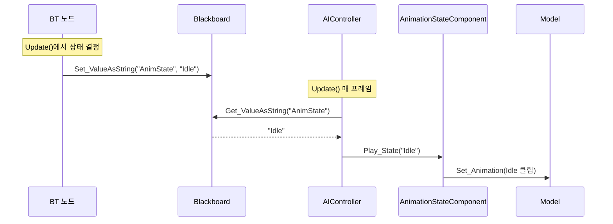

# 몬스터 BT + AnimationState 가이드라인

> BT가 상태 판단 + 애니메이션 전환까지 모두 담당하는 구조. FSM 없이 BT만으로 Idle/Run/Jump 제어.

---

## 전체 파이프라인 (이미 존재)



> [!IMPORTANT]
> `AIController.cpp` L73~117의 애니 재생 코드는 **이미 완성**되어 있다.
> 단, 같은 AnimState 문자열이 반복 세팅되면 **재생을 다시 시작하지 않는다** (변경 감지 방식).

---

## 현재 엔진 BT 인프라 현황

| 항목 | 상태 | 비고 |
|---|---|---|
| `Root` | ✅ 등록됨 | 자동 생성 |
| `Sequence` | ✅ 등록됨 | Composite |
| `Selector` | ✅ 등록됨 | Composite |
| `Task_Wait` | ✅ 등록됨 | Task |
| `Task_Move` | ✅ 등록됨 | Task |
| `Task_SetAnimState` | ❌ 없음 | **새로 만들어야 함** |
| Decorator | ❌ 없음 | TODO 상태 ([BTNode_Factory.cpp:L36](file:///d:/GitDesktop/Dx11_Naruto/Engine/Private/BTNode_Factory.cpp#L36)) |

> [!WARNING]  
> 데코레이터(조건 분기)가 현재 없으므로, **조건 기반 상태 분기**(HasTarget? ShouldJump?)는 바로 구현 불가.
> 당장은 **Sequence/Selector + Task 조합**만으로 시작해야 한다.

---

## 현재 BT JSON 형식

BT JSON은 **중첩 children이 아닌** `root_node_id` + `nodes` + `links` + `pin ids` 구조다.

실제 예시 ([Test_WaitMove.bt.json](file:///d:/GitDesktop/Dx11_Naruto/Client/Bin/Resources/Data/json/BehaviorTrees/Test_WaitMove.bt.json)):

```json
{
    "root_node_id": 1,
    "blackboard": { "bools": {}, "floats": {}, "ints": {}, "vectors": {} },
    "nodes": [
        {
            "id": 1,
            "type": "Root",
            "name": "Root",
            "input_pin_id": 0,
            "output_pin_ids": [2],
            "parameters": {},
            "pos_x": 100.0, "pos_y": 300.0
        },
        {
            "id": 3,
            "type": "Task_Wait",
            "name": "Task_Wait",
            "input_pin_id": 4,
            "output_pin_ids": [],
            "parameters": {},
            "wait_time": 2.0,
            "pos_x": 300.0, "pos_y": 500.0
        }
    ],
    "links": [
        { "id": 5, "start": 2, "end": 4 }
    ]
}
```

### 핵심 규칙
- 각 노드: `id`, `type`, `input_pin_id`, `output_pin_ids[]`
- 연결: `links[]`의 `start`(출력 핀) → `end`(입력 핀)
- 노드 고유 파라미터는 노드 JSON 최상위에 직접 기록 (예: `"wait_time": 2.0`)
- 타입 이름은 `BTNode_Factory` 등록명과 일치해야 함 (`Task_Wait`, `Sequence` 등)

---

## 구현 Step 1: BTNode에 리플렉션 지원 추가

> [!IMPORTANT]
> `BTNode`는 `Base`를 상속하며 `GENERATED_BODY` 매크로를 사용하지 않는다.
> `FClassReflectionInfo`를 직접 노출하는 **가상 함수를 수동으로** 추가해야 한다.

### [MODIFY] [BTNode.h](file:///d:/GitDesktop/Dx11_Naruto/Engine/Public/BTNode.h)

기존 코드 전부 유지. 아래 내용만 추가:

```diff
 #include "Base.h"
+#include "Property_Types.h"

 NS_BEGIN(Engine)

 class ENGINE_DLL BTNode : public Base
 {
     // ... 기존 멤버 전부 유지 ...

 public:
+    // 리플렉션 — 서브클래스가 오버라이드해서 프로퍼티 정보를 반환
+    // 기본 구현은 빈 info 반환 (프로퍼티가 없는 노드)
+    virtual const Engine::FClassReflectionInfo& GetReflectionInfo() const
+    {
+        static Engine::FClassReflectionInfo empty;
+        return empty;
+    }
 };
```

---

## 구현 Step 2: PROPERTY_STRING 매크로 추가

> [!IMPORTANT]
> `EPropertyType::String`은 이미 `Property_Types.h`에 정의되어 있으나, 등록 매크로가 없다.

### [MODIFY] [Reflection_Macro.h](file:///d:/GitDesktop/Dx11_Naruto/Engine/Public/Reflection_Macro.h)

기존 `PROPERTY_ENUM` 아래에 추가:

```cpp
#define PROPERTY_STRING(DisplayName, Member)                               \
    info.properties.push_back({                                             \
        DisplayName, Engine::EPropertyType::String,                         \
        offsetof(SelfType, Member), 0.f, 0.f, 0.f, {}                       \
    });
```

---

## 구현 Step 3: Reflection_Inspector에 String 렌더링 + 헤더 없는 호출용 함수 추가

### [MODIFY] [Reflection_Inspector.h](file:///d:/GitDesktop/Dx11_Naruto/Editor/Public/Reflection_Inspector.h)

```diff
 class Reflection_Inspector : public Component_Inspector
 {
 public:
     void Draw_Inspector(shared_ptr<Component> component) override;
     uint32 Get_ComponentType() const override { return 0; }

     void Draw_FromReflection(void* basePtr, const Engine::FClassReflectionInfo& info);

+    // BT Node Inspector 등에서 헤더 없이 프로퍼티만 그릴 때 사용
+    static void Draw_Properties_Only(void* basePtr, const Engine::FClassReflectionInfo& info);

 private:
     void Draw_Property(void* basePtr, const Engine::FPropertyInfo& prop);
+    static void Draw_Property_Simple(void* basePtr, const Engine::FPropertyInfo& prop);
 };
```

### [MODIFY] [Reflection_Inspector.cpp](file:///d:/GitDesktop/Dx11_Naruto/Editor/Private/Reflection_Inspector.cpp)

파일 맨 아래에 추가:

```cpp
// =========================================================
// [추가] 헤더 없이 프로퍼티만 그리는 static 함수
// BehaviorTree_View의 Node Inspector에서 호출
// =========================================================
void Reflection_Inspector::Draw_Properties_Only(void* basePtr, const Engine::FClassReflectionInfo& info)
{
    for (const auto& prop : info.properties)
    {
        Draw_Property_Simple(basePtr, prop);
    }
}

// Undo 없는 간단 렌더링 (static이라 멤버 캡처 변수 사용 불가)
void Reflection_Inspector::Draw_Property_Simple(void* basePtr, const Engine::FPropertyInfo& prop)
{
    void* memberPtr = static_cast<char*>(basePtr) + prop.offset;
    string label = "##" + prop.name;

    switch (prop.type)
    {
    case EPropertyType::Float:
    {
        float* val = static_cast<float*>(memberPtr);
        ImGui::Text("%s", prop.name.c_str());
        ImGui::SameLine(120.f);
        ImGui::PushItemWidth(-1);
        ImGui::DragFloat(label.c_str(), val, prop.dragSpeed, prop.minVal, prop.maxVal);
        ImGui::PopItemWidth();
        break;
    }
    case EPropertyType::Int:
    {
        int* val = static_cast<int*>(memberPtr);
        ImGui::Text("%s", prop.name.c_str());
        ImGui::SameLine(120.f);
        ImGui::PushItemWidth(-1);
        ImGui::DragInt(label.c_str(), val, prop.dragSpeed, (int)prop.minVal, (int)prop.maxVal);
        ImGui::PopItemWidth();
        break;
    }
    case EPropertyType::Bool:
    {
        bool* val = static_cast<bool*>(memberPtr);
        ImGui::Checkbox(prop.name.c_str(), val);
        break;
    }
    case EPropertyType::String:
    {
        // std::string → char buf 변환 후 InputText (imgui_stdlib 불필요)
        string* val = static_cast<string*>(memberPtr);
        ImGui::Text("%s", prop.name.c_str());
        ImGui::SameLine(120.f);
        ImGui::PushItemWidth(-1);

        char buf[256] = {};
        strncpy_s(buf, val->c_str(), sizeof(buf) - 1);
        if (ImGui::InputText(label.c_str(), buf, sizeof(buf)))
            *val = buf;

        ImGui::PopItemWidth();
        break;
    }
    case EPropertyType::Enum:
    {
        int* val = static_cast<int*>(memberPtr);
        ImGui::Text("%s", prop.name.c_str());
        ImGui::SameLine(120.f);
        ImGui::PushItemWidth(-1);

        const char* preview = (*val >= 0 && *val < (int)prop.enumNames.size())
            ? prop.enumNames[*val].c_str() : "???";

        if (ImGui::BeginCombo(label.c_str(), preview))
        {
            for (int i = 0; i < (int)prop.enumNames.size(); ++i)
            {
                bool isSelected = (*val == i);
                if (ImGui::Selectable(prop.enumNames[i].c_str(), isSelected))
                    *val = i;
                if (isSelected) ImGui::SetItemDefaultFocus();
            }
            ImGui::EndCombo();
        }
        ImGui::PopItemWidth();
        break;
    }
    default:
        break;
    }
}
```

---

## 구현 Step 4: BehaviorTree_View Node Inspector에서 리플렉션 호출

### [MODIFY] [BehaviorTree_View.cpp](file:///d:/GitDesktop/Dx11_Naruto/Editor/Private/BehaviorTree_View.cpp)

include 추가:

```diff
 #include "BehaviorTree_View.h"
+#include "Reflection_Inspector.h"
```

`Draw_NodeInspector()` 함수 내부 (L789 부근) 수정:

```cpp
// ── 기존 코드 ──
if (selectedNode->runtimeInstance)
{
    selectedNode->runtimeInstance->OnDraw_Inspector();
}

// ── [변경] 리플렉션 기반 자동 렌더링 ──
if (selectedNode->runtimeInstance)
{
    // 리플렉션 프로퍼티가 등록되어 있으면 자동 렌더링
    const auto& reflInfo = selectedNode->runtimeInstance->GetReflectionInfo();
    if (!reflInfo.properties.empty())
    {
        Reflection_Inspector::Draw_Properties_Only(
            selectedNode->runtimeInstance.get(), reflInfo);
    }

    // 리플렉션에 없는 커스텀 ImGui가 필요하면 여전히 호출
    selectedNode->runtimeInstance->OnDraw_Inspector();
}
```

---

## 구현 Step 5: BTTask_SetAnimState 작성

### [NEW] [BTTask_SetAnimState.h](file:///d:/GitDesktop/Dx11_Naruto/Engine/Public/BTTask_SetAnimState.h)

```cpp
#pragma once

#include "BTTask.h"
#include "Reflection_Macro.h"

NS_BEGIN(Engine)

// BT에서 실행되면 Blackboard의 "AnimState"에 지정된 상태 이름을 기록하는 Task.
// AIController가 매 프레임 이 값을 읽어서 AnimationStateComponent에 전달한다.
class ENGINE_DLL BTTask_SetAnimState : public BTTask
{
public:
    explicit BTTask_SetAnimState(const string& stateName = "Idle");
    explicit BTTask_SetAnimState(const BTTask_SetAnimState& rhs);
    virtual ~BTTask_SetAnimState() = default;

public:
    void            Initialize() override;
    EBTNodeResult   Update(float timeDelta) override;

    // 에디터 BT 뷰 인스펙터 (리플렉션으로 대체되므로 비워둬도 됨)
    void    OnDraw_Inspector() override;

    // BT JSON 직렬화
    json    Serialize_ToJson() override;
    void    Deserialize_FromJson(const json& data) override;

public:
    // 리플렉션: BehaviorTree_View의 Node Inspector에서 자동 렌더링 지원
    const Engine::FClassReflectionInfo& GetReflectionInfo() const override
    {
        return GetStaticReflectionInfo();
    }

    static Engine::FClassReflectionInfo& GetStaticReflectionInfo()
    {
        static Engine::FClassReflectionInfo info;
        return info;
    }

    // 정적 초기화 래퍼 (cpp에서 호출)
    static bool Register_Properties_Init()
    {
        static bool once = Register_Properties();
        return once;
    }

public:
    const string& Get_StateName() const { return _stateName; }
    void          Set_StateName(const string& name) { _stateName = name; }

private:
    // 리플렉션 프로퍼티 등록 (정적 초기화 시 1회 호출)
    static bool Register_Properties();

private:
    // Blackboard에 기록할 상태 이름 (예: "Idle", "Run")
    string _stateName = "Idle";

public:
    virtual Shared<BTNode> Clone() override;
};

NS_END
```

### [NEW] [BTTask_SetAnimState.cpp](file:///d:/GitDesktop/Dx11_Naruto/Engine/Private/BTTask_SetAnimState.cpp)

```cpp
#include "pch.h"
#include "BTTask_SetAnimState.h"
#include "Blackboard.h"

// 정적 초기화: 프로퍼티 등록 (한 번만 실행)
static bool s_registered = BTTask_SetAnimState::Register_Properties_Init();

// 생성자: 상태 이름을 받아서 저장
BTTask_SetAnimState::BTTask_SetAnimState(const string& stateName)
    : _stateName(stateName)
{
}

// 복사 생성자
BTTask_SetAnimState::BTTask_SetAnimState(const BTTask_SetAnimState& rhs)
    : BTTask(rhs)
    , _stateName(rhs._stateName)
{
}

void BTTask_SetAnimState::Initialize()
{
    BTNode::Initialize();
}

// Blackboard "AnimState"에 상태 이름 기록 → 즉시 Success 반환
EBTNodeResult BTTask_SetAnimState::Update(float timeDelta)
{
    auto bb = _blackboard.lock();
    if (!bb)
    {
        _lastResult = EBTNodeResult::Failed;
        return EBTNodeResult::Failed;
    }

    // AIController::Update()가 이 값을 읽어서 AnimationStateComponent::Play_State() 호출
    bb->Set_ValueAsString("AnimState", _stateName);

    _lastResult = EBTNodeResult::Succeeded;
    return EBTNodeResult::Succeeded;
}

void BTTask_SetAnimState::OnDraw_Inspector()
{
    // 리플렉션이 대신 처리하므로 비워둠
    // 만약 리플렉션 외 추가 커스텀 UI가 필요하면 여기에 작성
}

// BT JSON 직렬화: "state_name" 키로 저장
json BTTask_SetAnimState::Serialize_ToJson()
{
    json j = BTTask::Serialize_ToJson();
    j["state_name"] = _stateName;
    return j;
}

// BT JSON 역직렬화: "state_name"에서 복원 (없으면 "Idle" 기본값)
void BTTask_SetAnimState::Deserialize_FromJson(const json& data)
{
    _stateName = data.value("state_name", "Idle");
}

// 리플렉션 프로퍼티 등록 — Node Inspector에 "State Name" InputText 자동 노출
bool BTTask_SetAnimState::Register_Properties()
{
    using SelfType = BTTask_SetAnimState;
    auto& info = GetStaticReflectionInfo();
    info.className = "BTTask_SetAnimState";

    PROPERTY_STRING("State Name", _stateName);

    return true;
}

Shared<BTNode> BTTask_SetAnimState::Clone()
{
    auto clone = make_shared<BTTask_SetAnimState>(*this);
    clone->Initialize();
    return clone;
}
```

---

## 구현 Step 6: BTNode_Factory에 등록

### [MODIFY] [BTNode_Factory.cpp](file:///d:/GitDesktop/Dx11_Naruto/Engine/Private/BTNode_Factory.cpp)

```diff
 #include "BTTask_Wait.h"
 #include "BTTask_MoveTo.h"
+#include "BTTask_SetAnimState.h"

 void BTNode_Factory::Register_EngineNodes()
 {
     /* ... 기존 코드 ... */

     /* Task */
     Register("Task", "Task_Wait",         []() { return make_shared<BTTask_Wait>(); });
     Register("Task", "Task_Move",         []() { return make_shared<BTTask_MoveTo>(); });
+    Register("Task", "Task_SetAnimState", []() { return make_shared<BTTask_SetAnimState>(); });
 }
```

---

## 구현 Step 7: AnimationStateComponent에 상태 등록

에디터에서 Monster 프리팹 선택 → `AnimationStateComponent` 인스펙터에서:

| 상태 키 | 모드 | 애니메이션 | loop |
|---|---|---|---|
| `"Idle"` | Single | 제츠 Idle 클립명 | true |
| `"Run"` | Single | 제츠 Run 클립명 | true |

> 클립 이름은 `Animation_View`에서 Monster 모델 선택 시 확인 가능.

---

## 구현 Step 8: BT JSON — Idle ↔ Run 왔다갔다

### BT 구조

```
Root
 └─ Sequence (순서 실행 → 완료 시 재시작)
      ├─ Task_SetAnimState("Idle")   → Blackboard에 "Idle" 기록, 즉시 Success
      ├─ Task_Wait(3초)              → 3초 Idle 대기
      ├─ Task_SetAnimState("Run")    → Blackboard에 "Run" 기록, 즉시 Success
      └─ Task_Wait(2초)              → 2초 Run 대기 → Sequence 완료 → 처음부터 반복
```

### [NEW] Monster_IdleRun.bt.json

경로: `Client/Bin/Resources/Data/json/BehaviorTrees/Monster_IdleRun.bt.json`

```json
{
    "root_node_id": 1,
    "blackboard": {
        "bools": {}, "floats": {}, "ints": {}, "strings": {}, "vectors": {}
    },
    "nodes": [
        {
            "id": 1, "type": "Root", "name": "Root",
            "input_pin_id": 0, "output_pin_ids": [2],
            "parameters": {},
            "pos_x": 200.0, "pos_y": 100.0
        },
        {
            "id": 3, "type": "Sequence", "name": "Idle-Run Loop",
            "input_pin_id": 4, "output_pin_ids": [5, 6, 7, 8],
            "parameters": {},
            "pos_x": 200.0, "pos_y": 250.0
        },
        {
            "id": 9, "type": "Task_SetAnimState", "name": "Set Idle",
            "input_pin_id": 10, "output_pin_ids": [],
            "parameters": {},
            "state_name": "Idle",
            "pos_x": 50.0, "pos_y": 450.0
        },
        {
            "id": 11, "type": "Task_Wait", "name": "Wait 3s",
            "input_pin_id": 12, "output_pin_ids": [],
            "parameters": {},
            "wait_time": 3.0,
            "pos_x": 200.0, "pos_y": 450.0
        },
        {
            "id": 13, "type": "Task_SetAnimState", "name": "Set Run",
            "input_pin_id": 14, "output_pin_ids": [],
            "parameters": {},
            "state_name": "Run",
            "pos_x": 350.0, "pos_y": 450.0
        },
        {
            "id": 15, "type": "Task_Wait", "name": "Wait 2s",
            "input_pin_id": 16, "output_pin_ids": [],
            "parameters": {},
            "wait_time": 2.0,
            "pos_x": 500.0, "pos_y": 450.0
        }
    ],
    "links": [
        { "id": 20, "start": 2,  "end": 4  },
        { "id": 21, "start": 5,  "end": 10 },
        { "id": 22, "start": 6,  "end": 12 },
        { "id": 23, "start": 7,  "end": 14 },
        { "id": 24, "start": 8,  "end": 16 }
    ]
}
```

---

## 런타임 흐름 요약

```
1프레임: BT Sequence 실행
  Task_SetAnimState("Idle") → Blackboard["AnimState"] = "Idle" → Succeeded
  Task_Wait(3초)            → InProgress...

AIController::Update() 매 프레임:
  → Blackboard["AnimState"] 읽기 = "Idle"
  → 변경 감지 → AnimationStateComponent::Play_State("Idle") 호출
  → 모델 Idle 애니메이션 재생

3초 후: Task_Wait 완료 → Sequence 다음 child로
  Task_SetAnimState("Run") → Blackboard["AnimState"] = "Run" → Succeeded
  Task_Wait(2초)           → InProgress...

AIController::Update():
  → "Run" 감지 → Play_State("Run") → 모델 Run 애니메이션 재생

2초 후: Sequence 4개 child 전부 완료 → 다시 처음부터 반복
```

---

## 확장 계획 (현재는 미구현)

데코레이터가 추가되면 조건 분기가 가능해진다:

```
Root → Selector
         ├─ [Decorator: HasTarget?] → Sequence → SetAnimState("Run") → Task_Move
         └─ SetAnimState("Idle") → Task_Wait
```

> [!NOTE]
> 이 흐름은 데코레이터 구현 후에 가능. 현재는 Sequence/Selector + Task 조합만 사용 가능.

---

## 체크리스트

- [ ] `BTNode.h`에 `GetReflectionInfo()` 가상 함수 추가 (Step 1)
- [ ] `Reflection_Macro.h`에 `PROPERTY_STRING` 매크로 추가 (Step 2)
- [ ] `Reflection_Inspector`에 `Draw_Properties_Only()` + String 렌더링 추가 (Step 3)
- [ ] `BehaviorTree_View::Draw_NodeInspector()`에서 리플렉션 호출 추가 (Step 4)
- [ ] `BTTask_SetAnimState.h` / `.cpp` 작성 (Step 5)
- [ ] `BTNode_Factory.cpp`에 `"Task_SetAnimState"` 등록 (Step 6)
- [ ] 에디터에서 몬스터 프리팹 `AnimationStateComponent`에 Idle/Run 상태 등록 (Step 7)
- [ ] BT 에디터에서 트리 구성 또는 JSON 직접 작성 (Step 8)
- [ ] (추후) 데코레이터 노드 구현 → 조건 기반 상태 분기
